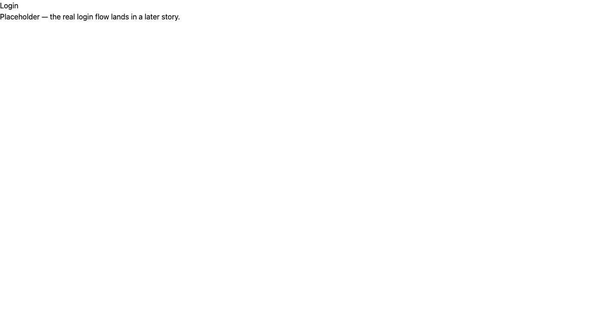

# Scaffold protected route group and session-check layout

*2026-07-23T14:46:43Z by Showboat 0.6.1*
<!-- showboat-id: d9085bb9-1816-4d49-970f-1aefb3cc135b -->

US-A03: src/routes/(app)/+layout.server.ts redirects unauthenticated visitors (no session cookie) to /login. src/routes/login/+page.svelte is a placeholder login page. A placeholder src/routes/(app)/inbox/+page.svelte exists so /inbox is protected. Full session validation against the sessions table lands in US-B05 once that table exists (US-B01); for now the check is presence of a non-empty 'session' cookie.

```bash
npm run check 2>&1 | sed -E 's/^[0-9]{10,}//'
```

```output

> resend-email-inbox@0.0.1 check
> svelte-kit sync && svelte-check --tsconfig ./tsconfig.json

 START "/Users/bloodintern1/Desktop/Resend-Email-Inbox"
 COMPLETED 1176 FILES 0 ERRORS 0 WARNINGS 0 FILES_WITH_PROBLEMS
```

```bash
npm run lint 2>&1
```

```output

> resend-email-inbox@0.0.1 lint
> prettier --check . && eslint .

Checking formatting...
All matched files use Prettier code style!
```

```bash
npm run build 2>&1 | grep -v 'gzip:' | sed -E 's/built in [0-9.]+(ms|s)/built in N/'
```

```output

> resend-email-inbox@0.0.1 build
> vite build

vite v8.1.5 building ssr environment for production...

transforming...✓ 153 modules transformed.
rendering chunks...
vite v8.1.5 building client environment for production...

transforming...✓ 163 modules transformed.
rendering chunks...
computing gzip size...

✓ built in N
computing gzip size...

✓ built in N

Run npm run preview to preview your production build locally.

> Using @sveltejs/adapter-vercel
  ✔ done
```

```bash
curl -s -i http://localhost:5173/inbox | tr -d '\r' | grep -E '^(HTTP|location)'
```

```output
HTTP/1.1 302 Found
location: /login
```

```bash
curl -s -i --cookie 'session=fake-token-value' http://localhost:5173/inbox | tr -d '\r' | grep -E '^HTTP'
```

```output
HTTP/1.1 200 OK
```

```bash {image}

```


