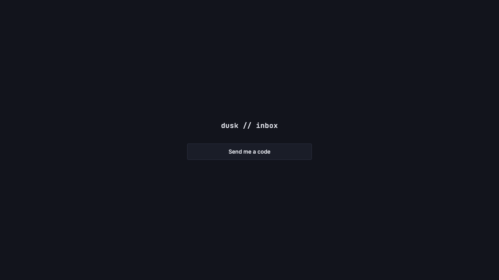
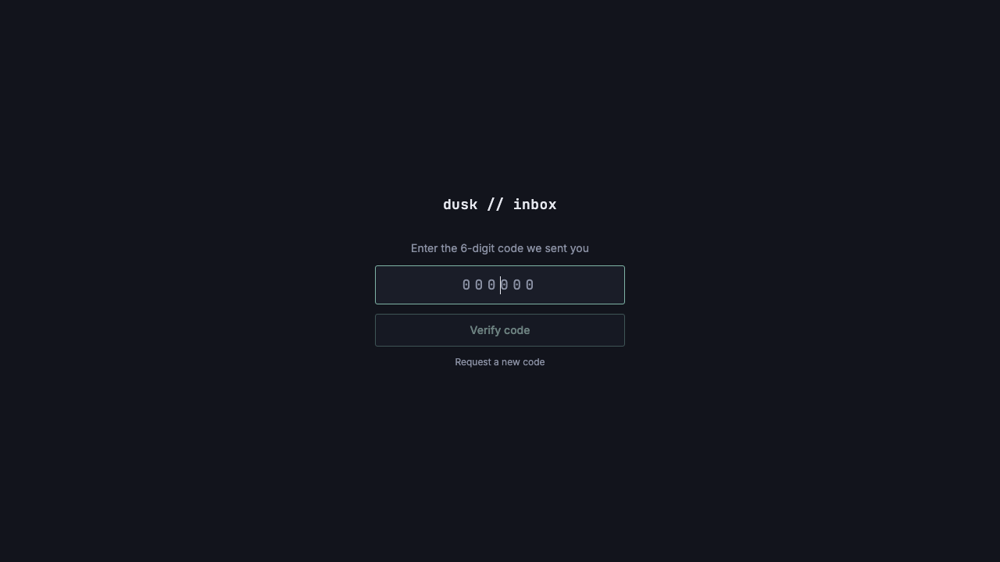
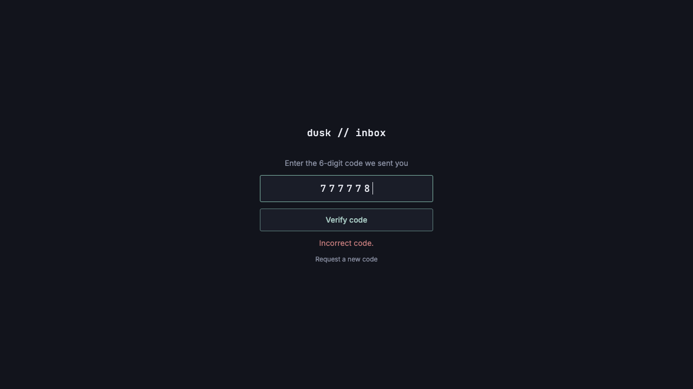
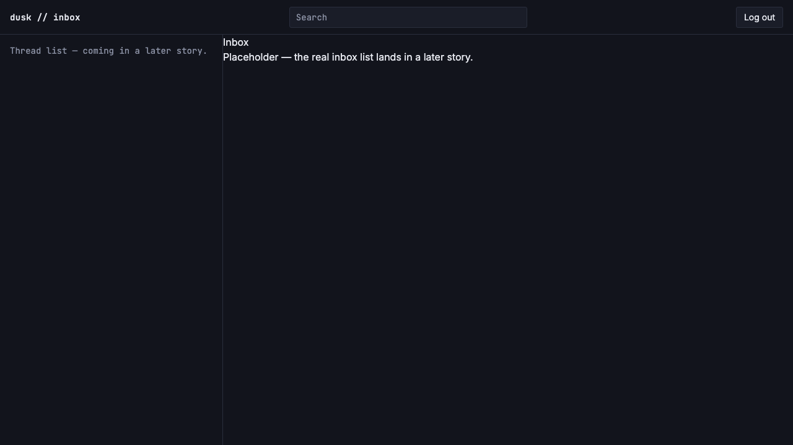
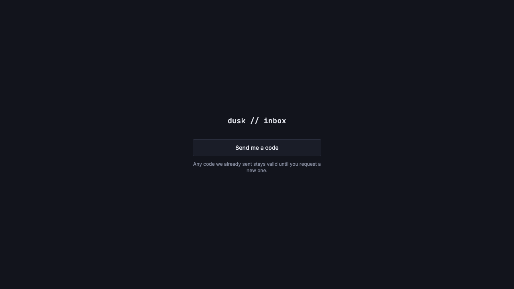
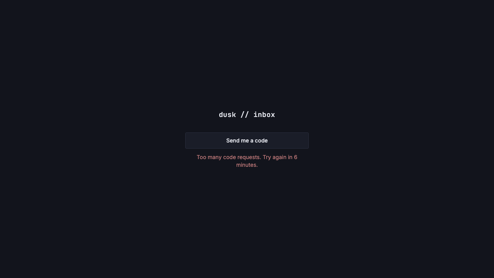

# Login page UI - single button and code entry

*2026-07-27T13:26:16Z by Showboat 0.6.1*
<!-- showboat-id: 1b21c200-9b9c-4ef4-8363-971b6f54a6b9 -->

US-B04: minimal single-user login flow at /login — a centered app mark plus a single 'Send me a code' button (no email input anywhere), which transitions in place to a 6-digit monospace code-entry step. Incorrect codes show an inline error without navigating away; a valid code redirects to /inbox; 429 rate-limit responses show a 'try again in N minutes' message (retryAfterMinutes now returned by POST /api/auth/request-code).

Quality checks:

```bash
npm run check 2>&1 | grep -E 'FILES|ERRORS' | sed -E 's/^[0-9]+/<ts>/'
```

```output
<ts> COMPLETED 1196 FILES 0 ERRORS 0 WARNINGS 0 FILES_WITH_PROBLEMS
```

```bash
npm run lint 2>&1 | tail -5
```

```output
> resend-email-inbox@0.0.1 lint
> prettier --check . && eslint .

Checking formatting...
All matched files use Prettier code style!
```

```bash
npm run build 2>&1 | grep -E '✓ built|error' | sed -E 's/[0-9]+(\.[0-9]+)?(ms|s)/<duration>/'
```

```output
✓ built in <duration>
.svelte-kit/output/server/entries/fallbacks/error.svelte.js                                           2.81 kB │ gzip:  1.18 kB
✓ built in <duration>
```

Browser verification (rodney, dev server on :5199). Unlike the first pass on this story, a real Resend API key is now provisioned locally, so `/api/auth/verify-code` was exercised **unmocked** against the live Turso DB with a seeded known code (`777777`). Only `/api/auth/request-code` is stubbed in-page (`window.fetch`) for the steps that just need to reach the code-entry screen — so those steps don't send another real email to `AUTH_RECIPIENT_EMAIL`. The rate-limit step below is unmocked too. Screenshots and assertions are from that run; the endpoints' own behavior is additionally covered in docs/demos/US-B02.md and docs/demos/US-B03.md.

Step 1 — initial /login render: centered app mark (now an `<h1>`, not a `<span>`) plus a single 'Send me a code' button. No email input anywhere on the page.



Step 2 — the request step transitions in place to the 6-digit monospace code-entry step, input auto-focused.



Non-digit input is stripped at the input rather than by the inert `pattern` attribute. Setting the field to `77-7 7x` and dispatching `input` leaves `7777` — four digits, so no submit fires. This is the paste shape (`123 456`, `123-456`) that email clients produce.

Step 3 — an incorrect code auto-submits on the sixth digit and shows an inline error in the danger color without navigating away from /login. This hit the real endpoint: `777778` against the seeded `777777` returned `400 {"error":"Incorrect code."}`.



Two accessibility behaviors verified in-page rather than by screenshot:

- Typing a correction clears the error immediately (`document.querySelector('p[role=alert]')` is `null` after the next `input`), so the UI no longer reads as failing through the whole retype.
- Two *identical* consecutive failures produce two different DOM nodes (`n2 === n1` evaluates to `false`), because the alert `<p>` is wrapped in `{#key errorNonce}`. A `role="alert"` region whose text is byte-identical is not re-announced, so without this the second "Incorrect code." would be silent for screen reader users.

Step 4 — the correct code redirects to /inbox. Submitting `777777` returned `200`, the server set the session cookie, and `rodney url` reports `http://localhost:5199/inbox` with the US-J02 app shell rendered. `/inbox` is behind the `(app)` route group's session check, so reaching it is itself proof the cookie was issued and accepted.



Step 5 — 'Request a new code' (formerly 'Start over') returns to the request step and discloses what a second request costs, rather than silently inviting a click that invalidates a working code and spends a rate-limit slot. Page text after clicking it: `dusk // inbox | Send me a code | Any code we already sent stays valid until you request a new one.`



Step 6 — rate limiting, unmocked. Three `auth_codes` rows were seeded with the oldest 4 minutes old, so one slot frees up in ~6 minutes. The page renders the derived message:



The header and body are computed from the same oldest-request timestamp, so they cannot disagree — `curl` against the same state returns `retry-after: 354` alongside `{"error":"Too many code requests. Please try again later.","retryAfterMinutes":6}` (354s rounds up to 6 minutes).

There is no `429` branch in the verify-code path: `/api/auth/verify-code` is not rate-limited, so every rejection there is a `400`. Brute force is bounded by the two limits that do exist — 5 attempts per code and 3 codes per 10 minutes, i.e. at most 15 guesses per 10 minutes against a 10^6 space:

```bash
grep -c 'status === 429' src/routes/login/+page.svelte
```

```output
1
```

Known limitation, not addressed here: reloading the page during the code step drops back to the request step with the issued code still valid but no longer enterable.

All `auth_codes` rows and the session row created by this run were deleted afterward, leaving the live Turso DB with 0 of each.
