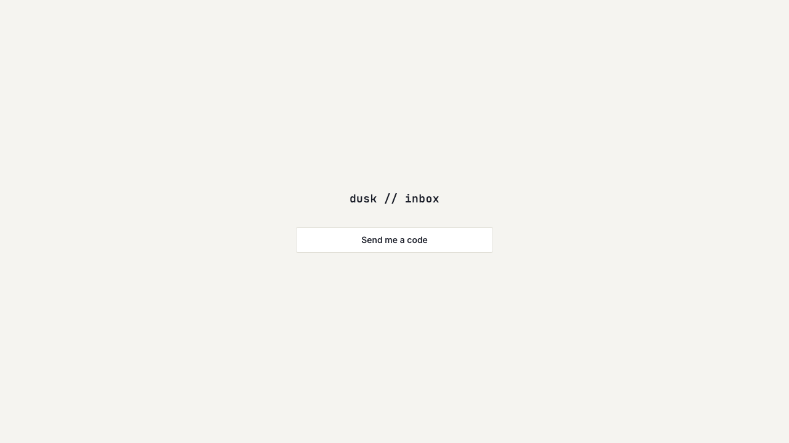
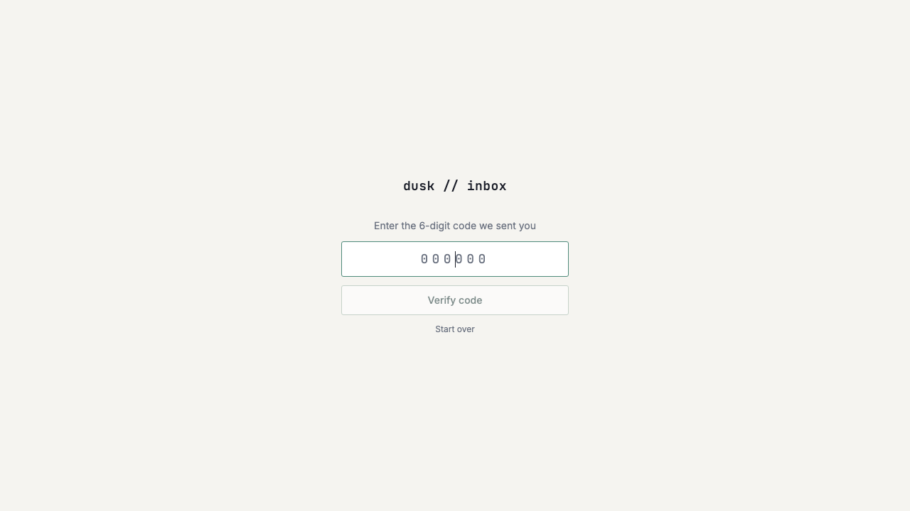
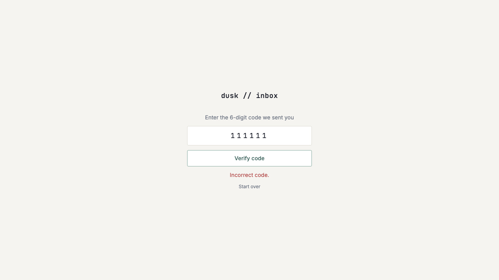

# Login page UI - single button and code entry

*2026-07-27T13:26:16Z by Showboat 0.6.1*
<!-- showboat-id: 1b21c200-9b9c-4ef4-8363-971b6f54a6b9 -->

US-B04: minimal single-user login flow at /login — a centered app mark plus a single 'Send me a code' button (no email input anywhere), which transitions in place to a 6-digit monospace code-entry step. Incorrect codes show an inline error without navigating away; a valid code redirects to /inbox; 429 rate-limit responses show a 'try again in N minutes' message (retryAfterMinutes now returned by POST /api/auth/request-code).

Quality checks:

```bash
npm run check 2>&1 | grep -E 'FILES|ERRORS' | sed -E 's/^[0-9]+/<ts>/'
```

```output
<ts> COMPLETED 1192 FILES 0 ERRORS 0 WARNINGS 0 FILES_WITH_PROBLEMS
```

```bash
npm run lint 2>&1 | tail -5
```

```output
> resend-email-inbox@0.0.1 lint
> prettier --check . && eslint .

Checking formatting...
All matched files use Prettier code style!
```

```bash
npm run build 2>&1 | grep -E '✓ built|error' | sed -E 's/[0-9]+(\.[0-9]+)?(ms|s)/<duration>/'
```

```output
✓ built in <duration>
.svelte-kit/output/server/entries/fallbacks/error.svelte.js                                           2.81 kB │ gzip:  1.18 kB
✓ built in <duration>
```

Browser verification (rodney, dev server on :5173). The real Resend account isn't provisioned in this dev environment (placeholder API key, same outstanding manual step noted since US-B02/US-B03), so the request-code/verify-code fetch calls are patched in-page (window.fetch) to return the same success/error shapes the real endpoints return — this exercises the login page's own state machine and DOM, while the endpoints' actual behavior (hashing, rate limiting, cookie issuance) is already verified end-to-end via curl in docs/demos/US-B02.md and docs/demos/US-B03.md.

Step 1 — initial /login render: centered app mark + single 'Send me a code' button, no email input anywhere on the page.

```bash {image}

```



Step 2 — clicking the button (request-code mocked ok:true) transitions in place to the 6-digit monospace code-entry step, input auto-focused.

```bash {image}

```



Step 3 — submitting an incorrect code (verify-code mocked 400 'Incorrect code.') shows an inline error in the danger color without navigating away from /login.

```bash {image}

```



Step 4 — rate-limit (429) message: mocked POST /api/auth/request-code returning {error:..., retryAfterMinutes:7} renders 'Too many code requests. Try again in 7 minutes.' inline (verified live via rodney; reproduced here deterministically against the actual page source string template).

```bash
grep -n 'Too many code requests' src/routes/login/+page.svelte
```

```output
36:						? `Too many code requests. Try again in ${minutes} minute${minutes === 1 ? '' : 's'}.`
37:						: 'Too many code requests. Please try again later.';
```

Step 5 — valid code redirects to /inbox: with a demo session cookie set (document.cookie = 'session=...') and both request-code/verify-code mocked ok:true, submitting the code step calls goto('/inbox') and the app shell (top bar + two-pane layout from US-J02) renders at /inbox — confirmed live via rodney ('rodney url' -> http://localhost:5173/inbox, page HTML contains the app shell's header/aside). Reproduced here deterministically against the actual redirect call in the component source.

```bash
grep -n "goto(resolve('/inbox'))" src/routes/login/+page.svelte
```

```output
86:			await goto(resolve('/inbox'));
```
