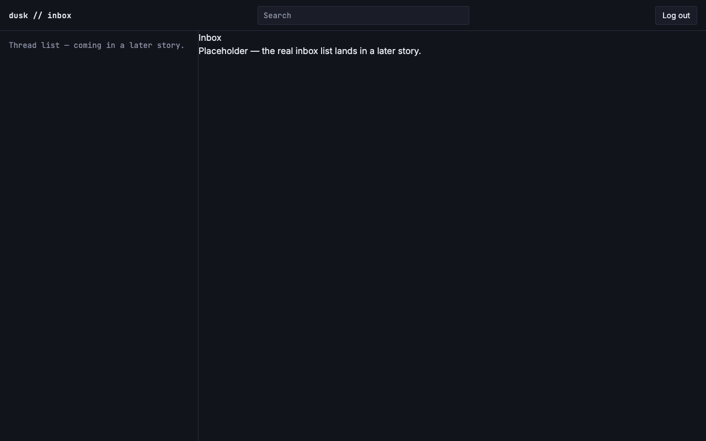
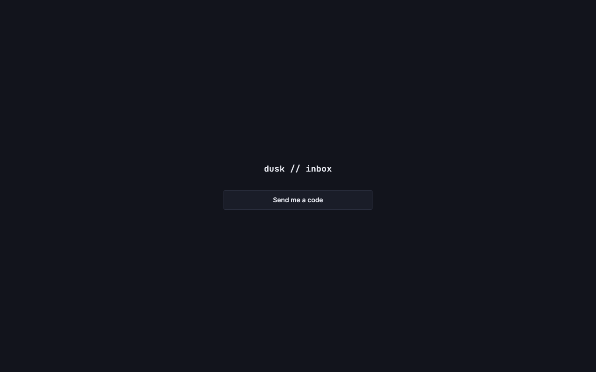

# Route protection and logout

*2026-07-27T17:22:31Z by Showboat 0.6.1*
<!-- showboat-id: ed015f36-4c9f-4a28-9f25-3c31b4192f7e -->

US-B05 replaces the placeholder route protection from US-A03 with real server-side session validation, and moves logout to `POST /api/auth/logout` where it now deletes the `sessions` row instead of only clearing the cookie.

What changed:
- `src/lib/server/auth/session.ts` — `hasSessionCookie` (cookie-presence only) is gone, replaced by `validateSession(db, cookies, now?)` (hash the cookie token, look it up in `sessions`, reject missing/unknown/expired, slide `expires_at` forward past the halfway point per FR-9) and `destroySession(db, cookies)`. Cookie name and flags now live here as the single source of truth, so the `set` in verify-code and the `delete` in logout cannot drift (a cookie deleted with a different `path` than it was set with is not deleted).
- `src/routes/(app)/+layout.server.ts` — calls `validateSession`; clears the cookie on the way out (when one was actually sent) so a stale token is not re-sent on every request.
- `src/routes/api/auth/logout/+server.ts` — new, replaces `src/routes/logout/+server.ts`; deletes the row, clears the cookie, 303 to /login.
- `src/routes/(app)/+layout.svelte` — the existing top-bar "Log out" form now posts to `/api/auth/logout`.
- `src/routes/api/auth/verify-code/+server.ts` — uses the shared `setSessionCookie`/`SESSION_TTL_MS` instead of its own copies.

### Quality checks

```bash
npm run check 2>&1 | grep -E 'COMPLETED|ERRORS' | sed 's/^[0-9]* //'
```

```output
COMPLETED 1196 FILES 0 ERRORS 0 WARNINGS 0 FILES_WITH_PROBLEMS
```

```bash
npm run lint 2>&1 | tail -2
```

```output
Checking formatting...
All matched files use Prettier code style!
```

```bash
npm run build >/dev/null 2>&1 && echo 'build: success'
```

```output
build: success
```

### Session logic against the live Turso database

`src/lib/server/auth/verify-auth-sessions.mts` (the existing US-B01 smoke-test script) gains a `session.ts` section covering the new functions. It runs against the real Turso instance and cleans up after itself. Exercising `validateSession` here rather than only over HTTP is what makes the time-dependent behavior assertable — the sliding-expiration branch takes an explicit `now`, so proving it does not require waiting 15 days. The last 11 assertions are new in this story.

```bash
node --env-file=.env node_modules/.bin/tsx src/lib/server/auth/verify-auth-sessions.mts
```

```output
PASS: createAuthCode inserts a row
PASS: getActiveAuthCode finds the freshly created code
PASS: invalidateActiveAuthCodes supersedes the prior active code
PASS: no active code remains after invalidation
PASS: a superseded code has used_at still NULL (expired, not redeemed)
PASS: getActiveAuthCode finds the second code
PASS: incrementAuthCodeAttempts bumps attempt_count to 1
PASS: four concurrent increments all land (attempt_count === 5)
PASS: markAuthCodeUsed sets used_at
PASS: markAuthCodeUsed returns undefined for an already-used code
PASS: getActiveAuthCode returns null once the code is used
PASS: an expired code is not returned as active
PASS: createSession inserts a row
PASS: getValidSessionByTokenHash finds the unexpired session
PASS: getValidSessionByTokenHash returns null once past expires_at
PASS: extendSessionExpiry updates expires_at (sliding expiration)
PASS: deleteSessionByTokenHash removes the row
PASS: session no longer found after delete
PASS: deleteSessionByTokenHash returns false when nothing to delete
PASS: validateSession accepts a live token (hashes the cookie, finds the row)
PASS: a fresh session is not refreshed (no cookie re-set, expires_at unchanged)
PASS: validateSession slides expires_at forward past the halfway point
PASS: the refreshed session cookie is re-set with the new expiry
PASS: validateSession rejects an unknown token
PASS: validateSession rejects a request with no cookie at all
PASS: validateSession rejects an expired session
PASS: destroySession deletes the sessions row
PASS: destroySession clears the session cookie
PASS: the deleted session no longer validates
PASS: destroySession reports false when there was no session to delete
```

### Route protection over HTTP

Self-contained: starts its own dev server on port 5200, waits for it, and kills it afterward. The second case is the actual regression this story fixes — before US-B05 any non-empty `session` cookie value got a 200.

```bash
npm run dev -- --port 5200 >/dev/null 2>&1 &
DEV=$!
until curl -sf -o /dev/null http://localhost:5200/login; do sleep 1; done

echo "GET /inbox, no cookie:"
curl -s -o /dev/null -w "  %{http_code} -> %{redirect_url}\n" http://localhost:5200/inbox

echo "GET /inbox, cookie present but not a real session (200 before US-B05):"
curl -s -o /dev/null -w "  %{http_code} -> %{redirect_url}\n" \
  -H 'Cookie: session=totally-made-up' http://localhost:5200/inbox

# tr -d '\r' because curl emits response headers with CRLF line endings, and a
# trailing \r makes `showboat verify` diff a byte-identical-looking re-run.
echo "POST /api/auth/logout:"
curl -s -o /dev/null -D- -X POST http://localhost:5200/api/auth/logout \
  | grep -iE '^(HTTP/|location:|set-cookie:)' | tr -d '\r' | sed 's/^/  /'

kill $DEV
```

```output
GET /inbox, no cookie:
  302 -> http://localhost:5200/login
GET /inbox, cookie present but not a real session (200 before US-B05):
  302 -> http://localhost:5200/login
POST /api/auth/logout:
  HTTP/1.1 303 See Other
  location: /login
  set-cookie: session=; Max-Age=0; Path=/; HttpOnly; Secure; SameSite=Lax
```

### Browser verification (rodney)

Driven against a dev server on port 5199 with a real login. `/api/auth/request-code` was stubbed in-page (`window.fetch`) so the run did not send a real email — a real Resend key is provisioned locally as of US-B04, so an unstubbed click would deliver one — and a known auth code (`424242`) was seeded straight into `auth_codes` with the same `hashAuthCode` the endpoint uses. `POST /api/auth/verify-code` itself was **not** stubbed: it minted the real session whose cookie every step below validates.

Observed, in order:

1. `/login` → clicked "Send me a code" → code field appeared (`input#login-code`).
2. Typed `424242`; the page auto-submitted on the sixth digit and landed on `/inbox` (`rodney url` → `http://localhost:5199/inbox`). The app shell rendered, which means `(app)/+layout.server.ts` ran `validateSession` against Turso and accepted the cookie — not a presence check.
3. `sessions` row count went 0 → 1.
4. Clicked the top bar's "Log out" button → landed on `/login`.
5. `sessions` row count went 1 → 0. **The row was deleted, not just the cookie** — this is the FR-8 property, and the part US-A03's placeholder logout did not do.
6. `document.cookie` no longer contains `session`.
7. Navigating back to `/inbox` redirected to `/login`.

Separately, via curl with a directly-seeded session token: `GET /inbox` returned 200 while the row was live, and after `POST /api/auth/logout` the *same* token returned 302 → `/login` — and re-deleting its row reported `false`, confirming logout had already removed it server-side rather than leaving a valid row a copied token could still use.

These browser steps are recorded as commentary rather than `exec` blocks because reproducing them requires seeding a matching auth code into the live database; the reproducible assertions live in the two `exec` blocks above.

```bash {image}

```



```bash {image}

```



### Review follow-up

Three points from the PR #15 review, fixed in `fix(US-B05): address PR review on session validation`:

1. **`validateSession` returned a deleted row on the refresh path.** `extendSessionExpiry` is an `UPDATE ... RETURNING`, so it yields `undefined` when no row matched — which past the halfway point means the session was deleted between the read and the write (a concurrent logout, or a revocation). The old `if (refreshed)` fell through and returned the row it had already read, authorizing that one request against a session that no longer existed. It now returns `null`, matching the rule `markAuthCodeUsed` already follows in verify-code: `undefined` means someone else got there first, so reject.
2. **The layout cleared the cookie even when none was sent.** Every unauthenticated hit — including a first-ever visit — emitted a `Set-Cookie` deleting a cookie that was never there. Now gated on the cookie actually being present.
3. **`sessions-store.ts`'s header comment was stale**, still describing `session.ts` as the presence-check-only module "untouched until US-B05". It now states the real split: this module owns the `sessions` *table*, `session.ts` owns the *cookie* and the request-level lifecycle built on it.

The block below shows the fix-2 behavior change directly — the cold-visit case is the one that no longer carries a `set-cookie`, while a request bearing a stale token still gets one.

```bash
npm run dev -- --port 5201 >/dev/null 2>&1 &
DEV=$!
until curl -sf -o /dev/null http://localhost:5201/login; do sleep 1; done

hdrs() { curl -s -o /dev/null -D- "$@" | grep -iE "^(HTTP/|location:|set-cookie:)" | tr -d "\r" | sed "s/^/  /"; }

echo "GET /inbox, no cookie at all (no set-cookie expected):"
hdrs http://localhost:5201/inbox

echo "GET /inbox, stale/bogus token (set-cookie clears it):"
hdrs -H "Cookie: session=totally-made-up" http://localhost:5201/inbox

kill $DEV
```

```output
GET /inbox, no cookie at all (no set-cookie expected):
  HTTP/1.1 302 Found
  location: /login
GET /inbox, stale/bogus token (set-cookie clears it):
  HTTP/1.1 302 Found
  location: /login
  set-cookie: session=; Max-Age=0; Path=/; HttpOnly; Secure; SameSite=Lax
```

The 30 assertions in the section above still pass unchanged after these fixes (`showboat verify` re-runs that block).

One gap, stated rather than glossed: the new `!refreshed` branch from fix 1 has **no automated assertion**. Reaching it requires deleting the `sessions` row between `validateSession`'s read and its update, which the verify script cannot stage without either a fake `Database` handle or a genuinely racy concurrent call — neither justified for a two-line branch. It rests on the `UPDATE ... RETURNING` semantics and the type signature, not on a test.
