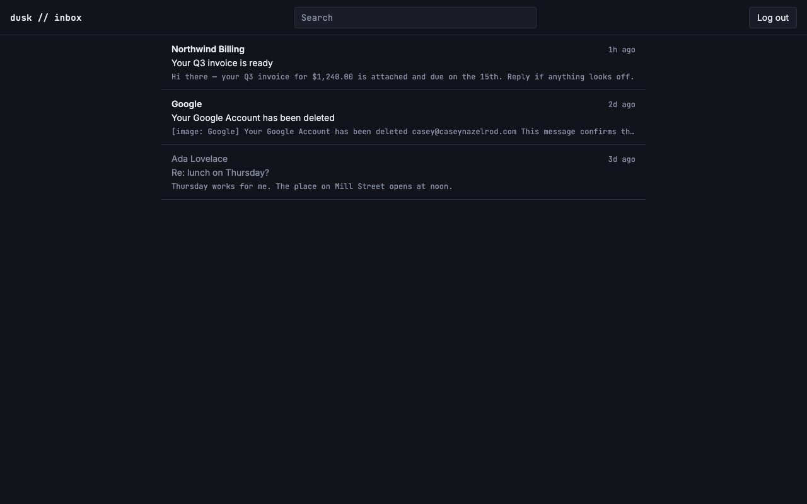

# US-F01: Load and render thread list

*2026-07-27T20:10:27Z by Showboat 0.6.1*
<!-- showboat-id: 3f2b8993-70a2-4839-87f0-7d989a8b2f3a -->

US-F01 renders the inbox thread list: `/inbox`'s server load pulls threads newest-activity-first, joined to each thread's latest non-deleted email for the preview (sender, subject, snippet, relative timestamp), and threads whose every member email is soft-deleted drop out of the list.

Three pieces:

- `src/lib/server/db/inbox.ts` — `listInboxThreads`, deliberately **one** query (FR-1: no per-row N+1). The preview columns come from a correlated subquery picking each thread's latest `is_deleted = 0` email; because that join is an INNER join it is also what implements the soft-delete exclusion, so "visible email" has one definition rather than a `NOT EXISTS` clause that could drift away from the preview's.
- `src/lib/inbox/format.ts` — `bodySnippet` / `senderLabel` / `relativeTime`, pure (no env, no db, no DOM) so both the server load and the Svelte components import them and a standalone `tsx` script can assert against them.
- `src/routes/(app)/inbox/` — the page load plus `ThreadRow.svelte`. Snippets are derived server-side so a large HTML body never crosses the wire just to render one preview line.

```bash
git diff --stat main...HEAD -- src/
```

```output
 src/lib/inbox/format.ts                        |  94 +++++++++
 src/lib/server/db/inbox.ts                     |  83 ++++++++
 src/lib/server/db/verify-inbox-list.mts        | 282 +++++++++++++++++++++++++
 src/routes/(app)/+layout.svelte                |  23 +-
 src/routes/(app)/inbox/+page.server.ts         |  28 +++
 src/routes/(app)/inbox/+page.svelte            |  44 +++-
 src/routes/(app)/inbox/ThreadRow.svelte        |  70 ++++++
 src/routes/(app)/inbox/[threadId]/+page.svelte |  20 ++
 8 files changed, 625 insertions(+), 19 deletions(-)
```

The one-query shape — the correlated subquery that both picks the preview email and excludes all-soft-deleted threads:

```bash
sed -n '46,80p' src/lib/server/db/inbox.ts
```

```output
): Promise<InboxThreadRow[]> {
	const limit = options.limit ?? INBOX_PAGE_SIZE;

	// `received_at` is the sort key, with `id` as a deterministic tie-breaker so
	// two emails carrying the identical header timestamp can't make the preview
	// flip between page loads.
	const latestVisibleEmailId = sql<string>`(
		select le.id from ${emails} le
		where le.thread_id = ${threads.id} and le.is_deleted = 0
		order by le.received_at desc, le.id desc
		limit 1
	)`;

	const rows = await db
		.select({
			threadId: threads.id,
			threadSubject: threads.subject,
			lastMessageAt: threads.lastMessageAt,
			isRead: threads.isRead,
			latestEmailId: emails.id,
			subject: emails.subject,
			fromEmail: emails.fromEmail,
			fromName: emails.fromName,
			bodyText: emails.bodyText,
			bodyHtml: emails.bodyHtml,
			receivedAt: emails.receivedAt,
			messageCount: sql<number>`(
				select count(*) from ${emails} ce
				where ce.thread_id = ${threads.id} and ce.is_deleted = 0
			)`
		})
		.from(threads)
		.innerJoin(emails, eq(emails.id, latestVisibleEmailId))
		.orderBy(desc(threads.lastMessageAt), desc(threads.id))
		.limit(limit);
```

34 checks: the pure helpers against fixtures, then `listInboxThreads` against the live Turso database. The DB half seeds four threads — one older, one newer, one whose only email is soft-deleted, and a three-message thread whose *newest* email is soft-deleted — and deletes every seeded row in the `finally` block. The load-bearing assertions are "excludes a thread whose only email is soft-deleted" and "previews the latest non-deleted email, not the newest deleted one".

```bash
node --env-file=.env node_modules/.bin/tsx src/lib/server/db/verify-inbox-list.mts
```

```output
bodySnippet
  ok   prefers the plain-text body
  ok   falls back to de-tagged HTML when there is no text body
  ok   treats a whitespace-only text body as absent
  ok   collapses runs of whitespace to single spaces
  ok   returns an empty string when there is nothing to preview
  ok   drops style/script content rather than previewing CSS
  ok   decodes the entities a reader would otherwise see literally
  ok   inserts a gap where a block element ended
  ok   truncates at the requested length with an ellipsis
  ok   does not truncate mid-word
  ok   leaves a body shorter than the limit untouched
senderLabel
  ok   prefers the display name
  ok   falls back to the address
  ok   treats a blank name as absent
relativeTime
  ok   under a minute reads as now
  ok   minutes
  ok   hours
  ok   days
  ok   older than a week falls back to an absolute date
  ok   a different year keeps the year
  ok   a future timestamp (clock skew) reads as now, never a negative duration
listInboxThreads — live DB
  ok   returns a row for each thread with a visible email
  ok   excludes a thread whose only email is soft-deleted
  ok   orders by last_message_at descending
  ok   previews the latest non-deleted email, not the newest deleted one
  ok   carries that email’s sender
  ok   counts only non-deleted emails in the thread
  ok   counts a single-email thread as one
  ok   carries the thread read state
  ok   carries the read state of a read thread
  ok   exposes lastMessageAt as a Date
  ok   an HTML-only body still yields a snippet
  ok   a nameless sender falls back to the address for display
  ok   honors the limit
34/34 checks passed
```

```bash
npm run check 2>&1 | sed -E "s/^[0-9]{10,}[[:space:]]//" | tail -3; npm run lint 2>&1 | tail -4
```

```output

START "/Users/bloodintern1/Desktop/Resend-Email-Inbox"
COMPLETED 1496 FILES 0 ERRORS 0 WARNINGS 0 FILES_WITH_PROBLEMS
> prettier --check . && eslint .

Checking formatting...
All matched files use Prettier code style!
```

Browser verification (rodney, dev server on :5199, real session minted through `POST /api/auth/verify-code` with a seeded code hash). Three seeded threads plus the one real received email already in the database; the third seeded thread's only email is soft-deleted.

Observed in the DOM:

- `ul > li` count: **3** — the soft-deleted-only thread is absent, and `document.body.innerText.includes('THIS ROW MUST NOT RENDER')` returned `false`.
- Row order top to bottom: `Northwind Billing / 1h ago`, `Google / 2d ago`, `Ada Lovelace / 3d ago` — `last_message_at` descending.
- Each row carries sender, subject, snippet and relative timestamp. The Google row's snippet is de-tagged from a real HTML-only body.
- Row hrefs resolve to `/inbox/<threadId>` (FR-4); clicking the first row navigated there.
- No console errors, and no error lines in the dev-server log.

Read threads (Ada Lovelace) render in the muted tone; unread ones in the primary tone at a heavier weight. Snippet and timestamp are monospace, sender and subject sans, dividers are 1px — per prd-ui-ux FR-2 and the feature PRD's Design Considerations.

```bash {image}

```



One deliberate structural change beyond the story's own files: the `(app)` shell's placeholder 360px thread-list column is gone. With the real list rendering, that column showed "Thread list — coming in a later story." *beside* the actual list. The list belongs to the inbox subtree rather than to every `(app)` route — a future `/contacts` page (US-I01) would otherwise inherit an inbox list beside it — so the list/detail split moves to `inbox/+layout.svelte` in US-G01, once there is a detail pane to sit beside. Until then the routed page gets the full width, capped and centered.
