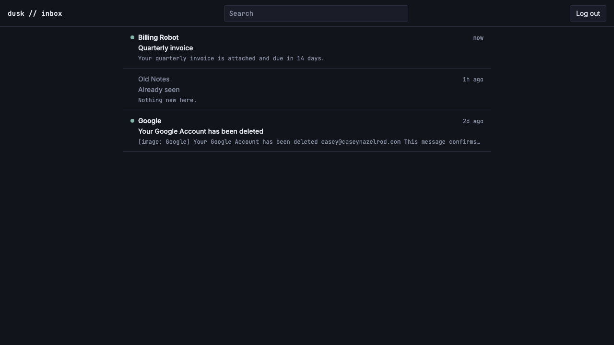
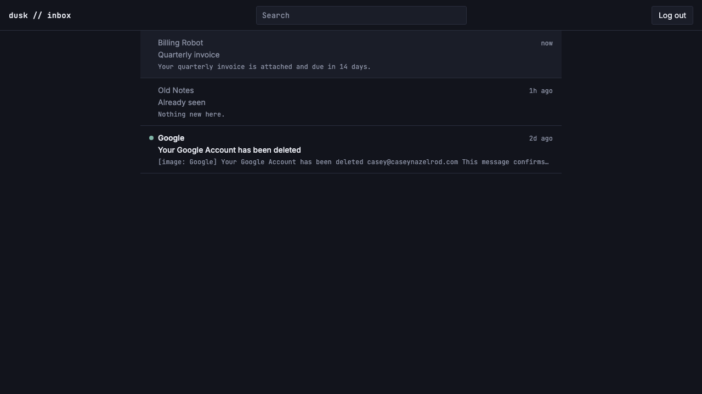

# Unread visual treatment

*2026-07-28T12:29:19Z by Showboat 0.6.1*
<!-- showboat-id: 3b159b3e-ff93-46e5-941c-a68ee2dc63e7 -->

US-F02 gives unread threads a visible identity and makes opening a thread the thing that clears it.

Three pieces:

- `markThreadRead` in `src/lib/server/db/emails.ts` — marks every email in the thread read, then **recomputes** `threads.is_read` from the emails inside one transaction. It never blindly sets the thread flag to true: `threads.is_read` means "every message in the thread is read", and an inbound message can land between the two statements, so a blind write would hide a message the owner never saw.
- `src/routes/(app)/inbox/[threadId]/+page.server.ts` — a real load beside the still-placeholder thread view (US-G01 replaces the view): 404 on an unknown thread id, otherwise mark read.
- `ThreadRow.svelte` — a sage accent dot (`bg-accent`, `#7fb4a6`) in a fixed-width gutter, sender at `font-semibold`/`text-text-primary` and subject at `font-medium` for unread rows, both muted for read ones.

```bash
git diff --stat main...HEAD -- src/
```

```output
 src/lib/server/db/emails.ts                       | 45 ++++++++++++
 src/lib/server/db/verify-inbox-list.mts           | 79 +++++++++++++++++++-
 src/routes/(app)/inbox/ThreadRow.svelte           | 90 +++++++++++++++--------
 src/routes/(app)/inbox/[threadId]/+page.server.ts | 30 ++++++++
 src/routes/(app)/inbox/[threadId]/+page.svelte    | 13 ++--
 5 files changed, 222 insertions(+), 35 deletions(-)
```

The recompute, and why it is a recompute:

```bash
sed -n '/Marks every email in a thread read/,/^}/p' src/lib/server/db/emails.ts
```

```output
 * Marks every email in a thread read and recomputes `threads.is_read`
 * (US-F02): opening a thread is what makes it read.
 *
 * Two properties worth keeping:
 *
 * - The thread flag is **recomputed** from the emails rather than assumed to be
 *   true. `threads.is_read` means "every message in the thread is read" (Data
 *   Model PRD), and an inbound message can land between the two statements —
 *   `touchThreadForNewMessage` would set the thread unread, and a blind
 *   `set({ isRead: true })` here would then hide a message the owner never saw.
 *   The `not exists` sees that row and leaves the thread unread.
 * - Soft-deleted emails are marked read too (they are messages of the thread),
 *   but only non-deleted ones count toward the thread flag — otherwise a
 *   deleted-but-unread email would pin the thread unread forever with no
 *   visible message explaining why. That matches `listInboxThreads`, where a
 *   soft-deleted email is not a visible message either.
 *
 * Both statements run in one transaction so a failure of the recompute can't
 * leave read emails under an unread thread (or the reverse).
 */
export async function markThreadRead(db: Database, threadId: string): Promise<void> {
	await db.transaction(async (tx) => {
		await tx
			.update(emails)
			.set({ isRead: true })
			.where(and(eq(emails.threadId, threadId), eq(emails.isRead, false)));

		await tx
			.update(threads)
			.set({
				isRead: sql`not exists (
					select 1 from ${emails} ue
					where ue.thread_id = ${threadId} and ue.is_read = 0 and ue.is_deleted = 0
				)`
			})
			.where(eq(threads.id, threadId));
	});
}
```

One non-obvious interaction: `src/app.html` sets `data-sveltekit-preload-data="hover"` app-wide, and this load has a side effect. With the default in place, moving the pointer across the list would preload each row's data — marking threads read the owner never opened. The rows opt down to `tap`:

```bash
grep -n -A3 'preload-data' 'src/routes/(app)/inbox/ThreadRow.svelte' | head -14
```

```output
38:	`preload-data="tap"` overrides the app-wide `hover` default from `app.html`
39-	on purpose: this link's load marks the thread read (US-F02), so preloading
40-	on hover would clear the unread state of every row the pointer crosses.
41--->
--
44:	data-sveltekit-preload-data="tap"
45-	class="flex gap-2 border-b border-border px-4 py-3 transition-colors duration-fast ease-standard hover:bg-surface focus-visible:bg-surface focus-visible:outline-none"
46->
47-	<!--
```

40 checks (34 from US-F01 plus 6 new): the pure helpers against fixtures, then `listInboxThreads` and `markThreadRead` against the live Turso database, with every seeded row deleted in the `finally` block. The new load-bearing assertions are "a soft-deleted unread email does not keep the thread unread" and the unknown-thread-id no-op (a deleted thread must not 500).

```bash
node --env-file=.env node_modules/.bin/tsx src/lib/server/db/verify-inbox-list.mts | tail -12
```

```output
  ok   exposes lastMessageAt as a Date
  ok   an HTML-only body still yields a snippet
  ok   a nameless sender falls back to the address for display
  ok   honors the limit
markThreadRead — live DB
  ok   marks every email in the thread read, soft-deleted ones included
  ok   recomputes the thread flag to read
  ok   a soft-deleted unread email does not keep the thread unread
  ok   marking read clears a thread whose newly arrived message is now read too
  ok   is a no-op for an unknown thread id
  ok   getThreadById misses on an unknown id
40/40 checks passed
```

```bash
npm run check 2>&1 | sed -E "s/^[0-9]{10,}[[:space:]]//" | tail -3; npm run lint 2>&1 | tail -4
```

```output

START "/Users/bloodintern1/Desktop/Resend-Email-Inbox"
COMPLETED 1498 FILES 0 ERRORS 0 WARNINGS 0 FILES_WITH_PROBLEMS
> prettier --check . && eslint .

Checking formatting...
All matched files use Prettier code style!
```

Browser verification (rodney, dev server on :5199, real session minted through `POST /api/auth/verify-code` with a seeded code hash — an httpOnly cookie can't be faked through `document.cookie`). Two seeded threads, one unread ("Billing Robot / Quarterly invoice") and one read ("Old Notes / Already seen"), plus the real received email already in the database.

Observed in the DOM:

- Unread row: has `span.bg-accent` (the dot), a `.font-semibold` sender, and the `sr-only` text "Unread." so the state isn't colour-only. Read row: no dot, muted tone.
- `data-sveltekit-preload-data` on the row anchor is `tap`.
- **Hovering the unread row and waiting, then reloading `/inbox`, left the dot in place** — the preload opt-out works.
- Clicking the row navigated to `/inbox/<threadId>`; navigating back re-ran the list load and the dot was gone, with the row now rendering in the muted tone.

```bash {image}

```



```bash {image}

```



The dot uses `rounded-[50%]`, not `rounded-full`: this app overrides the whole Tailwind radius namespace to 2-4px (`layout.css`, the "no pill shapes" design rule), so `rounded-full` renders a barely-rounded square. Its gutter keeps its 8px width on read rows too, so clearing a thread's unread state doesn't shift the row's text sideways.
