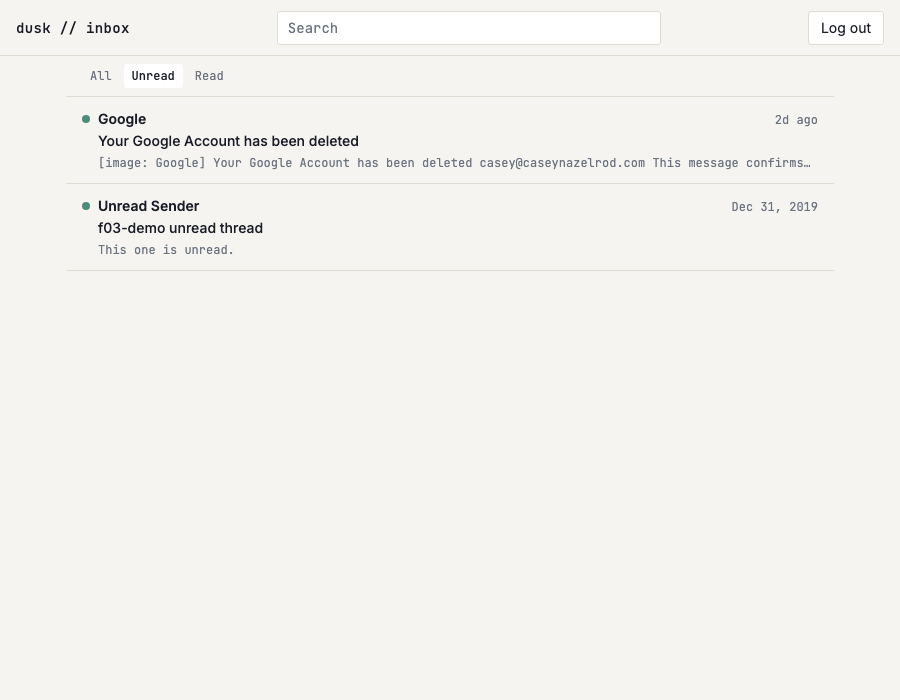

# US-F03: Read/unread filter

*2026-07-28T12:41:33Z by Showboat 0.6.1*
<!-- showboat-id: db7cd8b7-774e-47c8-abce-8a7da116d993 -->

The inbox list gains an All / Unread / Read control. The filter lives in the URL (`?filter=unread`) so it survives refresh and back-navigation, and the narrowing happens in `listInboxThreads` against `threads.is_read` — server-side, not by hiding rows the client already received.

## Quality checks

```bash
npm run check 2>&1 | grep -o "[0-9]* ERRORS [0-9]* WARNINGS"
```

```output
0 ERRORS 0 WARNINGS
```

```bash
npm run lint 2>&1 | tail -n 2
```

```output
Checking formatting...
All matched files use Prettier code style!
```

## Query + pure helpers

`verify-inbox-list.mts` grew the US-F03 cases: the `?filter=` parser (unknown values fall back to `all` rather than erroring), the query-string builder (which preserves US-F04's future `?q=`), and `listInboxThreads` under each filter against the live Turso DB.

```bash
node --env-file=.env node_modules/.bin/tsx src/lib/server/db/verify-inbox-list.mts 2>&1 | sed -n "/^parseInboxFilter/,/^listInboxThreads — live DB/p" | grep -v "live DB" ; node --env-file=.env node_modules/.bin/tsx src/lib/server/db/verify-inbox-list.mts 2>&1 | sed -n "/filter (US-F03)/,/filter=all/p;/checks passed/p"
```

```output
parseInboxFilter
  ok   accepts all
  ok   accepts unread
  ok   accepts read
  ok   defaults a missing param to all
  ok   defaults an unknown value to all rather than erroring
  ok   defaults an empty value to all
inboxFilterSearch
  ok   sets the param for a non-default filter
  ok   drops the param for the default filter
  ok   preserves other params when switching filter (FR-3)
  ok   preserves other params when clearing the filter
listInboxThreads — filter (US-F03)
  ok   filter=unread hides threads where is_read is true
  ok   filter=read hides unread threads, and still excludes the soft-deleted-only one
  ok   filter=all matches the unfiltered default
53/53 checks passed
```

## Browser verification

Two seeded threads — one read, one unread — plus a login code, so the assertions below don't depend on whatever real mail happens to be in the mailbox. Every row assertion filters to the `f03-demo` rows for the same reason (and because real rows carry relative timestamps that change between runs).

```bash
node --env-file=.env node_modules/.bin/tsx src/lib/server/db/seed-f03-demo.mts
```

```output
seeded
```

```bash
rodney --local start >/dev/null 2>&1 || true
rodney open http://localhost:5173/login >/dev/null
# The session cookie is httpOnly, so it has to come from the endpoint itself.
rodney js "fetch(\"/api/auth/verify-code\",{method:\"POST\",headers:{\"content-type\":\"application/json\"},body:JSON.stringify({code:\"123456\"})}).then(r=>r.status)"
```

```output
200
```

```bash
ROWS='Array.from(document.querySelectorAll("ul li")).map(li=>li.textContent.replace(/\s+/g," ").trim()).filter(t=>t.includes("f03-demo"))'
for f in "" "?filter=unread" "?filter=read"; do
  rodney open "http://localhost:5173/inbox$f" >/dev/null
  echo "--- /inbox$f  (active tab: $(rodney js "document.querySelector(\"nav a[aria-current]\").textContent.trim()"))"
  rodney js "$ROWS"
done
```

```output
--- /inbox  (active tab: All)
[
  "Unread. Unread Sender Dec 31, 2019 f03-demo unread thread This one is unread.",
  "Read Sender Dec 31, 2019 f03-demo read thread This one is read."
]
--- /inbox?filter=unread  (active tab: Unread)
[
  "Unread. Unread Sender Dec 31, 2019 f03-demo unread thread This one is unread."
]
--- /inbox?filter=read  (active tab: Read)
[
  "Read Sender Dec 31, 2019 f03-demo read thread This one is read."
]
```

```bash
active() { rodney js "document.querySelector(\"nav a[aria-current]\").textContent.trim()"; }
rodney open http://localhost:5173/inbox >/dev/null
rodney click "nav[aria-label=\"Filter threads\"] a:nth-of-type(2)" >/dev/null
rodney waitstable >/dev/null
echo "after clicking Unread:      $(rodney js location.search) / $(active)"
rodney reload >/dev/null
echo "after a full page reload:   $(rodney js location.search) / $(active)"
rodney back >/dev/null
rodney waitstable >/dev/null
echo "after browser back:         \"$(rodney js location.search)\" / $(active)"
rodney open "http://localhost:5173/inbox?filter=bogus" >/dev/null
echo "with a hand-edited value:   $(active)"
```

```output
after clicking Unread:      ?filter=unread / Unread
after a full page reload:   ?filter=unread / Unread
after browser back:         "" / All
with a hand-edited value:   All
```

```bash {image}

```



The seeded rows are removed again so they don't linger in the real mailbox.

```bash
node --env-file=.env node_modules/.bin/tsx src/lib/server/db/seed-f03-demo.mts --cleanup
```

```output
cleaned up
```
