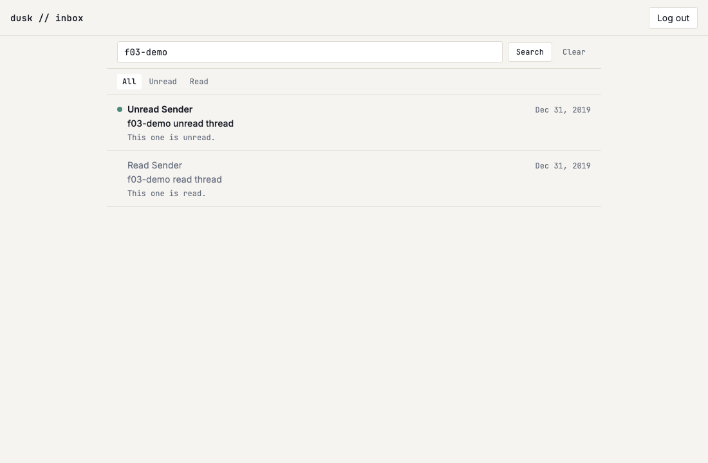

# US-F04: Subject/sender search

*2026-07-28T13:06:36Z by Showboat 0.6.1*
<!-- showboat-id: 9d68833c-add6-474b-8d24-21b20290b40d -->

The inbox list gains a search box: a case-insensitive substring match against the thread subject or any visible member email's sender name/address. The query lives in the URL (`?q=invoice`) alongside the read filter (FR-3), and the narrowing happens in `listInboxThreads`'s SQL — server-side (FR-2), inside the same single query as the rest of the list (FR-1).

## Quality checks

```bash
npm run check 2>&1 | grep -o "[0-9]* ERRORS [0-9]* WARNINGS"
```

```output
0 ERRORS 0 WARNINGS
```

```bash
npm run lint 2>&1 | tail -n 2
```

```output
Checking formatting...
All matched files use Prettier code style!
```

## Query + pure helpers

`verify-inbox-list.mts` grew the US-F04 cases: the `?q=` parser (whitespace-only is *no search*, never a `%%`-matches-everything one), the query-string builder (which keeps `?filter=` intact), the LIKE-pattern escaper, and `listInboxThreads` under search against the live Turso DB.

```bash
node --env-file=.env node_modules/.bin/tsx src/lib/server/db/verify-inbox-list.mts 2>&1 | sed -n "/^parseInboxQuery/,/^listInboxThreads — live DB/p" | grep -v "live DB"
```

```output
parseInboxQuery
  ok   keeps a plain query
  ok   trims surrounding whitespace
  ok   collapses internal whitespace
  ok   a missing param is no search
  ok   a whitespace-only param is no search, not a %% match
  ok   caps the length
inboxSearchSearch
  ok   sets the query param
  ok   preserves the filter when searching (FR-3)
  ok   clearing drops the param but keeps the filter
  ok   a whitespace-only query clears rather than searching for nothing
inboxSearchLikePattern
  ok   wraps in wildcards and lowercases
  ok   escapes a literal percent
  ok   escapes a literal underscore
  ok   escapes the escape character itself
```

```bash
node --env-file=.env node_modules/.bin/tsx src/lib/server/db/verify-inbox-list.mts 2>&1 | sed -n "/search (US-F04)/,/not a search/p;/checks passed/p"
```

```output
listInboxThreads — search (US-F04)
  ok   matches a subject substring
  ok   is case-insensitive
  ok   matches every seeded thread on the shared stamp, in list order
  ok   matches the sender address of a member email that is not the preview
  ok   matches a sender display name
  ok   ignores the sender of a soft-deleted email
  ok   a query with no hits returns nothing
  ok   a bare wildcard is matched literally, not as "everything"
  ok   search and filter narrow together (FR-3)
  ok   a whitespace-only query is not a search
77/77 checks passed
```

## Browser verification

Two seeded threads — one read, one unread, with distinct subjects and sender names — plus a login code, so the assertions don't depend on whatever real mail is in the mailbox. Every row assertion filters to the `f03-demo` rows (reused from US-F03's seeder). Assumes `npm run dev` on :5173.

```bash
node --env-file=.env node_modules/.bin/tsx src/lib/server/db/seed-f03-demo.mts
```

```output
seeded
```

```bash
rodney --local start >/dev/null 2>&1 || true
rodney open http://localhost:5173/login >/dev/null
# The session cookie is httpOnly, so it has to come from the endpoint itself.
rodney js "fetch(\"/api/auth/verify-code\",{method:\"POST\",headers:{\"content-type\":\"application/json\"},body:JSON.stringify({code:\"123456\"})}).then(r=>r.status)"
```

```output
200
```

```bash
ROWS='Array.from(document.querySelectorAll("ul li")).map(li=>li.textContent.replace(/\s+/g," ").trim()).filter(t=>t.includes("f03-demo"))'
for q in "" "?q=f03-demo" "?q=UNREAD+SENDER" "?q=f03-demo+read+thread" "?q=%25" "?q=f03-demo&filter=unread"; do
  echo "--- /inbox$q"
  rodney open "http://localhost:5173/inbox$q" >/dev/null
  rodney js "$ROWS"
done
```

```output
--- /inbox
[
  "Unread. Unread Sender Dec 31, 2019 f03-demo unread thread This one is unread.",
  "Read Sender Dec 31, 2019 f03-demo read thread This one is read."
]
--- /inbox?q=f03-demo
[
  "Unread. Unread Sender Dec 31, 2019 f03-demo unread thread This one is unread.",
  "Read Sender Dec 31, 2019 f03-demo read thread This one is read."
]
--- /inbox?q=UNREAD+SENDER
[
  "Unread. Unread Sender Dec 31, 2019 f03-demo unread thread This one is unread."
]
--- /inbox?q=f03-demo+read+thread
[
  "Read Sender Dec 31, 2019 f03-demo read thread This one is read."
]
--- /inbox?q=%25
[]
--- /inbox?q=f03-demo&filter=unread
[
  "Unread. Unread Sender Dec 31, 2019 f03-demo unread thread This one is unread."
]
```

`?q=%25` is a literal `%` — it matches nothing rather than every thread, which is the LIKE-escaping in `inboxSearchLikePattern` doing its job.

```bash
rodney open "http://localhost:5173/inbox?q=zzz-nothing" >/dev/null
echo "empty state: $(rodney js 'document.querySelector("main section > div").textContent.replace(/\s+/g," ").trim()')"
```

```output
empty state: No matching threads Nothing matches “zzz-nothing” in a subject or sender.
```

```bash
active() { rodney js "document.querySelector(\"nav a[aria-current]\").textContent.trim()"; }
rodney open "http://localhost:5173/inbox?filter=unread" >/dev/null
rodney input "#inbox-search" "unread sender" >/dev/null
rodney submit "form[role=search]" >/dev/null
rodney waitstable >/dev/null
echo "after submitting a query:   $(rodney js location.search) / $(active) / $(rodney js "document.querySelectorAll(\"ul li\").length") row(s)"
echo "the box keeps the query:    $(rodney js "document.querySelector(\"#inbox-search\").value")"
rodney click "form[role=search] a" >/dev/null
rodney waitstable >/dev/null
echo "after clicking Clear:       $(rodney js location.search) / $(active)"
rodney back >/dev/null
rodney waitstable >/dev/null
echo "after browser back:         $(rodney js location.search)"
rodney open "http://localhost:5173/inbox?q=f03-demo" >/dev/null
rodney click "nav[aria-label=\"Filter threads\"] a:nth-of-type(3)" >/dev/null
rodney waitstable >/dev/null
echo "switching filter keeps ?q=: $(rodney js location.search)"
```

```output
after submitting a query:   ?filter=unread&q=unread+sender / Unread / 1 row(s)
the box keeps the query:    unread sender
after clicking Clear:       ?filter=unread / Unread
after browser back:         ?filter=unread&q=unread+sender
switching filter keeps ?q=: ?q=f03-demo&filter=read
```

```bash {image}

```



The seeded rows are removed again so they don't linger in the real mailbox.

```bash
node --env-file=.env node_modules/.bin/tsx src/lib/server/db/seed-f03-demo.mts --cleanup
```

```output
cleaned up
```
