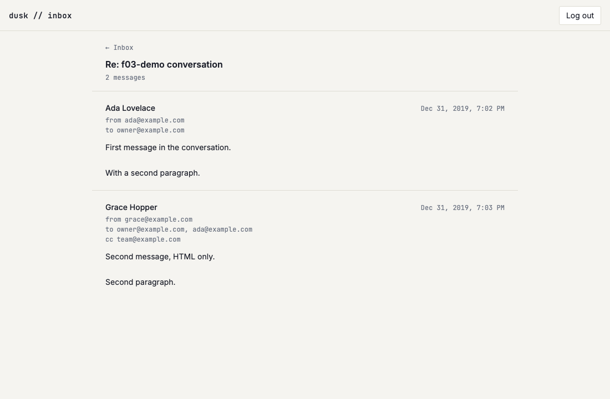

# US-G01: Load and render a full thread

*2026-07-28T13:20:57Z by Showboat 0.6.1*
<!-- showboat-id: e89cab65-65b5-4d57-8266-bdf6e8265928 -->

**US-G01 — Load and render a full thread.** `/inbox/[threadId]` now loads the thread and every one of its non-deleted messages ordered by `received_at` ascending, and renders sender, recipients (to/cc), timestamp and body for each. An unknown thread id — or a thread whose every message is soft-deleted — answers `404` and shows a scoped empty state with a way back to the list.

What this story adds:

- `listThreadEmails` in `src/lib/server/db/emails.ts` — visible messages, oldest first, `id` breaking a tie on the sender-supplied `received_at`.
- `bodyPlainText` / `htmlToPlainText` / `addressListLabel` / `absoluteTime` in `src/lib/inbox/format.ts` (still pure, still shared by the load, the components and this script).
- `src/routes/(app)/inbox/[threadId]/` — a real `+page.server.ts`, `+page.svelte`, `ThreadMessage.svelte` and a route-scoped `+error.svelte`, replacing US-F01's placeholder page.

Two deliberate scope calls, both recorded in the code:

- **HTML bodies render as de-tagged plain text for now.** The sandboxed `<iframe srcdoc>` and per-message remote-image opt-in are US-G02's acceptance criteria (FR-2/FR-3); nothing here uses `{@html}`.
- **The list/detail split is deferred.** US-F01/F02's notes expected this story to move the inbox list into an `inbox/+layout.svelte` column. A layout load runs *in parallel* with the page load it wraps, so a list rendered from the layout would show a snapshot taken before this page's `markThreadRead` committed — the row just opened would keep its unread dot. That ordering belongs with US-G04's mark-read-on-view criterion.

## Quality checks

```bash
npm run check 2>&1 | grep -E "COMPLETED" | sed "s/^[0-9]* //"
```

```output
COMPLETED 1505 FILES 0 ERRORS 0 WARNINGS 0 FILES_WITH_PROBLEMS
```

```bash
npm run lint 2>&1 | tail -n 2
```

```output
Checking formatting...
All matched files use Prettier code style!
```

## Query and pure helpers

`verify-inbox-list.mts` (the standing standalone check for the inbox, extended rather than duplicated) grew the US-G01 sections: the four new formatters on fixtures, and `listThreadEmails` against the live Turso DB. The seeded rows are deleted in its `finally`.

```bash
node --env-file=.env node_modules/.bin/tsx src/lib/server/db/verify-inbox-list.mts 2>&1 | sed -n "/htmlToPlainText/,/absoluteTime/p;/listThreadEmails/,/markThreadRead/p" | grep -v "^markThreadRead"
```

```output
htmlToPlainText / bodyPlainText
  ok   keeps a blank line between block elements
  ok   turns a <br> into a single newline
  ok   collapses indentation without collapsing the line structure
  ok   caps a run of empty blocks at one blank line
  ok   drops style/script content
  ok   decodes entities, and does not double-decode an escaped one
  ok   empty markup yields an empty string
  ok   bodyPlainText prefers the text body and keeps its line breaks
  ok   bodyPlainText falls back to de-tagged HTML
  ok   bodyPlainText treats a whitespace-only text body as absent
  ok   bodyPlainText with no body at all is empty
  ok   bodyPlainText normalizes CRLF in a text body
addressListLabel
  ok   joins addresses with commas
  ok   a null list renders no line
  ok   an empty list renders no line
  ok   a list of blanks renders no line
  ok   blank entries are dropped, not joined as gaps
absoluteTime
listThreadEmails — live DB
  ok   returns every visible message oldest first, excluding the soft-deleted one
  ok   is the ascending mirror of the list’s newest-first preview pick
  ok   carries the recipients the thread view renders
  ok   carries the cc list
  ok   renders no cc line for an email without one
  ok   a single-email thread returns just that email
  ok   a thread whose only email is soft-deleted has no visible message (the load 404s on this)
  ok   an unknown thread id yields no messages
```

```bash
node --env-file=.env node_modules/.bin/tsx src/lib/server/db/verify-inbox-list.mts 2>&1 | grep -E "^(  FAIL|[0-9]+/[0-9]+)"
```

```output
104/104 checks passed
```

## Browser verification

The US-F03 seeder now also seeds a three-message conversation — two visible messages (the second HTML-only, with two `to` recipients and a `cc`) plus a soft-deleted third that must not render — and a `123456` login code. It prints no row ids on purpose: the demo reaches the thread by searching the list and clicking the row, so nothing here depends on a generated UUID. Assumes `npm run dev` on :5173.

```bash
node --env-file=.env node_modules/.bin/tsx src/lib/server/db/seed-f03-demo.mts
```

```output
seeded
```

```bash
rodney --local start >/dev/null 2>&1 || true
rodney open http://localhost:5173/login >/dev/null
# The session cookie is httpOnly, so it has to come from the endpoint itself.
rodney js "fetch(\"/api/auth/verify-code\",{method:\"POST\",headers:{\"content-type\":\"application/json\"},body:JSON.stringify({code:\"123456\"})}).then(r=>r.status)"
```

```output
200
```

```bash
rodney open "http://localhost:5173/inbox?q=f03-demo+conversation" >/dev/null
rodney waitstable >/dev/null
rodney click "ul li a" >/dev/null
rodney waitstable >/dev/null
echo "on a thread URL: $(rodney js "location.pathname.startsWith(\"/inbox/\")")"
echo "articles rendered: $(rodney js "document.querySelectorAll(\"article\").length")"
echo "--- header"
rodney text "section > header"
echo "--- messages"
rodney text "section > div"
```

```output
on a thread URL: true
articles rendered: 2
--- header
← Inbox
Re: f03-demo conversation

2 messages
--- messages
Ada Lovelace
Dec 31, 2019, 7:02 PM
from
ada@example.com
to
owner@example.com

First message in the conversation.

With a second paragraph.

Grace Hopper
Dec 31, 2019, 7:03 PM
from
grace@example.com
to
owner@example.com, ada@example.com
cc
team@example.com

Second message, HTML only.

Second paragraph.
```

Oldest first (Ada before Grace), the soft-deleted third message absent from both the count and the render, `cc` shown only on the message that has one, and the header carrying the newest message's *own* subject ("Re: …") rather than `threads.subject`, which stores the normalized grouping key.

(The rendered timestamps and the seeded 2019 dates are in the running machine's timezone — this block reproduces on the machine that recorded it, like US-F03/F04's date assertions.)

```bash {image}

```



### A thread with no visible messages

Soft-deleting every message in the seeded conversation while the browser sits on it: a reload now 404s, because `listThreadEmails` returns nothing and the list drops the thread for the same reason. The two views agree about what exists.

```bash
rodney js "location.pathname.startsWith(\"/inbox/\")" >/dev/null
node --env-file=.env node_modules/.bin/tsx src/lib/server/db/seed-f03-demo.mts --hide-conversation
rodney reload >/dev/null
rodney waitstable >/dev/null
echo "articles rendered: $(rodney js "document.querySelectorAll(\"article\").length")"
rodney text "section"
echo "--- and the thread is gone from the list too"
rodney open "http://localhost:5173/inbox?q=f03-demo+conversation" >/dev/null
rodney waitstable >/dev/null
rodney js "document.querySelectorAll(\"ul li\").length"
```

```output
conversation hidden
articles rendered: 0
This thread isn’t here

It may have been deleted, or the link may be out of date.

← Back to inbox
--- and the thread is gone from the list too
0
```

### An unknown thread id

Same 404 boundary, and the `← Back to inbox` link is the one action it offers.

```bash
rodney open "http://localhost:5173/inbox/does-not-exist" >/dev/null
rodney waitstable >/dev/null
rodney text "section"
rodney click "section a" >/dev/null
rodney waitstable >/dev/null
echo "back on: $(rodney js "location.pathname")"
```

```output
This thread isn’t here

It may have been deleted, or the link may be out of date.

← Back to inbox
back on: /inbox
```

### Cleanup

The seeded rows and the login code go away again, so the demo leaves the live database as it found it.

```bash
node --env-file=.env node_modules/.bin/tsx src/lib/server/db/seed-f03-demo.mts --cleanup
```

```output
cleaned up
```
