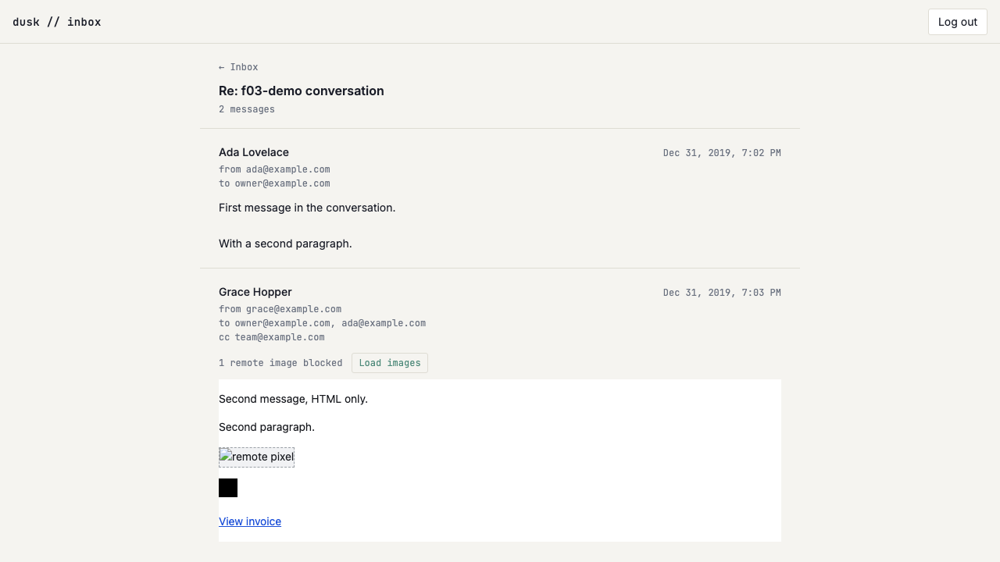

# US-G02: Sanitized HTML rendering with image opt-in

*2026-07-28T18:16:44Z by Showboat 0.6.1*
<!-- showboat-id: 136ff4fc-f012-48ec-9779-e4f861f4acd4 -->

**US-G02 — Sanitized HTML rendering with image opt-in.** An HTML email body now renders inside a sandboxed `<iframe srcdoc>` (`sandbox="allow-same-origin"`, never `allow-scripts`) sized to its content height. Every remote `` is moved aside on the server before the markup crosses the wire, so nothing in a stored body reaches a third party on open; a per-message **Load images** button puts them back for that one message. A message with only `body_text` renders as preformatted, wrapped plain text and mounts no iframe at all.

What this story adds:

- `src/lib/inbox/srcdoc.ts` — pure (no env/db/DOM/deps), shared by the load, the component and the verification script: `BLOCKED_IMAGE_ATTR`, `restoreBlockedImages`, `buildEmailSrcdoc`.
- `src/lib/server/inbox/html.ts` — `prepareEmailHtml`, the read-path pass that re-sanitizes a stored body and parks each remote image URL on `data-dt-blocked-src`, returning the blocked count.
- `src/routes/(app)/inbox/[threadId]/EmailHtmlBody.svelte` — the sandboxed frame, the toggle, content-height measurement, and link-click interception.
- `htmlHasVisibleContent` in `src/lib/inbox/format.ts`, and `SANITIZE_OPTIONS` exported from `src/lib/server/inbound/sanitize.ts` so the write path and this read path cannot sanitize under different rules.

Decisions worth keeping:

- **Blocking is a read-path decision, not a write-path one.** `emails.body_html` still holds the sender's image URLs — "Load images" has to be able to put them back — and FR-3 asks for an opt-in *per message*, which a stored-once-stripped body could not offer.
- **The image URL is parked on a `data-*` attribute** precisely because the sanitizer runs with `ALLOW_DATA_ATTR: false`. A sender who writes `data-dt-blocked-src` themselves has it stripped before ours is added, so the only values that can ever be restored are the ones we moved. A `javascript:` src is likewise gone before this pass sees the element, so parking can never restore a scheme DOMPurify refused.
- **The toggle is enforced twice**: the attribute swap, and the srcdoc's own CSP (`default-src 'none'`, `img-src data:` until the reader opts in). `data:` and `cid:` sources are never counted as blocked — a data URI is bytes already in the body, and a `cid:` reference reaches nobody.
- **No DOMPurify hooks.** The blocking pass walks the sanitized DOM fragment instead. Hooks live on the process-wide DOMPurify singleton and `removeHook` pops whichever hook is last rather than a named one, so a second hook registered anywhere in the process could have left this closure installed on the *write* path — quietly writing `data-dt-blocked-src` into stored bodies. Walking a fragment has no global state to get wrong.

Three things the sandbox does **not** give you for free. All three were found by review or by driving the real browser, and each is fixed here:

- **A sandbox without `allow-popups` does not make links inert.** A plain `<a href>` navigates the frame *itself*, which sandbox always permits — so a phishing link rendered the attacker's page inside this app's chrome, and the frame went cross-origin, silently killing the height measurement with it. The fix is declarative: the srcdoc carries `<base target="_blank">`, and opening a new context is exactly what the sandbox blocks, so the worst case is "nothing happens" even with no JS. The component's click handler is an upgrade on top, turning that into a real new tab.
- **`documentElement.scrollHeight` is floored at the frame's own viewport height**, so measuring it returns whatever height was last set: the frame could only ever grow, never shrink, and every short message was padded out to the initial guess. The content height comes from the **body** box instead.
- **A body's last bottom margin collapses through the body**, so `body.scrollHeight` alone stopped short of the final line and clipped it. The srcdoc stylesheet sets `display: flow-root` on the body to contain that margin — load-bearing for sizing, not cosmetic.
- **`<template>` content is invisible to `querySelectorAll`** (it lives in a separate fragment), so a remote image parked inside one was neither blocked nor counted. `template` is now in `FORBIDDEN_TAGS` — nothing in an email needs one, since it exists to be cloned by script and script is forbidden.

## Quality checks

```bash
npm run check 2>&1 | grep -E "COMPLETED" | sed "s/^[0-9]* //"
```

```output
COMPLETED 1508 FILES 0 ERRORS 0 WARNINGS 0 FILES_WITH_PROBLEMS
```

```bash
npm run lint 2>&1 | tail -n 2
```

```output
Checking formatting...
All matched files use Prettier code style!
```

## Pure helpers and the blocking pass

The standing standalone check (`verify-inbox-list.mts`) grew a US-G02 section rather than gaining a sibling script.

```bash
node --env-file=.env node_modules/.bin/tsx src/lib/server/db/verify-inbox-list.mts 2>&1 | sed -n "/^prepareEmailHtml/,/^listInboxThreads/p" | grep -v "^listInboxThreads"
```

```output
prepareEmailHtml
  ok   returns null for a null body
  ok   returns null for a blank body
  ok   returns null for a body that is entirely stripped
  ok   keeps prose markup
  ok   counts no blocked images when there are none
  ok   moves a remote image src onto the blocked attribute
  ok   leaves no src attribute behind
  ok   counts the blocked image
  ok   counts every blocked image
  ok   leaves a data: image loading
  ok   does not count a data: image as blocked
  ok   does not count a cid: image as blocked (nothing to load)
  ok   strips scripts
  ok   strips event handlers
  ok   strips nested iframes
  ok   a sender-supplied blocked-src attribute does not survive to be restored
  ok   drops remote media src outright
  ok   never parks a javascript: src
  ok   a meta refresh cannot survive to redirect the frame
htmlHasVisibleContent (which body the thread view renders)
  ok   is true for ordinary prose
  ok   is false for a preheader-plus-tracking-pixel body that renders blank
  ok   is false for markup with no text at all
  ok   is true for an image-only body whose image is not pixel-sized
  ok   is true for an image-only body that declares no dimensions at all
  ok   a spacer gif does not count as content
  ok   template content cannot hide a remote image from the blocking walk
buildEmailSrcdoc
  ok   is a full document
  ok   restricts img-src to data: while images are blocked
  ok   keeps the image blocked in the document body
  ok   forces every link into a new browsing context, which the sandbox then blocks
  ok   restores the src once images are loaded
  ok   opens img-src for remote schemes once images are loaded
  ok   restoreBlockedImages is a no-op on markup with nothing blocked
```

```bash
node --env-file=.env node_modules/.bin/tsx src/lib/server/db/verify-inbox-list.mts 2>&1 | grep -E "^(  FAIL|[0-9]+/[0-9]+)"
```

```output
137/137 checks passed
```

## Browser verification

The shared seeder's HTML-only message carries one remote image (blocked), one `data:` image (never blocked) and a link (for the containment check). Assumes `npm run dev` on :5173.

Each browser block below starts by closing any stray tab and selecting the app tab: a link click deliberately opens a new tab, and that tab takes focus.

```bash
node --env-file=.env node_modules/.bin/tsx src/lib/server/db/seed-f03-demo.mts
rodney --local start >/dev/null 2>&1 || true
rodney open http://localhost:5173/login >/dev/null
rodney waitstable >/dev/null
# The session cookie is httpOnly, so it has to come from the endpoint itself.
rodney js "fetch(\"/api/auth/verify-code\",{method:\"POST\",headers:{\"content-type\":\"application/json\"},body:JSON.stringify({code:\"123456\"})}).then(r=>r.status)"
```

```output
seeded
200
```

```bash
rodney open "http://localhost:5173/inbox?q=f03-demo+conversation" >/dev/null
rodney waitstable >/dev/null
rodney click "ul li a" >/dev/null
rodney waitstable >/dev/null
rodney sleep 1 >/dev/null
echo "messages rendered: $(rodney js "document.querySelectorAll(\"article\").length")"
echo "iframes (only the HTML message gets one): $(rodney js "document.querySelectorAll(\"iframe\").length")"
echo "pre blocks (only the text-only message): $(rodney js "document.querySelectorAll(\"pre\").length")"
echo "sandbox: $(rodney attr "iframe" sandbox)"
echo "allow-scripts in the sandbox list: $(rodney js "document.querySelector(\"iframe\").sandbox.contains(\"allow-scripts\")")"
echo "srcdoc CSP: $(rodney js "document.querySelector(\"iframe\").getAttribute(\"srcdoc\").match(/content=\"([^\"]*)\"/)[1]")"
echo "--- the toggle"
rodney text "article:nth-of-type(2) div div"
```

```output
messages rendered: 2
iframes (only the HTML message gets one): 1
pre blocks (only the text-only message): 1
sandbox: allow-same-origin
allow-scripts in the sandbox list: false
srcdoc CSP: default-src 'none'; img-src data:; style-src 'unsafe-inline'
--- the toggle
1 remote image blocked

Load images
```

Inside the frame, before opting in: the remote image has no `src` at all (its URL is parked, `naturalWidth` 0 — nothing was fetched), while the `data:` image loaded normally. The frame is sized to its content, and the last line is not clipped.

```bash
rodney js "JSON.stringify([...document.querySelector(\"iframe\").contentDocument.images].map(i=>({src:i.getAttribute(\"src\"),parked:i.getAttribute(\"data-dt-blocked-src\"),loadedWidth:i.naturalWidth})),null,1)"
# The measurement settles asynchronously (load + ResizeObserver), so give it a beat.
rodney sleep 2 >/dev/null
rodney js "(() => { const f=document.querySelector(\"iframe\"); const d=f.contentDocument; const last=d.body.lastElementChild.getBoundingClientRect(); return JSON.stringify({frameHeight:f.getBoundingClientRect().height, bodyContentHeight:d.body.scrollHeight, lastLineBottom:Math.round(last.bottom), lastLineClipped:last.bottom > f.getBoundingClientRect().height}); })()"
```

```output
[
 {
  "src": null,
  "parked": "https://example.com/tracker.gif",
  "loadedWidth": 0
 },
 {
  "src": "data:image/gif;base64,R0lGODlhAQABAIAAAAAAAP///yH5BAAAAAAALAAAAAABAAEAAAIBRAA7",
  "parked": null,
  "loadedWidth": 1
 }
]
{"frameHeight":208,"bodyContentHeight":208,"lastLineBottom":194,"lastLineClipped":false}
```

**Links cannot take the frame over.** The assertion below is the invariant that holds whether or not the click handler is attached: after clicking a link, the frame still shows the email rather than the remote page.

```bash
echo "srcdoc forces links into a new context: $(rodney js "document.querySelector(\"iframe\").getAttribute(\"srcdoc\").includes(\"<base target=\\\"_blank\\\">\")")"
rodney js "(()=>{const d=document.querySelector(\"iframe\").contentDocument; d.querySelector(\"a\").click(); return \"clicked \" + d.querySelector(\"a\").getAttribute(\"href\");})()"
rodney sleep 2 >/dev/null
# The click opens a new tab, which takes focus: re-select the app tab by URL.
APP=$(rodney pages | tr -d "*" | grep localhost | sed -E "s/.*\[([0-9]+)\].*/\1/" | head -1)
rodney page "$APP" >/dev/null
echo "frame still same-origin (never taken over): $(rodney js "document.querySelector(\"iframe\").contentDocument !== null")"
echo "frame still showing the email: $(rodney js "document.querySelector(\"iframe\").contentDocument.URL")"
```

```output
srcdoc forces links into a new context: true
clicked https://example.com/invoice
frame still same-origin (never taken over): true
frame still showing the email: about:srcdoc
```

Clicking **Load images** on that one message restores its `src`, opens the frame's own `img-src` policy, and retires the toggle. Nothing about any other message changes — there is no app-wide setting here. The frame is re-measured afterwards and *shrinks*, which is the behaviour a `documentElement.scrollHeight` measurement cannot produce.

```bash
# Drop the tab the link click opened, and reload the thread so the toggle is back
# in its default state.
for i in $(rodney pages | tr -d "*" | grep -v localhost | sed -E "s/.*\[([0-9]+)\].*/\1/"); do rodney closepage "$i" >/dev/null 2>&1 || true; done
APP=$(rodney pages | tr -d "*" | grep localhost | sed -E "s/.*\[([0-9]+)\].*/\1/" | head -1)
rodney page "$APP" >/dev/null
rodney open "http://localhost:5173/inbox?q=f03-demo+conversation" >/dev/null
rodney waitstable >/dev/null
rodney click "ul li a" >/dev/null
rodney waitstable >/dev/null
# Wait for hydration: until the frame has been measured its height is still the
# pre-measure guess, and its click handler is not attached yet.
for _ in $(seq 30); do
  H=$(rodney js "document.querySelector(\"iframe\").getBoundingClientRect().height")
  [ "$H" != "120" ] && break
  rodney sleep 0.5 >/dev/null
done
echo "--- before the toggle"
rodney js "JSON.stringify({toggleButtons:document.querySelectorAll(\"article button\").length, frameHeight:document.querySelector(\"iframe\").getBoundingClientRect().height})"
# Driven with a direct click: `rodney click` on this button waits for network idle,
# which the restored remote image request never reaches in this sandbox.
rodney js "document.querySelector(\"article:nth-of-type(2) button\").click()" >/dev/null
rodney sleep 2 >/dev/null
echo "--- after the toggle"
rodney js "JSON.stringify({csp:document.querySelector(\"iframe\").getAttribute(\"srcdoc\").match(/content=\"([^\"]*)\"/)[1], imgs:[...document.querySelector(\"iframe\").contentDocument.images].map(i=>i.getAttribute(\"src\")), toggleButtonsRemaining:document.querySelectorAll(\"article button\").length, frameHeight:document.querySelector(\"iframe\").getBoundingClientRect().height},null,1)"
echo "still sized to its content, and it shrank rather than only growing:"
rodney js "(() => { const f=document.querySelector(\"iframe\"); return f.getBoundingClientRect().height === f.contentDocument.body.scrollHeight && f.getBoundingClientRect().height < 208; })()"
```

```output
--- before the toggle
{"toggleButtons":1,"frameHeight":208}
--- after the toggle
{
 "csp": "default-src 'none'; img-src data: https: http:; style-src 'unsafe-inline'; upgrade-insecure-requests",
 "imgs": [
  "https://example.com/tracker.gif",
  "data:image/gif;base64,R0lGODlhAQABAIAAAAAAAP///yH5BAAAAAAALAAAAAABAAEAAAIBRAA7"
 ],
 "toggleButtonsRemaining": 0,
 "frameHeight": 204
}
still sized to its content, and it shrank rather than only growing:
true
```

### Choosing between a text part and an HTML part

The third acceptance criterion is about a message with *only* `body_text`, but the interesting cases have **both**, and they cut in opposite directions:

- HTML that is a hidden preheader plus a tracking pixel (common in transactional mail) sanitizes to non-empty markup that renders **blank**. Preferring it would hide the message behind an empty frame and a "1 remote image blocked" notice.
- HTML that is one hero image (a retail email) **is** the message, and its text part is a "View this email in your browser" stub. Demanding *text* would throw the real message away.

So `htmlHasVisibleContent` counts text *or* an image that does not declare itself pixel-sized. Both threads below come from the same seeder.

```bash
node --env-file=.env node_modules/.bin/tsx src/lib/server/db/seed-g02-pixel.mts
for q in "g02-pixel+pixel" "g02-pixel+hero"; do
  rodney open "http://localhost:5173/inbox?q=$q" >/dev/null
  rodney waitstable >/dev/null
  rodney click "ul li a" >/dev/null
  rodney waitstable >/dev/null
  rodney sleep 1 >/dev/null
  echo "== $q"
  echo "   iframes mounted: $(rodney js "document.querySelectorAll(\"iframe\").length")"
  echo "   pre blocks: $(rodney js "document.querySelectorAll(\"pre\").length")"
  echo "   Load images buttons: $(rodney js "document.querySelectorAll(\"article button\").length")"
  echo "   what the reader sees: $(rodney text "article" | tail -1)"
done
```

```output
seeded pixel thread
== g02-pixel+pixel
   iframes mounted: 0
   pre blocks: 1
   Load images buttons: 0
   what the reader sees: Your code is 480912.
== g02-pixel+hero
   iframes mounted: 1
   pre blocks: 0
   Load images buttons: 1
   what the reader sees: Load images
```

```bash {image}

```



### Cleanup

The seeded rows and the login code go away again, so the demo leaves the live database as it found it.

```bash
node --env-file=.env node_modules/.bin/tsx src/lib/server/db/seed-g02-pixel.mts --cleanup
node --env-file=.env node_modules/.bin/tsx src/lib/server/db/seed-f03-demo.mts --cleanup
```

```output
cleaned pixel thread
cleaned up
```
