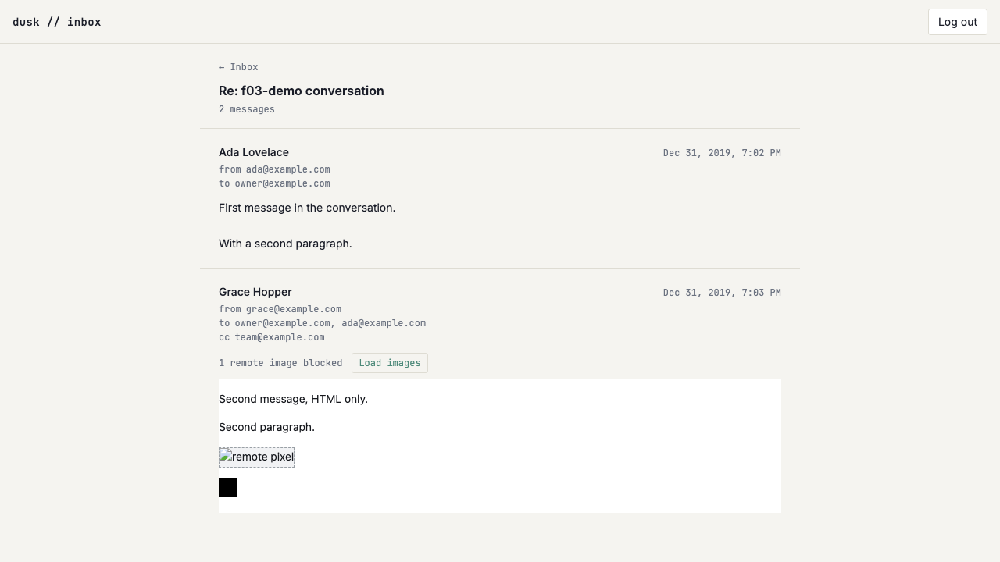

# US-G02: Sanitized HTML rendering with image opt-in

*2026-07-28T13:53:26Z by Showboat 0.6.1*
<!-- showboat-id: dcc935df-12f1-4be1-bc53-3be2a4a993cc -->

**US-G02 — Sanitized HTML rendering with image opt-in.** An HTML email body now renders inside a sandboxed `<iframe srcdoc>` (`sandbox="allow-same-origin"`, never `allow-scripts`) sized to its content height. Every remote `` is moved aside on the server before the markup crosses the wire, so nothing in a stored body reaches a third party on open; a per-message **Load images** button puts them back for that one message. A message with only `body_text` renders as preformatted, wrapped plain text and mounts no iframe at all.

What this story adds:

- `src/lib/inbox/srcdoc.ts` — pure (no env/db/DOM/deps), shared by the load, the component and the verification script: `BLOCKED_IMAGE_ATTR`, `restoreBlockedImages`, `buildEmailSrcdoc`.
- `src/lib/server/inbox/html.ts` — `prepareEmailHtml`, the read-path pass that re-sanitizes a stored body and parks each remote image URL on `data-dt-blocked-src`, returning the blocked count.
- `src/routes/(app)/inbox/[threadId]/EmailHtmlBody.svelte` — the sandboxed frame, the toggle, and the content-height measurement.
- `SANITIZE_OPTIONS` exported from `src/lib/server/inbound/sanitize.ts` so the write path and this read path cannot sanitize under different rules.

Four decisions worth keeping:

- **Blocking is a read-path decision, not a write-path one.** `emails.body_html` still holds the sender's image URLs — "Load images" has to be able to put them back — and FR-3 asks for an opt-in *per message*, which a stored-once-stripped body could not offer.
- **The image URL is parked on a `data-*` attribute** precisely because the sanitizer runs with `ALLOW_DATA_ATTR: false`. A sender who writes `data-dt-blocked-src` themselves has it stripped before our hook runs, so the only values that can ever be restored are the ones we moved.
- **The toggle is enforced twice**: the attribute swap, and the srcdoc's own CSP (`default-src 'none'`, `img-src data:` until the reader opts in). `data:` and `cid:` sources are never counted as blocked — a data URI is bytes already in the body, and a `cid:` reference reaches nobody.
- **`allow-same-origin` is present only so this side can read `contentDocument` to size the frame.** With scripting off inside the frame there is nothing in there that can use the shared origin. Links inside the frame are consequently inert (that would need `allow-popups`, which the story's sandbox list doesn't include) — a known limitation, recorded in the component.

## Quality checks

```bash
npm run check 2>&1 | grep -E "COMPLETED" | sed "s/^[0-9]* //"
```

```output
COMPLETED 1508 FILES 0 ERRORS 0 WARNINGS 0 FILES_WITH_PROBLEMS
```

```bash
npm run lint 2>&1 | tail -n 2
```

```output
Checking formatting...
All matched files use Prettier code style!
```

## Pure helpers and the blocking pass

The standing standalone check (`verify-inbox-list.mts`) grew a US-G02 section rather than gaining a sibling script: `prepareEmailHtml` on fixtures, and the document `buildEmailSrcdoc` produces in both states.

```bash
node --env-file=.env node_modules/.bin/tsx src/lib/server/db/verify-inbox-list.mts 2>&1 | sed -n "/^prepareEmailHtml/,/^listInboxThreads/p" | grep -v "^listInboxThreads"
```

```output
prepareEmailHtml
  ok   returns null for a null body
  ok   returns null for a blank body
  ok   returns null for a body that is entirely stripped
  ok   keeps prose markup
  ok   counts no blocked images when there are none
  ok   moves a remote image src onto the blocked attribute
  ok   leaves no src attribute behind
  ok   counts the blocked image
  ok   counts every blocked image
  ok   leaves a data: image loading
  ok   does not count a data: image as blocked
  ok   does not count a cid: image as blocked (nothing to load)
  ok   strips scripts
  ok   strips event handlers
  ok   strips nested iframes
  ok   a sender-supplied blocked-src attribute does not survive to be restored
  ok   drops remote media src outright
buildEmailSrcdoc
  ok   is a full document
  ok   restricts img-src to data: while images are blocked
  ok   keeps the image blocked in the document body
  ok   restores the src once images are loaded
  ok   opens img-src for remote schemes once images are loaded
  ok   restoreBlockedImages is a no-op on markup with nothing blocked
```

```bash
node --env-file=.env node_modules/.bin/tsx src/lib/server/db/verify-inbox-list.mts 2>&1 | grep -E "^(  FAIL|[0-9]+/[0-9]+)"
```

```output
127/127 checks passed
```

## Browser verification

The shared seeder's HTML-only message now carries one remote image (blocked) and one `data:` image (never blocked). Assumes `npm run dev` on :5173.

```bash
node --env-file=.env node_modules/.bin/tsx src/lib/server/db/seed-f03-demo.mts
rodney --local start >/dev/null 2>&1 || true
rodney open http://localhost:5173/login >/dev/null
rodney waitstable >/dev/null
# The session cookie is httpOnly, so it has to come from the endpoint itself.
rodney js "fetch(\"/api/auth/verify-code\",{method:\"POST\",headers:{\"content-type\":\"application/json\"},body:JSON.stringify({code:\"123456\"})}).then(r=>r.status)"
```

```output
seeded
200
```

```bash
rodney open "http://localhost:5173/inbox?q=f03-demo+conversation" >/dev/null
rodney waitstable >/dev/null
rodney click "ul li a" >/dev/null
rodney waitstable >/dev/null
echo "messages rendered: $(rodney js "document.querySelectorAll(\"article\").length")"
echo "iframes (only the HTML message gets one): $(rodney js "document.querySelectorAll(\"iframe\").length")"
echo "pre blocks (only the text-only message): $(rodney js "document.querySelectorAll(\"pre\").length")"
echo "sandbox: $(rodney attr "iframe" sandbox)"
echo "srcdoc CSP: $(rodney js "document.querySelector(\"iframe\").getAttribute(\"srcdoc\").match(/content=\"([^\"]*)\"/)[1]")"
echo "--- the toggle"
rodney text "article:nth-of-type(2) div div"
```

```output
messages rendered: 2
iframes (only the HTML message gets one): 1
pre blocks (only the text-only message): 1
sandbox: allow-same-origin
srcdoc CSP: default-src 'none'; img-src data:; style-src 'unsafe-inline'
--- the toggle
1 remote image blocked

Load images
```

Inside the frame, before opting in: the remote image has no `src` at all (its URL is parked, `naturalWidth` 0 — nothing was fetched), while the `data:` image loaded normally. The frame is also sized to its content rather than a fixed height.

```bash
rodney js "JSON.stringify([...document.querySelector(\"iframe\").contentDocument.images].map(i=>({src:i.getAttribute(\"src\"),parked:i.getAttribute(\"data-dt-blocked-src\"),loadedWidth:i.naturalWidth})),null,1)"
rodney sleep 1 >/dev/null
echo "frame height matches its content: $(rodney js "document.querySelector(\"iframe\").getBoundingClientRect().height === document.querySelector(\"iframe\").contentDocument.documentElement.scrollHeight")"
echo "allow-scripts in the sandbox list: $(rodney js "document.querySelector(\"iframe\").sandbox.contains(\"allow-scripts\")")"
```

```output
[
 {
  "src": null,
  "parked": "https://example.com/tracker.gif",
  "loadedWidth": 0
 },
 {
  "src": "data:image/gif;base64,R0lGODlhAQABAIAAAAAAAP///yH5BAAAAAAALAAAAAABAAEAAAIBRAA7",
  "parked": null,
  "loadedWidth": 1
 }
]
frame height matches its content: true
allow-scripts in the sandbox list: false
```

Clicking **Load images** on that one message restores its `src`, opens the frame's own `img-src` policy, and retires the toggle. Nothing about any other message changes — there is no app-wide setting here.

```bash
rodney click "article:nth-of-type(2) button" >/dev/null
rodney waitstable >/dev/null
echo "srcdoc CSP now: $(rodney js "document.querySelector(\"iframe\").getAttribute(\"srcdoc\").match(/content=\"([^\"]*)\"/)[1]")"
rodney js "JSON.stringify([...document.querySelector(\"iframe\").contentDocument.images].map(i=>i.getAttribute(\"src\")),null,1)"
echo "toggle buttons remaining: $(rodney js "document.querySelectorAll(\"article button\").length")"
```

```output
srcdoc CSP now: default-src 'none'; img-src data: https: http:; style-src 'unsafe-inline'
[
 "https://example.com/tracker.gif",
 "data:image/gif;base64,R0lGODlhAQABAIAAAAAAAP///yH5BAAAAAAALAAAAAABAAEAAAIBRAA7"
]
toggle buttons remaining: 0
```

```bash {image}

```



### Cleanup

The seeded rows and the login code go away again, so the demo leaves the live database as it found it.

```bash
node --env-file=.env node_modules/.bin/tsx src/lib/server/db/seed-f03-demo.mts --cleanup
```

```output
cleaned up
```
