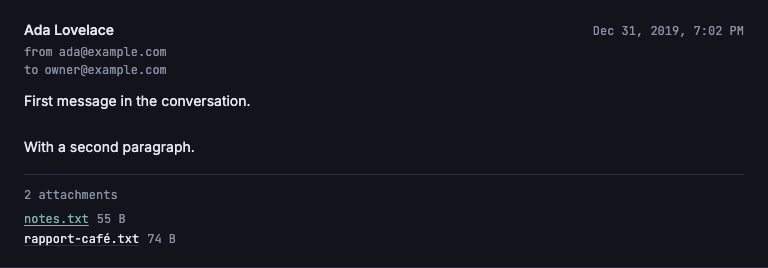

# US-G03: Attachment list and download

*2026-07-29T13:31:57Z by Showboat 0.6.1*
<!-- showboat-id: e6bdb100-c320-448d-8533-ae7a55286ec5 -->

Each message that carries attachments now lists them (filename + size) below its body, and each row is a link that downloads the file through a **presigned R2 URL minted per click**.

The R2 bucket is private and has no public URL, so a download needs a signature. The pieces:

- `listAttachmentsForEmails` fetches every rendered message's attachments in **one** query; the load groups them by email id. `r2_object_key` never leaves the server.
- `AttachmentList.svelte` renders filename + `formatFileSize(size_bytes)` and links at `GET /inbox/[threadId]/attachments/[attachmentId]`.
- That endpoint (`+server.ts`) checks the session **itself** — a layout load does not run for a `+server.ts` request, so `(app)/+layout.server.ts` does not protect it — resolves the attachment *scoped to its thread and to a non-deleted email*, presigns a 60-second GET with a signed `Content-Disposition`/`Content-Type`, and 302s the browser to R2. The bytes never pass through the function.

```bash
npm run check 2>&1 | grep -oE "[0-9]+ FILES [0-9]+ ERRORS [0-9]+ WARNINGS [0-9]+ FILES_WITH_PROBLEMS"
```

```output
1512 FILES 0 ERRORS 0 WARNINGS 0 FILES_WITH_PROBLEMS
```

```bash
npm run lint 2>&1 | tail -2
```

```output
Checking formatting...
All matched files use Prettier code style!
```

The shared verification script gained the new pure helpers (`formatFileSize`, `attachmentContentDisposition`, `downloadContentType`) and the two new queries against the live Turso DB — including the checks that a soft-deleted message's attachment and an attachment reached through the wrong thread id both come back `undefined`.

```bash
node --env-file=.env node_modules/.bin/tsx src/lib/server/db/verify-inbox-list.mts 2>&1 | awk "/^(formatFileSize|attachmentContentDisposition|downloadContentType|attachment queries)/{on=1} /^[a-zA-Z].*(—|\$)/{if (!/^(formatFileSize|attachmentContentDisposition|downloadContentType|attachment queries)/) on=0} on || /checks passed\$/"
```

```output
formatFileSize
  ok   renders whole bytes with no decimal
  ok   switches to KB at 1000 bytes (decimal units)
  ok   keeps one decimal place
  ok   trims a trailing .0
  ok   scales to MB
  ok   scales to GB
  ok   clamps at the largest unit rather than running off the array
  ok   renders a zero-byte attachment honestly
  ok   never renders NaN
  ok   never renders a negative size
  ok   never renders Infinity
attachmentContentDisposition
  ok   forces a download and emits both filename forms
  ok   is never inline, whatever the name
  ok   percent-encodes a non-ASCII name in filename*
  ok   falls back to an ASCII-only quoted filename for clients that ignore filename*
  ok   escapes a quote that would end the parameter
  ok   strips CR/LF from the quoted form
  ok   never yields an empty filename
downloadContentType
  ok   passes a plain type through
  ok   lowercases and trims
  ok   rejects a type carrying parameters
  ok   rejects a header-injecting type
  ok   rejects an empty type
attachment queries — live DB
  ok   returns a message’s attachments in insertion order
  ok   carries the R2 object key, not a URL
  ok   one query covers every email id it is handed
  ok   returns nothing for an empty id list
  ok   returns nothing for an email with no attachments
  ok   finds an attachment scoped to its own thread
  ok   exposes the object key the endpoint presigns
  ok   misses when the attachment belongs to another thread
  ok   misses when the attachment’s email is soft-deleted
  ok   misses on an unknown attachment id
196/196 checks passed
```

The end-to-end download, against a real dev server and the real R2 bucket. The seeder puts three tiny objects in the bucket and attaches two to the conversation's first message and one to its **soft-deleted** third — the last exists precisely to prove it stays unreachable. Row ids are looked up rather than pasted, and the presigned URL is reduced to its shape (host, `X-Amz-Expires`, signature present) because the signature and date change on every run.

```bash
set -e
PORT=5199
# Seed the demo rows + R2 objects, then a fresh login code.
node --env-file=.env node_modules/.bin/tsx src/lib/server/db/seed-f03-demo.mts > /dev/null
cat > src/lib/server/db/tmp-g03.mts <<'EOF'
import { createClient } from '@libsql/client';
import { drizzle } from 'drizzle-orm/libsql';
import { and, eq, like } from 'drizzle-orm';
import { attachments, authCodes, emails } from './schema.js';
import { hashAuthCode } from '../auth/auth-codes.js';
const db = drizzle(createClient({ url: process.env.TURSO_DATABASE_URL!, authToken: process.env.TURSO_AUTH_TOKEN! }));
await db.insert(authCodes).values({ codeHash: hashAuthCode('123456'), expiresAt: new Date(Date.now() + 600000) });
const rows = await db
	.select({ file: attachments.filename, id: attachments.id, threadId: emails.threadId, deleted: emails.isDeleted })
	.from(attachments)
	.innerJoin(emails, eq(attachments.emailId, emails.id))
	.where(like(attachments.r2ObjectKey, 'inbound/f03-demo/%'));
for (const r of rows) console.log(`${r.file}\t${r.id}\t${r.threadId}\t${r.deleted}`);
EOF
IDS=$(node --env-file=.env node_modules/.bin/tsx src/lib/server/db/tmp-g03.mts)
rm src/lib/server/db/tmp-g03.mts
THREAD=$(echo "$IDS" | grep '^notes.txt' | cut -f3)
OK=$(echo "$IDS" | grep '^notes.txt' | cut -f2)
GONE=$(echo "$IDS" | grep '^unreachable.txt' | cut -f2)

npm run dev -- --port $PORT --strictPort > /tmp/g03-dev.log 2>&1 &
DEV=$!
trap 'kill $DEV 2>/dev/null' EXIT
until curl -sf -o /dev/null "http://localhost:$PORT/login"; do sleep 1; done

echo "unauthenticated:            $(curl -s -o /dev/null -w '%{http_code}' "http://localhost:$PORT/inbox/$THREAD/attachments/$OK")"
curl -s -c /tmp/g03-jar.txt -X POST "http://localhost:$PORT/api/auth/verify-code" \
	-H 'content-type: application/json' -d '{"code":"123456"}' -o /dev/null
echo "signed in, endpoint answers: $(curl -s -b /tmp/g03-jar.txt -o /dev/null -w '%{http_code}' "http://localhost:$PORT/inbox/$THREAD/attachments/$OK")"
LOC=$(curl -s -b /tmp/g03-jar.txt -o /dev/null -w '%{redirect_url}' "http://localhost:$PORT/inbox/$THREAD/attachments/$OK")
echo "redirect host:              $(echo "$LOC" | sed -E 's#https://[^.]+\.[^.]+\.(r2\.cloudflarestorage\.com)/.*#\1#')"
echo "signed, short-lived:        $(echo "$LOC" | grep -o 'X-Amz-Expires=[0-9]*'), signature present: $(echo "$LOC" | grep -c 'X-Amz-Signature=')"
echo "R2 answers with:            $(curl -sL -b /tmp/g03-jar.txt -D - -o /tmp/g03-body.txt "http://localhost:$PORT/inbox/$THREAD/attachments/$OK" | grep -i '^content-disposition' | tr -d '\r')"
echo "bytes:                      $(cat /tmp/g03-body.txt)"
echo "soft-deleted message's file: $(curl -s -b /tmp/g03-jar.txt -o /dev/null -w '%{http_code}' "http://localhost:$PORT/inbox/$THREAD/attachments/$GONE")"
echo "attachment under the wrong thread: $(curl -s -b /tmp/g03-jar.txt -o /dev/null -w '%{http_code}' "http://localhost:$PORT/inbox/00000000-0000-4000-8000-000000000000/attachments/$OK")"
```

```output
unauthenticated:            401
signed in, endpoint answers: 302
redirect host:              r2.cloudflarestorage.com
signed, short-lived:        X-Amz-Expires=60, signature present: 1
R2 answers with:            Content-Disposition: attachment; filename="notes.txt"; filename*=UTF-8''notes.txt
bytes:                      Attachment one, downloaded through a presigned R2 URL.
soft-deleted message's file: 404
attachment under the wrong thread: 404
```

And in the browser (rodney against the same dev server), on the seeded three-message conversation: only the message that actually has files gets a list, the soft-deleted message's attachment is nowhere in the DOM, and a click downloads instead of navigating.

```bash
set -e
PORT=5198
node --env-file=.env node_modules/.bin/tsx src/lib/server/db/seed-f03-demo.mts > /dev/null
npm run dev -- --port $PORT --strictPort > /tmp/g03-dev2.log 2>&1 &
DEV=$!
trap 'kill $DEV 2>/dev/null' EXIT
until curl -sf -o /dev/null "http://localhost:$PORT/login"; do sleep 1; done

rodney --local start > /dev/null
rodney open "http://localhost:$PORT/login" > /dev/null
rodney waitstable > /dev/null
rodney js "fetch('/api/auth/verify-code',{method:'POST',headers:{'content-type':'application/json'},body:JSON.stringify({code:'123456'})}).then(r=>r.status)" > /dev/null
rodney open "http://localhost:$PORT/inbox?q=f03-demo+conversation" > /dev/null
rodney waitstable > /dev/null
rodney click 'a[href^="/inbox/"]' > /dev/null
rodney waitstable > /dev/null

echo "messages rendered:            $(rodney count article)"
SEL='section[aria-label="Attachments"]'
echo "attachment sections:          $(rodney count "$SEL")  (only the message that has files)"
echo "heading:                      $(rodney text "$SEL h4")"
echo "rows (filename + size):"
rodney js "Array.from(document.querySelectorAll('section[aria-label=Attachments] a')).map(a=>'  '+a.textContent.replace(/\s+/g,' ').trim()).join('\n')"
echo "the soft-deleted message's file is absent: $(rodney js "!document.body.textContent.includes('unreachable.txt')")"
echo "hrefs point at the download endpoint:      $(rodney js "Array.from(document.querySelectorAll('section[aria-label=Attachments] a')).every(a=>/^\/inbox\/[0-9a-f-]{36}\/attachments\/[0-9a-f-]{36}\$/.test(a.getAttribute('href')))")"
echo "forced out of the SPA router (data-sveltekit-reload): $(rodney js "document.querySelector('section[aria-label=Attachments] a').closest('[data-sveltekit-reload]')!==null")"
BEFORE=$(rodney url)
rodney click "$SEL a" > /dev/null
rodney sleep 2
echo "clicking a row downloads rather than navigating:      $([ "$BEFORE" = "$(rodney url)" ] && echo true || echo false)"
rodney screenshot-el 'article:first-of-type' docs/demos/us-g03-attachment-list.png > /dev/null
```

```output
messages rendered:            2
attachment sections:          1  (only the message that has files)
heading:                      2 attachments
rows (filename + size):
  notes.txt 55 B
  rapport-café.txt 74 B
the soft-deleted message's file is absent: true
hrefs point at the download endpoint:      true
forced out of the SPA router (data-sveltekit-reload): true
clicking a row downloads rather than navigating:      true
```

```bash {image}

```


