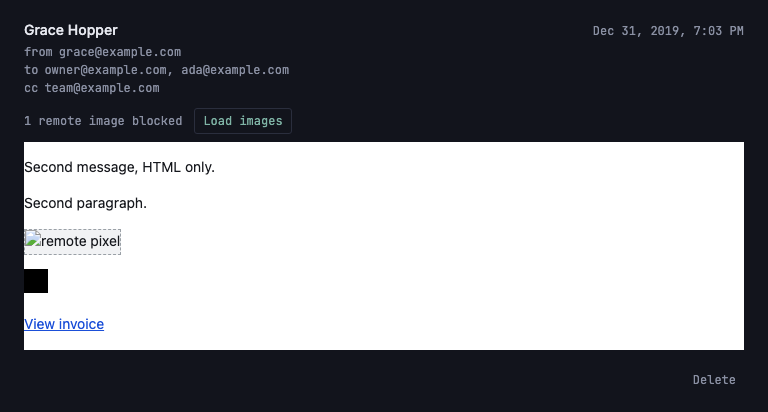

# Mark read on view, soft-delete a message

*2026-07-30T16:13:50Z by Showboat 0.6.1*
<!-- showboat-id: 5b851306-3d10-4a6b-8ec6-12fc10432a08 -->

**Story:** opening a thread marks it read, and an individual message can be soft-deleted; deleting the last visible message returns to `/inbox`.

Two of the three behaviours already had foundations: `markThreadRead` (US-F02) is called by the thread load, and `is_deleted` has been the definition of "visible message" since US-E03/G01. What this story adds is the delete itself — `softDeleteThreadEmail` in `src/lib/server/db/emails.ts`, a `deleteMessage` form action on `(app)/inbox/[threadId]/+page.server.ts`, and a per-message Delete button in `ThreadMessage.svelte`.

Three things are worth calling out, because they are the parts that are easy to get wrong:

- **The action validates the session itself.** SvelteKit runs a form action *before* any `load`, so `(app)/+layout.server.ts` — the group's choke point for rendering — would have let an anonymous POST delete the message and only *then* redirected to `/login`. Same trap as the attachment `+server.ts` in US-G03, same fix.
- **`threads.is_read` is recomputed on delete, not just on view.** Deleting a thread's only unread message has to leave the thread read, or the inbox shows an unread dot with no visible message behind it. `markThreadRead` and the delete now share one `recomputeThreadIsRead` helper so the two can't drift.
- **Both branches of the action redirect (303).** The form is deliberately not `use:enhance`d, so without a redirect the reader is left sitting on the action's own POST URL (`?/deleteMessage`) and a refresh re-submits it.

### Typecheck and lint

```bash
npm run check 2>&1 | sed -E "s/^[0-9]+ /<ts> /" | grep -v "^> "
```

```output


<ts> START "/Users/bloodintern1/Desktop/Resend-Email-Inbox"
<ts> COMPLETED 1512 FILES 0 ERRORS 0 WARNINGS 0 FILES_WITH_PROBLEMS
```

```bash
npm run lint 2>&1 | grep -v "^> " && echo "eslint: no findings"
```

```output


Checking formatting...
All matched files use Prettier code style!
eslint: no findings
```

### The query layer

`src/lib/server/db/verify-inbox-list.mts` is this area's standalone check (extended rather than replaced, per the repo's convention). Its new section covers `softDeleteThreadEmail` against the live Turso database: the soft delete itself, the thread-scoped `where` that stops one thread's URL from deleting another thread's message, idempotence on a re-submit, the `is_read` recompute, and the `visibleRemaining` count the action's redirect decision hangs on. Trimmed here to that section plus the total.

```bash
node --env-file=.env node_modules/.bin/tsx src/lib/server/db/verify-inbox-list.mts 2>&1 | awk "/^softDeleteThreadEmail/{on=1} on || /checks passed\$/"
```

```output
softDeleteThreadEmail — live DB
  ok   the thread under test starts with two visible messages
  ok   reports not-found for an unknown email id
  ok   reports not-found when the email belongs to another thread
  ok   a cross-thread attempt does not delete the email
  ok   deleting the unread message leaves the other two visible
  ok   recomputes the thread flag to read once the unread message is gone
  ok   soft delete sets is_deleted without destroying the row
  ok   the deleted message is gone from listThreadEmails
  ok   deleting an already-deleted message is idempotent
  ok   deleting one of two leaves one visible
  ok   deleting the last visible message reports none remaining
  ok   the emptied thread has no visible messages left
  ok   the emptied thread drops out of listInboxThreads
  ok   the thread row itself is not destroyed
211/211 checks passed
```

### In the browser

Against a real dev server, driving the seeded three-message conversation from `seed-f03-demo.mts` (two visible messages, one already soft-deleted at seed time, thread unread). Self-contained: it seeds, starts the server, signs in through the real `verify-code` endpoint so the browser applies the httpOnly session cookie, and removes its own rows on exit. The generated thread id is substituted out of the printed URLs so a re-run reproduces byte-for-byte. A throwaway probe reads the rows back straight from Turso, so "the message left the view but the row survived" is asserted against the database rather than against the DOM.

```bash
set -euo pipefail
PORT=5197
node --env-file=.env node_modules/.bin/tsx src/lib/server/db/seed-f03-demo.mts > /dev/null
npm run dev -- --port $PORT --strictPort > /tmp/g04-dev.log 2>&1 &
DEV=$!
trap 'kill $DEV 2>/dev/null; node --env-file=.env node_modules/.bin/tsx src/lib/server/db/seed-f03-demo.mts --cleanup > /dev/null; rm -f ./g04-probe.mts' EXIT
until curl -sf -o /dev/null "http://localhost:$PORT/login"; do sleep 1; done

# A throwaway probe that reads the rows back straight from Turso, so "the message
# left the view but the row is intact" is asserted against the database and not
# just against the DOM. Built here rather than checked in: it is one query.
cat > ./g04-probe.mts <<'PROBE'
import { createClient } from '@libsql/client';
const client = createClient({
	url: process.env.TURSO_DATABASE_URL!,
	authToken: process.env.TURSO_AUTH_TOKEN
});
const [what, id] = process.argv.slice(2);
if (what === 'thread') {
	const r = await client.execute({ sql: 'select is_read from threads where id = ?', args: [id] });
	console.log(`threads.is_read = ${r.rows[0].is_read}`);
} else {
	const r = await client.execute({
		sql: 'select is_deleted, subject, length(coalesce(body_html, body_text)) as bytes from emails where id = ?',
		args: [id]
	});
	const row = r.rows[0];
	console.log(`is_deleted=${row.is_deleted} subject=${JSON.stringify(row.subject)} body_bytes=${row.bytes}`);
}
client.close();
PROBE
probe() { node --env-file=.env node_modules/.bin/tsx ./g04-probe.mts "$1" "$2"; }

rodney --local start > /dev/null
rodney open "http://localhost:$PORT/login" > /dev/null
rodney waitstable > /dev/null
rodney js "fetch('/api/auth/verify-code',{method:'POST',headers:{'content-type':'application/json'},body:JSON.stringify({code:'123456'})}).then(r=>r.status)" > /dev/null

# --- AC 1: loading the thread page marks it read -------------------------------
ROW='a[href^="/inbox/"]'
rodney open "http://localhost:$PORT/inbox?q=f03-demo+conversation" > /dev/null
rodney waitstable > /dev/null
echo "list row before opening:  $(rodney text "$ROW" | tr -s ' \n' ' ')"
THREAD=$(rodney attr "$ROW" href)
TID=${THREAD##*/}
rodney click "$ROW" > /dev/null
rodney waitstable > /dev/null
echo "messages in the thread:   $(rodney count article)"
echo "delete affordances:       $(rodney js "Array.from(document.querySelectorAll('footer form button')).map(b=>b.getAttribute('aria-label')).join(' / ')")"
echo "each posts a message id:  $(rodney js "Array.from(document.querySelectorAll('footer form input[name=emailId]')).every(i=>/^[0-9a-f-]{36}\$/.test(i.value))")"
rodney screenshot-el 'article:last-of-type' docs/demos/us-g04-delete-affordance.png > /dev/null
rodney open "http://localhost:$PORT/inbox?q=f03-demo+conversation" > /dev/null
rodney waitstable > /dev/null
echo "list row after opening:   $(rodney text "$ROW" | tr -s ' \n' ' ')"
echo "in the database:          $(probe thread "$TID")"

# --- AC 2: deleting one message of several ------------------------------------
rodney open "http://localhost:$PORT$THREAD" > /dev/null
rodney waitstable > /dev/null
GONE=$(rodney attr 'article:last-of-type footer input[name=emailId]' value)
rodney click 'article:last-of-type footer button' > /dev/null
rodney waitstable > /dev/null
echo
echo "after deleting the newest of the two visible messages:"
echo "  url (no ?/action):      $(rodney url | sed "s#http://localhost:$PORT/inbox/$TID#/inbox/<thread>#")"
echo "  messages rendered:      $(rodney count article) ($(rodney text 'section > header p' | tr -s ' \n' ' '))"
echo "  senders left:           $(rodney js "Array.from(document.querySelectorAll('article h3')).map(h=>h.textContent).join(', ')")"
echo "  the row is not gone:    $(probe email "$GONE")"

# --- AC 3: deleting the last visible message returns to /inbox ----------------
rodney click 'article:last-of-type footer button' > /dev/null
rodney waitstable > /dev/null
echo
echo "after deleting the last visible message:"
echo "  redirected to:          $(rodney url | sed "s#http://localhost:$PORT##")"
echo "  thread gone from list:  $(rodney js "!document.body.innerHTML.includes('$TID')")"
rodney open "http://localhost:$PORT$THREAD" > /dev/null
rodney waitstable > /dev/null
echo "  visiting it directly:   $(rodney text 'main' | tr -s ' \n' ' ')"
```

```output
list row before opening:  Unread. Grace Hopper 2 Dec 31, 2019 Re: f03-demo conversation Second message, HTML only. Second paragraph. View invoice 
messages in the thread:   2
delete affordances:       Delete message from Ada Lovelace / Delete message from Grace Hopper
each posts a message id:  true
list row after opening:   Grace Hopper 2 Dec 31, 2019 Re: f03-demo conversation Second message, HTML only. Second paragraph. View invoice 
in the database:          threads.is_read = 1

after deleting the newest of the two visible messages:
  url (no ?/action):      /inbox/<thread>
  messages rendered:      1 (1 message )
  senders left:           Ada Lovelace
  the row is not gone:    is_deleted=1 subject="Re: f03-demo conversation" body_bytes=348

after deleting the last visible message:
  redirected to:          /inbox
  thread gone from list:  true
  visiting it directly:   This thread isn’t here It may have been deleted, or the link may be out of date. ← Back to inbox 
```

The affordance itself — below the body and the attachments, in the metadata face, muted until hovered or focused:

```bash {image}

```



### Acceptance criteria

- [x] **Loading the thread page marks all its emails `is_read = true` if not already, and recomputes `threads.is_read`** — the list row loses its `Unread.` marker after the thread is opened, and `threads.is_read = 1` in the database. The load calls `markThreadRead`, which now shares its recompute with the delete path.
- [x] **A delete action on an individual message sets `is_deleted = true`; the message disappears from the thread view but is not destroyed** — the thread drops from 2 messages to 1 while the row reads back `is_deleted=1` with its subject and its 348-byte body intact.
- [x] **Deleting the last visible message in a thread returns the user to `/inbox`** — a 303 to `/inbox`, the thread gone from the list, and a direct visit answering the route's own 404 boundary.
- [x] **Typecheck passes** — `npm run check`, 0 errors (and `npm run lint` clean).
- [x] **Verify in browser using dev-browser skill** — the run above (rodney against `npm run dev`).

Nothing was left as an outstanding manual step.
