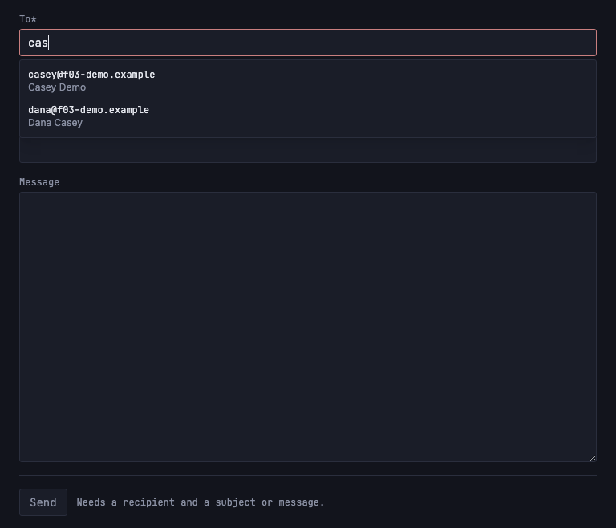

# Compose new email UI

*2026-07-30T18:08:08Z by Showboat 0.6.1*
<!-- showboat-id: a22cb44e-ae65-429b-a2a1-e3aed6f7cd0c -->

**Story:** `/compose` is a real compose screen — To with contact autocomplete, a collapsible Cc, Subject, a plain-text body, and a Send button that stays unavailable until the draft is actually sendable.

Nothing is sent: delivery is US-H02. What lands here is the screen, the validation rule, and the shape US-H02 fills in.

Three decisions worth stating, because they are the ones a later story could undo by accident:

- **The validation rule lives in one pure module**, `src/lib/compose/addresses.ts`. The browser gates the Send button with `validateComposeDraft`, and the `send` action re-checks the submitted form with the *same* function — so a submit that bypasses the disabled button (curl, a stale tab, JavaScript off) is rejected by the same rule the UI showed, not by a second one that can drift.
- **The recipient field is one plain `<input name="to">` holding a comma-separated list**, not a chip widget over a hidden mirror. The value that submits is the value the owner can see and edit, and the suggestion popup is purely additive on top of a field that works without it.
- **The action validates the session itself.** It mutates nothing today, but SvelteKit runs an action *before* any `load`, so `(app)/+layout.server.ts` cannot protect it — and US-H02 turns this body into a real send. Building the check in now means that story cannot forget it (same trap as US-G03's endpoint and US-G04's delete).

Every failure path echoes the draft back to the page, which is US-H02's FR-4 ("a send failure must never drop composed content") arriving early: it is much cheaper to build the form around a returned draft now than to retrofit it around a failed API call later.

### Typecheck and lint

```bash
npm run check 2>&1 | sed -E "s/^[0-9]+ /<ts> /" | grep -v "^> "
```

```output


<ts> START "/Users/bloodintern1/Desktop/Resend-Email-Inbox"
<ts> COMPLETED 1518 FILES 0 ERRORS 0 WARNINGS 0 FILES_WITH_PROBLEMS
```

```bash
npm run lint 2>&1 | grep -v "^> " && echo "eslint: no findings"
```

```output


Checking formatting...
All matched files use Prettier code style!
eslint: no findings
```

### The validation rule, on its own

`src/lib/compose/verify-compose-addresses.mts` is this area's standalone check — no db, no env, no browser, because the module has none of those either. It pins down what counts as an address, how a recipient list is parsed, exactly when a draft becomes sendable, and how the autocomplete narrows and ranks.

```bash
npx tsx src/lib/compose/verify-compose-addresses.mts
```

```output
isValidAddress
  ok   accepts "a@b.co"
  ok   accepts "casey@caseynazelrod.com"
  ok   accepts "first.last+tag@sub.example.co.uk"
  ok   accepts "  padded@example.com  "
  ok   rejects ""
  ok   rejects "nope"
  ok   rejects "no@domain"
  ok   rejects "no@domain."
  ok   rejects "@example.com"
  ok   rejects "a b@example.com"
  ok   rejects "two@@example.com"
  ok   rejects "trailing@-example.com"
  ok   rejects "a@example.c"
parseAddressList
  ok   single address, lowercased
  ok   comma and semicolon both separate
  ok   display-name form is unwrapped
  ok   duplicates collapse case-insensitively
  ok   a trailing separator is not an error
  ok   empty field yields nothing at all
  ok   bad entries are reported, good ones still parsed
  ok   order of first appearance is preserved
validateComposeDraft
  ok   an empty draft is not sendable
  ok   recipient + subject is sendable
  ok   recipient + body only is sendable
  ok   a body of only whitespace is no body
  ok   content without a recipient is not sendable
  ok   a malformed To blocks send and names the offender
  ok   an empty Cc is fine (Cc is optional)
  ok   a malformed Cc blocks send
activeEntry
  ok   caret at the end targets the last entry
  ok   caret inside an earlier entry targets that one
  ok   an out-of-range caret is clamped, not thrown
replaceActiveEntry
  ok   replaces the fragment being typed and appends a separator
  ok   earlier addresses survive, with exactly one separator between
  ok   text after the caret is kept
suggestContacts
  ok   an empty fragment suggests nothing
  ok   address prefix outranks a mid-string name hit
  ok   a name-only match is still found
  ok   matching is case-insensitive
  ok   addresses already in the field are not re-offered
  ok   the suggestion list is capped

41/41 checks passed
```

### In the browser

Against a real dev server, with the contacts `seed-f03-demo.mts` now seeds for this story (three on a throwaway domain: two whose names share a fragment, one with no name at all). Self-contained: it seeds, starts the server, signs in through the real `verify-code` endpoint so the browser applies the httpOnly session cookie, and removes its own rows on exit.

```bash
set -euo pipefail
PORT=5196
node --env-file=.env node_modules/.bin/tsx src/lib/server/db/seed-f03-demo.mts > /dev/null
npm run dev -- --port $PORT --strictPort > /tmp/h01-dev.log 2>&1 &
DEV=$!
trap 'kill $DEV 2>/dev/null; node --env-file=.env node_modules/.bin/tsx src/lib/server/db/seed-f03-demo.mts --cleanup > /dev/null' EXIT
until curl -sf -o /dev/null "http://localhost:$PORT/login"; do sleep 1; done

rodney --local start > /dev/null
rodney open "http://localhost:$PORT/login" > /dev/null
rodney waitstable > /dev/null
rodney js "fetch('/api/auth/verify-code',{method:'POST',headers:{'content-type':'application/json'},body:JSON.stringify({code:'123456'})}).then(r=>r.status)" > /dev/null

SEND='#compose-form button[type=submit]'
compose() { rodney open "http://localhost:$PORT/compose" > /dev/null; rodney waitstable > /dev/null; }
sendable() { rodney js "!document.querySelector('$SEND').disabled"; }

# --- AC 1: the fields, and Cc collapsed by default ----------------------------
compose
echo "reached from the shell:   $(rodney js "document.querySelector('header a[href=\"/compose\"]').textContent")"
echo "fields:                   $(rodney js "Array.from(document.querySelectorAll('#compose-form label')).map(l=>l.textContent.trim()).join(' / ')")"
echo "body is a plain textarea: $(rodney js "document.querySelector('#body').tagName")"
echo "Cc collapsed:             $(rodney js "document.querySelector('#cc') === null") (toggle: $(rodney text '#cc-toggle'))"
rodney click '#cc-toggle' > /dev/null
echo "Cc after clicking + Cc:   $(rodney js "!!document.querySelector('#cc')")"

# --- AC 2: autocomplete over the seeded contacts -------------------------------
compose
rodney input '#to' 'cas' > /dev/null
echo
echo "typing \"cas\" offers:"
rodney js "Array.from(document.querySelectorAll('[role=option]')).map(o=>'  '+o.textContent.trim().replace(/\s+/g,' ')).join('\n')"
echo "  (address-prefix match first, then the name match; the third contact matches neither)"
# The compose form specifically — the shell's logout form is the first `form`
# in the document.
rodney screenshot-el '#compose-form' docs/demos/us-h01-autocomplete.png > /dev/null
rodney click '[role=option]' > /dev/null
echo "clicking the first one:   $(rodney js "JSON.stringify(document.querySelector('#to').value)")"
rodney clear '#to' > /dev/null
rodney input '#to' 'dan' > /dev/null
rodney js "(()=>{const i=document.querySelector('#to');i.dispatchEvent(new KeyboardEvent('keydown',{key:'ArrowDown',bubbles:true}));return null})()" > /dev/null
echo "highlighted by ArrowDown: $(rodney js "document.querySelector('[role=option][aria-selected=true]').firstElementChild.textContent")"
rodney js "(()=>{const i=document.querySelector('#to');i.dispatchEvent(new KeyboardEvent('keydown',{key:'Enter',bubbles:true}));return null})()" > /dev/null
echo "Enter takes it:           $(rodney js "JSON.stringify(document.querySelector('#to').value)")"
rodney clear '#to' > /dev/null
rodney input '#to' 'someone@elsewhere.test' > /dev/null
rodney input '#subject' 'Hi' > /dev/null
echo "an address typed by hand, matching no contact, is accepted too:"
echo "  field:                  $(rodney js "JSON.stringify(document.querySelector('#to').value)")"
echo "  suggestions open:       $(rodney count '[role=option]')"
echo "  sendable:               $(sendable)"

# --- AC 3/4: the send gate -----------------------------------------------------
compose
echo
echo "send gate:"
echo "  empty form:             $(sendable)"
rodney input '#to' 'casey@f03-demo.example' > /dev/null
echo "  recipient only:         $(sendable)  ($(rodney text '#compose-form > div:last-of-type p'))"
rodney input '#body' 'No subject, but a body.' > /dev/null
echo "  recipient + body:       $(sendable)"
rodney clear '#body' > /dev/null
rodney input '#subject' 'Subject, no body' > /dev/null
echo "  recipient + subject:    $(sendable)"
rodney clear '#to' > /dev/null
rodney input '#to' 'not-an-address' > /dev/null
echo "  malformed recipient:    $(sendable)  ($(rodney text '#to-error'))"
rodney clear '#to' > /dev/null
rodney input '#to' 'casey@f03-demo.example' > /dev/null
# Focus moves off the To field first: its suggestion popup is absolutely
# positioned over the + Cc button, and a real user's click would land on the
# suggestion, not the toggle. Leaving the field closes the popup.
rodney focus '#subject' > /dev/null
rodney click '#cc-toggle' > /dev/null
rodney input '#cc' 'oops' > /dev/null
echo "  malformed Cc:           $(sendable)  ($(rodney text '#cc-error'))"

# --- The same rule on the server, for a submit that never saw the button ------
echo
echo "the action re-checks it, so bypassing the disabled button changes nothing:"
POST="fetch('/compose?/send',{method:'POST',headers:{'x-sveltekit-action':'true'},body:new URLSearchParams({to:'oops'})}).then(r=>r.json())"
VERDICT=$(rodney js "$POST.then(r=>r.type+' '+r.status)")
ECHOED=$(rodney js "$POST.then(r=>JSON.parse(r.data)[2])")
echo "  invalid draft:          $VERDICT"
echo "  and it echoes it back:  $ECHOED"
echo "  no cookie at all:       $(curl -s -X POST "http://localhost:$PORT/compose?/send" -H 'x-sveltekit-action: true' --data 'to=casey@f03-demo.example&subject=hi' | sed -E 's/.*"status":([0-9]+).*Not authenticated.*/failure \1, Not authenticated./')"

# --- A valid submit: accepted, nothing sent, nothing lost ----------------------
compose
rodney input '#to' 'casey@f03-demo.example' > /dev/null
rodney input '#subject' 'Kickoff' > /dev/null
rodney input '#body' 'First outbound draft.' > /dev/null
rodney click "$SEND" > /dev/null
rodney waitstable > /dev/null
echo
echo "submitting a valid draft (a plain POST, no client-side enhancement):"
echo "  the page reports:       $(rodney text '[role=status]')"
echo "  input survived:         $(rodney js "['#to','#subject','#body'].map(s=>JSON.stringify(document.querySelector(s).value)).join(' ')")"
```

```output
reached from the shell:   Compose
fields:                   To* / Subject / Message
body is a plain textarea: TEXTAREA
Cc collapsed:             true (toggle: + Cc)
Cc after clicking + Cc:   true

typing "cas" offers:
  casey@f03-demo.example Casey Demo
  dana@f03-demo.example Dana Casey
  (address-prefix match first, then the name match; the third contact matches neither)
clicking the first one:   "casey@f03-demo.example, "
highlighted by ArrowDown: dana@f03-demo.example
Enter takes it:           "dana@f03-demo.example, "
an address typed by hand, matching no contact, is accepted too:
  field:                  "someone@elsewhere.test"
  suggestions open:       0
  sendable:               true

send gate:
  empty form:             false
  recipient only:         false  (Needs a recipient and a subject or message.)
  recipient + body:       true
  recipient + subject:    true
  malformed recipient:    false  (Not a valid address: not-an-address)
  malformed Cc:           false  (Not a valid address: oops)

the action re-checks it, so bypassing the disabled button changes nothing:
  invalid draft:          failure 400
  and it echoes it back:  oops
  no cookie at all:       failure 401, Not authenticated.

submitting a valid draft (a plain POST, no client-side enhancement):
  the page reports:       Draft accepted — sending is not wired up yet (US-H02).
  input survived:         "casey@f03-demo.example" "Kickoff" "First outbound draft."
```

The field mid-suggestion. The popup is themed to the app's own surface (a `<datalist>` could not be), addresses are in the metadata face, and the display name sits under the address it belongs to — the thing you remember is the thing you can search by:

```bash {image}

```



### Acceptance criteria

- [x] **`/compose` renders To, Cc (optional, collapsible), Subject, and body fields** — `To* / Subject / Message` render immediately, with Cc behind a `+ Cc` toggle. Collapsed means *not rendered*, so the form submits no `cc` field at all rather than a hidden one holding something stale.
- [x] **To supports typing an address directly or selecting from existing contacts (autocomplete)** — typing `cas` offers both matching contacts (address-prefix match ranked ahead of the name match), and either a click or ArrowDown+Enter inserts it followed by a separator, ready for the next recipient. A hand-typed address matching no contact is accepted and sendable.
- [x] **The body supports plain text** — a plain `<textarea>`; there is no editor to fall back from.
- [x] **Client-side validation requires at least one To address and a non-empty subject or body before allowing send** — Send is `disabled` for an empty form, for a recipient with neither subject nor body, and for a malformed address in To *or* Cc; it enables for recipient + body and for recipient + subject. The server action re-checks the same rule, so a submit that never saw the button (the two `fetch`es above) is rejected identically — and a session-less POST is refused before anything else happens.
- [x] **Typecheck passes** — `npm run check`, 0 errors, 0 warnings (and `npm run lint` clean).
- [x] **Verify in browser using dev-browser skill** — the run above (rodney against `npm run dev`).

Deliberately **not** in this story, and left for the ones that own them: the send itself and the outbound `emails` row (US-H02), reply/forward pre-fill and threading headers (US-H03/H04), and attachments (US-H05). A valid submit today reports that it went nowhere rather than implying otherwise.
