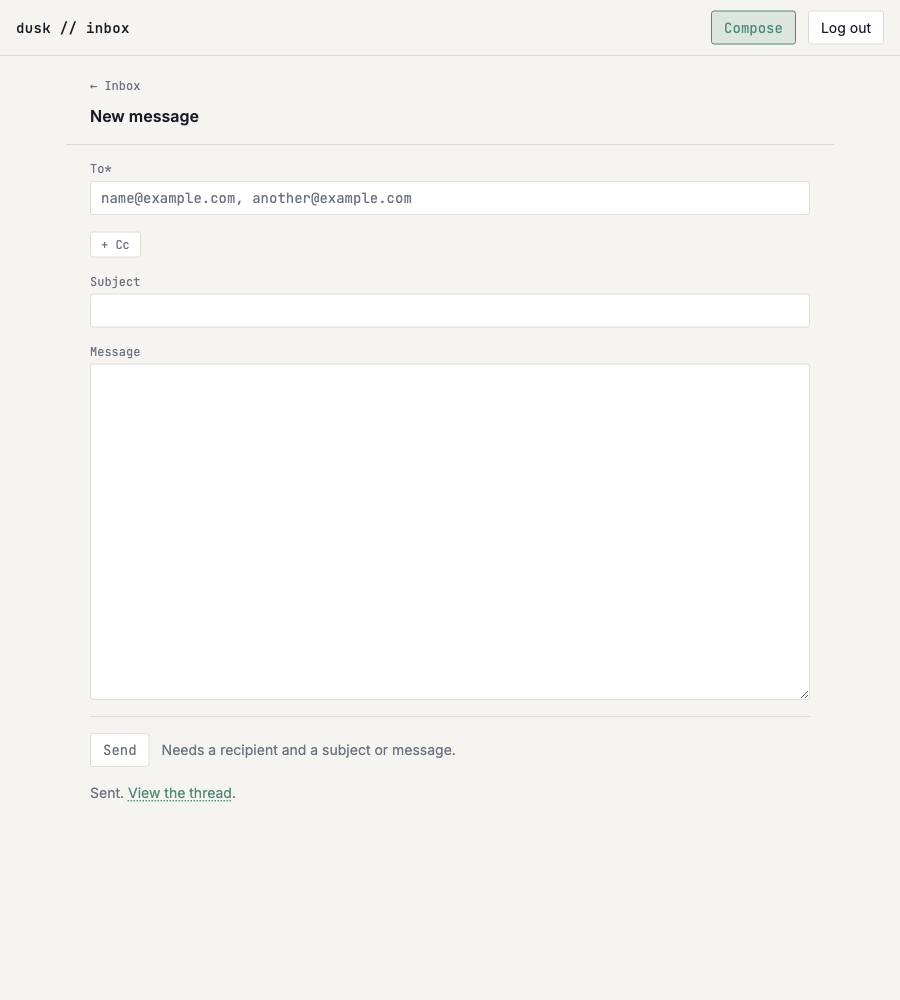
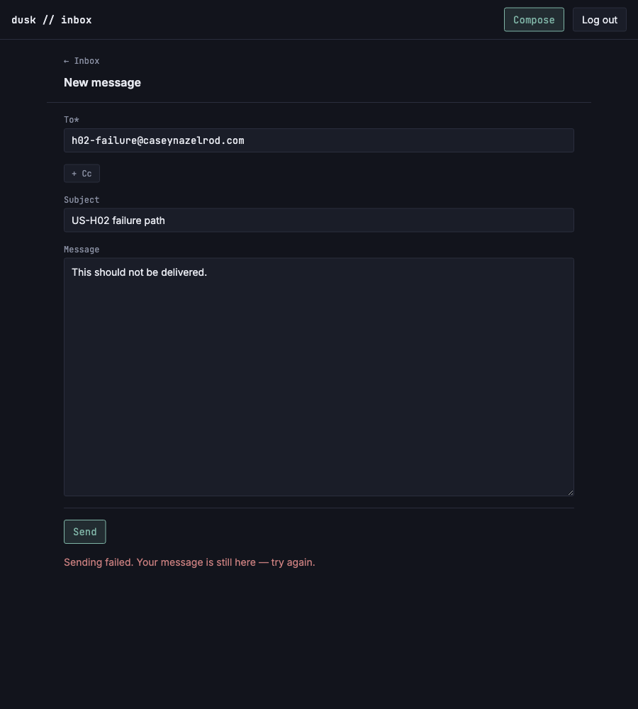

# Send outbound email via Resend

*2026-07-31T20:20:58Z by Showboat 0.6.1*
<!-- showboat-id: c285cac0-41ed-4cf1-b29d-3211d3269a7f -->

**Story:** clicking Send on `/compose` now delivers the email through the Resend API and records what was sent — one `emails` row with `direction = 'outbound'`, `is_read = true`, and a thread to sit in.

The action runs three steps, and the *order* is the design:

1. **Validate** with the same `validateComposeDraft` the Send button is gated on (US-H01), so the rule holds with JavaScript off.
2. **Send.** The only step whose failure means nothing happened — so it is the only one that reports an error and hands the draft back for a retry (FR-4).
3. **Store.** Deliberately *after* delivery: writing the row first would mean either rolling back a committed row or leaving an `emails` row for mail that never went out, and a phantom sent message is the worse lie. The cost is the reverse gap — delivered but unrecorded — which returns `sent: true` with a warning, never an error, because anything that reads as "not sent" invites sending the same mail twice.

Two facts about Resend's headers were **measured, not assumed**, and they shape how threading will work in US-H03:

- **`Message-ID` does not survive.** Resend sends via Amazon SES, which stamps its own `<…@email.amazonses.com>` id over any custom one; a probe send carrying `Message-ID: <probe-custom@caseynazelrod.com>` arrived with SES's instead. The real id can't be read back at send time either — `emails.get()` 404s for seconds after a send, and an action cannot wait.
- **`In-Reply-To` and `References` do survive, verbatim.** The same probe's `In-Reply-To: <probe-parent@caseynazelrod.com>` arrived intact.

So the id this app mints is stored in `emails.message_id` *and* seeded into the outgoing `References` chain — a replying client copies the parent's `References` into its reply, which is the one header-level route back to a message this app sent. The 30-day same-subject fallback catches the rest.

### Typecheck and lint

```bash
npm run check 2>&1 | sed -E "s/^[0-9]+ /<ts> /" | grep -v "^> "
```

```output


<ts> START "/Users/bloodintern1/Desktop/Resend-Email-Inbox"
<ts> COMPLETED 1520 FILES 0 ERRORS 0 WARNINGS 0 FILES_WITH_PROBLEMS
```

```bash
npm run lint 2>&1 | grep -v "^> " && echo "eslint: no findings"
```

```output


Checking formatting...
All matched files use Prettier code style!
eslint: no findings
```

### What the send writes, without sending

`src/lib/server/outbound/verify-outbound-send.mts` is this area's standalone check, extending the repo's `verify-*.mts` convention: the minted `Message-ID` on fixtures, and `storeSentEmail` against the live Turso database (there is no test database, so every seeded row is removed in a `finally`). The Resend call is deliberately outside it — a script that sends real mail on every run is a script nobody runs, and delivery is proved for real below.

```bash
node --env-file=.env node_modules/.bin/tsx src/lib/server/outbound/verify-outbound-send.mts
```

```output
newOutboundMessageId / senderDomain
  ok   takes the domain of the sending address
  ok   takes the last @ so a quoted local part cannot steal the domain
  ok   rejects an address with no domain
  ok   is angle-bracketed <uuid@domain>, the form In-Reply-To arrives in
  ok   is unique per call
storeSentEmail — live DB
  ok   a message with no thread starts one
  ok   the row is outbound
  ok   the row is read — the owner wrote it
  ok   the row is not deleted
  ok   the recipients are stored as given
  ok   cc is stored
  ok   bcc is an empty list, never null
  ok   the body is stored as text
  ok   no HTML part is invented
  ok   received_at is the send time (the inbox sort key)
  ok   the thread subject is normalized, so a reply to this message can match it
  ok   a thread of only sent mail is read
  ok   the thread sorts at the send time
  ok   a contact is upserted per recipient, To and Cc alike (FR-5)
  ok   they are auto-created and nameless — compose drops display names
  ok   an explicit thread id is joined, not duplicated
  ok   both messages are in one thread
  ok   the parent Message-ID is recorded
  ok   the thread now holds both messages, oldest first
  ok   last_message_at moved forward to the newer send
  ok   last_message_at only ever moves forward
  ok   sending into a thread with an unread message leaves it unread
  ok   the thread appears in the inbox list
  ok   its preview is the newest message
29/29 checks passed
```

### A real send, in a real browser

Against `npm run dev` on port 5173, driven with rodney. The session cookie is `httpOnly`, so it is obtained the way this repo's other demos do it — seed the demo auth code, then let `/api/auth/verify-code` set its own cookie — rather than by driving the login UI.

The recipient is `h02-demo@caseynazelrod.com`: a real deliverable address on the apex, whose MX is Resend, which is what makes the delivered copy come back through the production inbound webhook a few seconds later.

```bash
node --env-file=.env node_modules/.bin/tsx src/lib/server/db/seed-f03-demo.mts --cleanup >/dev/null
SUBJECT="US-H02 demo send"
node --env-file=.env node_modules/.bin/tsx src/lib/server/db/seed-f03-demo.mts >/dev/null
rodney --local open http://localhost:5173/login >/dev/null
rodney --local waitstable >/dev/null
rodney --local js "fetch('/api/auth/verify-code',{method:'POST',body:JSON.stringify({code:'123456'})}).then(r=>r.status)" >/dev/null
rodney --local open http://localhost:5173/compose >/dev/null
rodney --local waitstable >/dev/null
rodney --local input '#compose-form input[name=to]' 'h02-demo@caseynazelrod.com' >/dev/null
rodney --local input '#subject' "$SUBJECT" >/dev/null
rodney --local input '#body' 'Sent through the Resend API by the compose action.' >/dev/null
echo "Send button disabled on a valid draft: $(rodney --local js "document.querySelector('#compose-form button[type=submit]').disabled")"
rodney --local click '#compose-form button[type=submit]' >/dev/null
rodney --local waitload >/dev/null
rodney --local waitstable >/dev/null
echo "Notice after the send:                 $(rodney --local text '[role=status]')"
echo "Whole-form error shown:                $(rodney --local js "document.querySelector('[role=alert]') ? 'yes' : 'no'")"
echo "Fields after a successful send:         $(rodney --local js "JSON.stringify(['to','cc','subject','body'].map(n=>document.querySelector('[name='+n+']')?.value ?? null))")"
echo "The notice links to:                   $(rodney --local js "document.querySelector('[role=status] a')?.getAttribute('href').replace(/[0-9a-f-]{36}/,'<thread-id>')")"
```

```output
Send button disabled on a valid draft: false
Notice after the send:                 Sent. View the thread.
Whole-form error shown:                no
Fields after a successful send:         ["",null,"",""]
The notice links to:                   /inbox/<thread-id>
```

### The row it wrote, and the mail actually arriving

The probe below is written into the repo root and removed by a `trap` — `/tmp` is outside `node_modules` resolution, so `@libsql/client` would not resolve from there. It reads back the stored row, waits for the delivered copy to come in through the production inbound webhook, then deletes everything it saw so the real mailbox is left as it was.

```bash
trap "rm -f h02-proof.mts" EXIT
cat > h02-proof.mts <<'PROBE'
// Reads back what the send wrote, waits for the delivered copy to arrive through
// the real inbound webhook, then removes every row it saw again.
import { createClient } from '@libsql/client';

const SUBJECT = 'US-H02 demo send';
const c = createClient({
	url: process.env.TURSO_DATABASE_URL!,
	authToken: process.env.TURSO_AUTH_TOKEN!
});

const rows = (
	await c.execute({
		sql: 'select * from emails where subject = ? and direction = ? order by created_at',
		args: [SUBJECT, 'outbound']
	})
).rows as Record<string, unknown>[];
const sent = rows[rows.length - 1];

// Anything else under this subject is a leftover from an earlier run of this
// demo (a copy delivered after that run had already cleaned up). Clear it now,
// so the wait below can't match it and mistake it for this send's delivery.
await c.execute({ sql: 'delete from emails where subject = ? and id != ?', args: [SUBJECT, sent.id as string] });

console.log('the stored outbound row');
for (const key of [
	'direction',
	'is_read',
	'is_deleted',
	'from_email',
	'to_emails',
	'cc_emails',
	'bcc_emails',
	'subject',
	'body_text',
	'body_html'
]) {
	console.log(`  ${key.padEnd(12)} ${JSON.stringify(sent[key])}`);
}
console.log(`  message_id   ${String(sent.message_id).replace(/[0-9a-f-]{36}/, '<uuid>')}`);

const thread = (
	await c.execute({ sql: 'select * from threads where id = ?', args: [sent.thread_id as string] })
).rows[0] as Record<string, unknown>;
console.log('its thread');
console.log(`  subject      ${JSON.stringify(thread.subject)} (normalized for grouping)`);
// Neither `is_read` nor an exact `last_message_at` is asserted here: the copy
// delivered below lands in this same thread as an unread inbound message, so both
// legitimately depend on when this probe happens to look.
// `verify-outbound-send.mts` pins those rules down without a live mail race.
console.log(
	`  sorts at     ${Number(thread.last_message_at) >= Number(sent.received_at) ? 'the send time or later' : 'BEFORE THE SEND'}`
);

const recipients = (
	await c.execute("select email, name, auto_created from contacts where email like 'h02-demo@%'")
).rows;
console.log('contacts upserted for the recipient (FR-5)');
for (const row of recipients) console.log(`  ${JSON.stringify(row)}`);

// Delivery, from the provider's own record: poll until Resend reports a terminal
// event for this send. `emails.get()` 404s for a few seconds after a send (the
// same eventual consistency that stops the action reading back SES's Message-ID),
// so this polls rather than asking once.
//
// Deliberately *not* asserted by waiting for the delivered copy to loop back
// through the inbound webhook: `h02-demo@` is on the apex and the copy does
// arrive, but that round trip took anywhere from 5 to over 60 seconds across
// runs, and a demo that fails on a slow mail hop is a demo that cries wolf.
console.log("Resend's record of the send");
const { Resend } = await import('resend');
const resend = new Resend(process.env.RESEND_API_KEY!);
let event: string | undefined;
for (let i = 0; i < 15 && !['delivered', 'bounced', 'failed'].includes(event ?? ''); i++) {
	await new Promise((resolve) => setTimeout(resolve, 2000));
	const list = await resend.emails.list({ limit: 10 });
	event = list.data?.data.find((row) => row.subject === SUBJECT)?.last_event;
}
console.log(`  last_event   ${event ?? 'never appeared'}`);

// Clean up: a demo must not leave rows in the real mailbox.
await c.execute({ sql: 'delete from emails where subject = ?', args: [SUBJECT] });
await c.execute({
	sql: 'delete from threads where subject = ? and id not in (select thread_id from emails)',
	args: [SUBJECT.toLowerCase()]
});
await c.execute("delete from contacts where email like 'h02-demo@%'");
console.log('demo rows removed');
c.close();
PROBE
node --env-file=.env node_modules/.bin/tsx ./h02-proof.mts
```

```output
the stored outbound row
  direction    "outbound"
  is_read      1
  is_deleted   0
  from_email   "casey@caseynazelrod.com"
  to_emails    "[\"h02-demo@caseynazelrod.com\"]"
  cc_emails    "[]"
  bcc_emails   "[]"
  subject      "US-H02 demo send"
  body_text    "Sent through the Resend API by the compose action."
  body_html    null
  message_id   <<uuid>@caseynazelrod.com>
its thread
  subject      "us-h02 demo send" (normalized for grouping)
  sorts at     the send time or later
contacts upserted for the recipient (FR-5)
  {"email":"h02-demo@caseynazelrod.com","name":null,"auto_created":1}
Resend's record of the send
  last_event   delivered
demo rows removed
```

```bash {image}
```



### When the send fails, the message survives

The third criterion — an inline error and no data loss — needs a send that genuinely fails, so this runs a second dev server on port 5174 with a bogus `RESEND_API_KEY` and composes into that. Nothing is written and nothing is delivered; the draft stays in the fields.

```bash
trap 'kill %1 2>/dev/null; rm -f h02-count.mts' EXIT
RESEND_API_KEY=re_bogus_key npm run dev -- --port 5174 >/dev/null 2>&1 &
until curl -sf -o /dev/null http://localhost:5174/login; do sleep 1; done

rodney --local open http://localhost:5174/compose >/dev/null
rodney --local waitstable >/dev/null
rodney --local input '#compose-form input[name=to]' 'h02-failure@caseynazelrod.com' >/dev/null
rodney --local input '#subject' 'US-H02 failure path' >/dev/null
rodney --local input '#body' 'This should not be delivered.' >/dev/null
rodney --local click '#compose-form button[type=submit]' >/dev/null
rodney --local waitload >/dev/null
rodney --local waitstable >/dev/null

echo "Inline error:                  $(rodney --local text '[role=alert]')"
echo "Reported as sent:              $(rodney --local js "document.querySelector('[role=status]') ? 'yes' : 'no'")"
echo "The draft the owner typed:     $(rodney --local js "JSON.stringify(['to','subject','body'].map(n=>document.querySelector('[name='+n+']').value))")"
cat > h02-count.mts <<'PROBE'
import { createClient } from '@libsql/client';
const c = createClient({
	url: process.env.TURSO_DATABASE_URL!,
	authToken: process.env.TURSO_AUTH_TOKEN!
});
const rows = await c.execute({
	sql: 'select count(*) as n from emails where subject = ?',
	args: ['US-H02 failure path']
});
console.log(`Rows written for this subject: ${rows.rows[0].n}`);
c.close();
PROBE
node --env-file=.env node_modules/.bin/tsx ./h02-count.mts
```

```output
Inline error:                  Sending failed. Your message is still here — try again.
Reported as sent:              no
The draft the owner typed:     ["h02-failure@caseynazelrod.com","US-H02 failure path","This should not be delivered."]
Rows written for this subject: 0
```

### When the send fails, the message survives

The third criterion — an inline error and no data loss — needs a send that genuinely fails, so this runs a second dev server on port 5174 with a bogus `RESEND_API_KEY` and composes into that. Nothing is written and nothing is delivered; the draft stays in the fields.

```bash
trap 'kill %1 2>/dev/null; rm -f h02-count.mts' EXIT
RESEND_API_KEY=re_bogus_key npm run dev -- --port 5174 >/dev/null 2>&1 &
until curl -sf -o /dev/null http://localhost:5174/login; do sleep 1; done

rodney --local open http://localhost:5174/compose >/dev/null
rodney --local waitstable >/dev/null
rodney --local input '#compose-form input[name=to]' 'h02-failure@caseynazelrod.com' >/dev/null
rodney --local input '#subject' 'US-H02 failure path' >/dev/null
rodney --local input '#body' 'This should not be delivered.' >/dev/null
rodney --local click '#compose-form button[type=submit]' >/dev/null
rodney --local waitload >/dev/null
rodney --local waitstable >/dev/null

echo "Inline error:                  $(rodney --local text '[role=alert]')"
echo "Reported as sent:              $(rodney --local js "document.querySelector('[role=status]') ? 'yes' : 'no'")"
echo "The draft the owner typed:     $(rodney --local js "JSON.stringify(['to','subject','body'].map(n=>document.querySelector('[name='+n+']').value))")"
cat > h02-count.mts <<'PROBE'
import { createClient } from '@libsql/client';
const c = createClient({
	url: process.env.TURSO_DATABASE_URL!,
	authToken: process.env.TURSO_AUTH_TOKEN!
});
const rows = await c.execute({
	sql: 'select count(*) as n from emails where subject = ?',
	args: ['US-H02 failure path']
});
console.log(`Rows written for this subject: ${rows.rows[0].n}`);
c.close();
PROBE
node --env-file=.env node_modules/.bin/tsx ./h02-count.mts
```

```output
Inline error:                  Sending failed. Your message is still here — try again.
Reported as sent:              no
The draft the owner typed:     ["h02-failure@caseynazelrod.com","US-H02 failure path","This should not be delivered."]
Rows written for this subject: 0
```

```bash {image}
```



### What is deliberately not here

- **Reply and forward pre-fill, quoting, and `In-Reply-To` on the wire** are US-H03/H04. The parts they need already exist and are exercised above: `storeSentEmail` takes a `threadId` to join, `sendOutboundEmail` takes an `inReplyTo`, and `emails.in_reply_to` is stored.
- **Attachments** are US-H05; nothing here uploads or attaches.
- **No HTML part is sent.** The compose body is a `<textarea>`, so the message *is* plain text — generating an HTML twin would add an escaping step and a second body that can disagree with the first. The thread view renders `body_text` for these rows.

