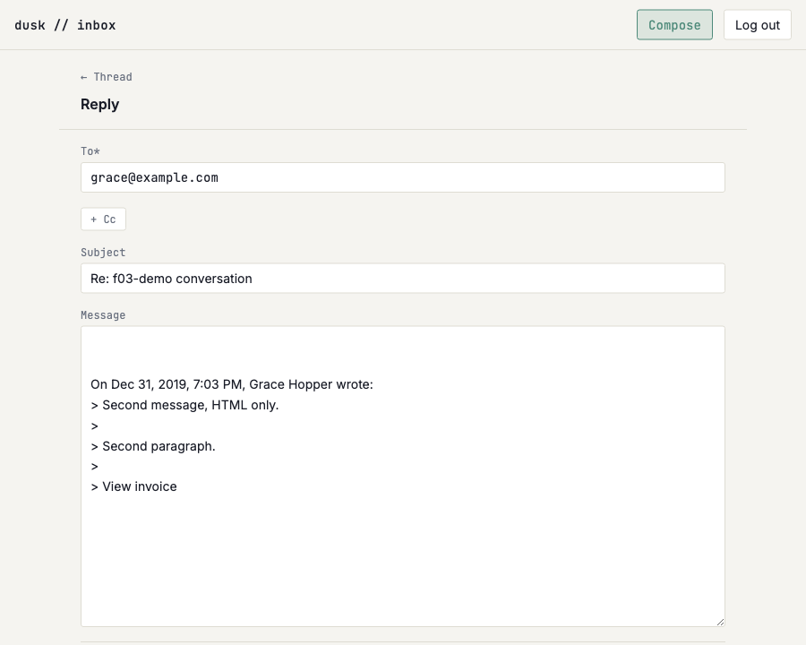

# US-H03: Reply pre-fills context and threading headers

*2026-07-31T20:38:17Z by Showboat 0.6.1*
<!-- showboat-id: d99a86df-644b-4f97-8c41-9b9b48c68ffb -->

-

### Typecheck and lint

```bash
npm run check 2>&1 | sed -E "s/^[0-9]+ /<ts> /" | grep -v "^> "
```

```output


<ts> START "/Users/bloodintern1/Desktop/Resend-Email-Inbox"
<ts> COMPLETED 1521 FILES 0 ERRORS 0 WARNINGS 0 FILES_WITH_PROBLEMS
```

```bash
npm run lint 2>&1 | grep -v "^> " && echo "eslint: no findings"
```

```output


Checking formatting...
All matched files use Prettier code style!
eslint: no findings
```

-

```bash
npx tsx src/lib/compose/verify-compose-addresses.mts | sed -n "/^replySubject/,\$p"
```

```output
replySubject (US-H03)
  ok   prefixes a plain subject
  ok   does not double-prefix
  ok   prefix matching is case-insensitive
  ok   tolerates a missing space after the colon
  ok   a counted prefix still counts
  ok   leading whitespace is trimmed, not prefixed twice
  ok   a forward is replied to, not left alone
  ok   only the outermost prefix decides
  ok   a subject that merely starts with "re" is prefixed
  ok   an empty subject stays empty
quoteOriginal / replyBody (US-H03)
  ok   attribution line then > -prefixed lines
  ok   a blank line is quoted as a bare > (no trailing space)
  ok   CRLF does not leave a stray carriage return inside the quote
  ok   a body-less message still gets its attribution
  ok   the reply body opens with room to write above the quote
  ok   a pre-filled reply is sendable as-is (recipient + quoted body)
replyRecipients (US-H03)
  ok   an inbound message is replied to its sender
  ok   a sent message is replied to its own recipients, not to oneself
  ok   replying to a message this app sent to itself yields no recipient

65/65 checks passed
```

-

```bash
node --env-file=.env node_modules/.bin/tsx src/lib/server/outbound/verify-outbound-send.mts | sed -n "/an explicit thread id/,\$p"
```

```output
  ok   an explicit thread id is joined, not duplicated
  ok   both messages are in one thread
  ok   the parent Message-ID is recorded
  ok   the thread now holds both messages, oldest first
  ok   last_message_at moved forward to the newer send
  ok   last_message_at only ever moves forward
  ok   sending into a thread with an unread message leaves it unread
getVisibleEmailById — the reply target (US-H03)
  ok   finds the message a reply is answering
  ok   an unknown id is undefined, not a throw
  ok   a soft-deleted message is not a reply target — its text must not be quoted back out
  ok   the thread appears in the inbox list
  ok   its preview is the newest message
32/32 checks passed
```

-

```bash
# The send below is real mail to a real address on the apex, so its delivered
# copy loops back in through the production inbound webhook some seconds later
# — after this document's own cleanup has run. Sweeping any straggler from a
# previous run first is what keeps `showboat verify` re-runnable: a stray email
# referencing the seeded thread would make `--cleanup` trip over the FK.
node --env-file=.env -e 'const {createClient}=require("@libsql/client");const c=createClient({url:process.env.TURSO_DATABASE_URL,authToken:process.env.TURSO_AUTH_TOKEN});c.execute({sql:"delete from emails where body_text like ?",args:["US-H03 reply proof.%"]}).then(()=>process.exit(0))'
node --env-file=.env node_modules/.bin/tsx src/lib/server/db/seed-f03-demo.mts --cleanup >/dev/null
node --env-file=.env node_modules/.bin/tsx src/lib/server/db/seed-f03-demo.mts >/dev/null
rodney --local open http://localhost:5173/login >/dev/null
rodney --local waitstable >/dev/null
rodney --local js "fetch('/api/auth/verify-code',{method:'POST',body:JSON.stringify({code:'123456'})}).then(r=>r.status)" >/dev/null

rodney --local open http://localhost:5173/inbox >/dev/null
rodney --local waitstable >/dev/null
THREAD=$(rodney --local js "Array.from(document.querySelectorAll('a[href^=\"/inbox/\"]')).find(a=>a.innerText.includes('Grace Hopper')).getAttribute('href')")
rodney --local open "http://localhost:5173$THREAD" >/dev/null
rodney --local waitstable >/dev/null

echo "Messages in the thread:      $(rodney --local js "document.querySelectorAll('article').length")"
echo "A Reply link per message:    $(rodney --local js "document.querySelectorAll('article a[href*=replyTo]').length")"
echo "It is a plain GET link to:   $(rodney --local js "document.querySelector('article a[href*=replyTo]').getAttribute('href').replace(/[0-9a-f-]{36}/,'<email-id>')")"
echo "Named for its own message:   $(rodney --local js "document.querySelector('article a[href*=replyTo]').getAttribute('aria-label')")"

for n in 1 2; do
	rodney --local click "article:nth-of-type($n) a[href*=replyTo]" >/dev/null
	rodney --local waitload >/dev/null
	rodney --local waitstable >/dev/null
	echo
	echo "--- Reply to message $n ---"
	echo "Heading:      $(rodney --local text 'main h1')"
	echo "Back link:    $(rodney --local attr 'main header a' href | sed -E 's/[0-9a-f-]{36}/<thread-id>/')"
	echo "To:           $(rodney --local js "document.querySelector('#compose-form [name=to]').value")"
	echo "Subject:      $(rodney --local js "document.querySelector('#subject').value")"
	echo "Send enabled: $(rodney --local js "!document.querySelector('#compose-form button[type=submit]').disabled")"
	echo "Body:"
	rodney --local js "document.querySelector('#body').value" | sed 's/^/  |/'
	rodney --local back >/dev/null
	rodney --local waitstable >/dev/null
done
```

```output
Messages in the thread:      2
A Reply link per message:    2
It is a plain GET link to:   /compose?replyTo=<email-id>
Named for its own message:   Reply to message from Ada Lovelace

--- Reply to message 1 ---
Heading:      Reply
Back link:    /inbox/<thread-id>
To:           ada@example.com
Subject:      Re: f03-demo conversation
Send enabled: true
Body:
  |
  |
  |On Dec 31, 2019, 7:02 PM, Ada Lovelace wrote:
  |> First message in the conversation.
  |>
  |> With a second paragraph.
  |

--- Reply to message 2 ---
Heading:      Reply
Back link:    /inbox/<thread-id>
To:           grace@example.com
Subject:      Re: f03-demo conversation
Send enabled: true
Body:
  |
  |
  |On Dec 31, 2019, 7:03 PM, Grace Hopper wrote:
  |> Second message, HTML only.
  |>
  |> Second paragraph.
  |>
  |> View invoice
  |
```

```bash {image}

```



-

```bash
trap 'rm -f h03-proof.mts' EXIT

rodney --local open http://localhost:5173/inbox >/dev/null
rodney --local waitstable >/dev/null
THREAD=$(rodney --local js "Array.from(document.querySelectorAll('a[href^=\"/inbox/\"]')).find(a=>a.innerText.includes('Grace Hopper')).getAttribute('href')")
rodney --local open "http://localhost:5173$THREAD" >/dev/null
rodney --local waitstable >/dev/null
rodney --local click 'article:nth-of-type(2) a[href*=replyTo]' >/dev/null
rodney --local waitload >/dev/null
rodney --local waitstable >/dev/null

echo "The form posts to:            $(rodney --local attr '#compose-form' action | sed -E 's/[0-9a-f-]{36}/<email-id>/')"

# A real deliverable address on the apex, whose MX is Resend — which is what
# makes the delivered copy come back through the production inbound webhook.
rodney --local clear '#compose-form [name=to]' >/dev/null
rodney --local input '#compose-form [name=to]' 'casey@caseynazelrod.com' >/dev/null
# Typed above the quote, which is where the caret already is.
rodney --local js "document.querySelector('#body').value = 'US-H03 reply proof.' + document.querySelector('#body').value" >/dev/null
rodney --local click '#compose-form button[type=submit]' >/dev/null
rodney --local waitload >/dev/null
rodney --local waitstable >/dev/null

echo "Notice after the send:        $(rodney --local text '[role=status]')"
echo "It links back to:             $(rodney --local js "document.querySelector('[role=status] a').getAttribute('href')" | sed -E "s#$THREAD#<the original thread>#")"
echo "Fields after a sent reply:    $(rodney --local js "JSON.stringify(['to','subject','body'].map(n=>document.querySelector('[name='+n+']').value))")"

cat > h03-proof.mts <<'PROBE'
import { createClient } from '@libsql/client';

const c = createClient({
	url: process.env.TURSO_DATABASE_URL!,
	authToken: process.env.TURSO_AUTH_TOKEN!
});

const threadId = process.argv[2];
const rows = (
	await c.execute({
		sql: 'select id, direction, thread_id, message_id, in_reply_to, subject, body_text from emails where thread_id = ? order by received_at, id',
		args: [threadId]
	})
).rows as unknown as {
	id: string;
	direction: string;
	thread_id: string;
	message_id: string;
	in_reply_to: string | null;
	subject: string;
	body_text: string | null;
}[];

const parent = rows.find((r) => r.message_id === '<f03-demo-conv-2@invalid>')!;
const sent = rows.find((r) => r.direction === 'outbound')!;

console.log('The reply this app stored');
console.log(`  in the parent's thread   ${sent.thread_id === threadId}`);
console.log(`  in_reply_to = the parent ${sent.in_reply_to === parent.message_id}`);
console.log(`  subject                  ${sent.subject}`);
console.log(`  quotes the original      ${sent.body_text!.includes('> Second message, HTML only.')}`);
console.log(`  above the owner's text   ${sent.body_text!.startsWith('US-H03 reply proof.')}`);

const removed = await c.execute({
	sql: "delete from emails where thread_id = ? and body_text like 'US-H03 reply proof.%'",
	args: [threadId]
});
console.log(`demo rows removed: ${removed.rowsAffected > 0}`);
c.close();
PROBE
node --env-file=.env node_modules/.bin/tsx ./h03-proof.mts "${THREAD#/inbox/}"
```

```output
The form posts to:            ?/send&replyTo=<email-id>
Notice after the send:        Sent. View the thread.
It links back to:             <the original thread>
Fields after a sent reply:    ["","",""]
The reply this app stored
  in the parent's thread   true
  in_reply_to = the parent true
  subject                  Re: f03-demo conversation
  quotes the original      true
  above the owner's text   true
demo rows removed: true
```

-

```bash
rodney --local open http://localhost:5173/inbox >/dev/null
rodney --local waitstable >/dev/null
THREAD=$(rodney --local js "Array.from(document.querySelectorAll('a[href^=\"/inbox/\"]')).find(a=>a.innerText.includes('Grace Hopper')).getAttribute('href')")
rodney --local open "http://localhost:5173$THREAD" >/dev/null
rodney --local waitstable >/dev/null
rodney --local click 'article:nth-of-type(2) a[href*=replyTo]' >/dev/null
rodney --local waitload >/dev/null
rodney --local waitstable >/dev/null

# A recipient the shared rule refuses. The Send button is disabled for it in the
# browser, so the form is submitted directly — the action's own re-validation is
# the real enforcement, and it is what this exercises.
rodney --local clear '#compose-form [name=to]' >/dev/null
rodney --local input '#compose-form [name=to]' 'oops-not-an-address' >/dev/null
rodney --local js "document.getElementById('compose-form').submit()" >/dev/null
rodney --local waitload >/dev/null
rodney --local waitstable >/dev/null

echo "Landed on:                  $(rodney --local url | sed -E 's#^.*localhost:5173##; s/[0-9a-f-]{36}/<email-id>/')"
echo "Still a reply:              $(rodney --local text 'main h1')"
echo "Inline message:             $(rodney --local text '[role=alert]')"
echo "Reported as sent:           $(rodney --local js "document.querySelector('[role=status]') ? 'yes' : 'no'")"
echo "What was typed survives:    $(rodney --local js "document.querySelector('#compose-form [name=to]').value")"
echo "Subject survives:           $(rodney --local js "document.querySelector('#subject').value")"
echo "Quote survives:             $(rodney --local js "document.querySelector('#body').value.includes('> Second message, HTML only.')")"
echo "Back link still the thread: $(rodney --local attr 'main header a' href | sed -E 's/[0-9a-f-]{36}/<thread-id>/')"
echo "A retry would post to:      $(rodney --local attr '#compose-form' action | sed -E 's/[0-9a-f-]{36}/<email-id>/')"
```

```output
Landed on:                  /compose?/send&replyTo=<email-id>
Still a reply:              Reply
Inline message:             Not a valid address: oops-not-an-address
Reported as sent:           no
What was typed survives:    oops-not-an-address
Subject survives:           Re: f03-demo conversation
Quote survives:             true
Back link still the thread: /inbox/<thread-id>
A retry would post to:      ?/send&replyTo=<email-id>
```

-

```bash
rodney --local open "http://localhost:5173/compose?replyTo=00000000-0000-0000-0000-000000000000" >/dev/null
rodney --local waitstable >/dev/null
echo "Heading:        $(rodney --local text "main h1")"
echo "Back link:      $(rodney --local attr "main header a" href)"
echo "Fields:         $(rodney --local js "JSON.stringify([\"to\",\"subject\",\"body\"].map(n=>document.querySelector(\"[name=\"+n+\"]\").value))")"
echo "Posts to:       $(rodney --local attr "#compose-form" action)"
```

```output
Heading:        New message
Back link:      /inbox
Fields:         ["","",""]
Posts to:       ?/send
```

-

```bash
node --env-file=.env -e 'const {createClient}=require("@libsql/client");const c=createClient({url:process.env.TURSO_DATABASE_URL,authToken:process.env.TURSO_AUTH_TOKEN});c.execute({sql:"delete from emails where body_text like ?",args:["US-H03 reply proof.%"]}).then(()=>{console.log("delivered copies swept");process.exit(0)})'
node --env-file=.env node_modules/.bin/tsx src/lib/server/db/seed-f03-demo.mts --cleanup
```

```output
delivered copies swept
cleaned up
```
