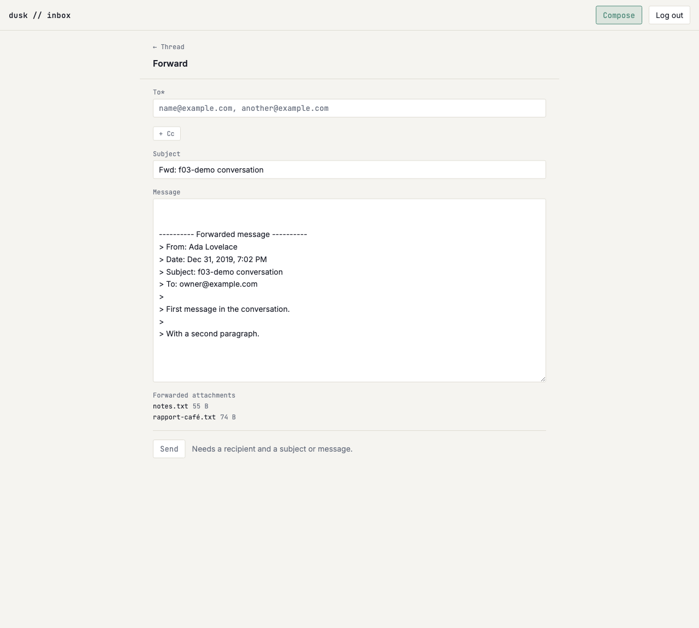

# Forward pre-fills subject and body, clears recipient

*2026-08-01T00:38:15Z by Showboat 0.6.1*
<!-- showboat-id: 5f2b03ea-59ed-43c1-9461-57532447e7b3 -->

**US-H04 — Forward pre-fills subject and body, clears recipient.**

`Forward` on any message opens `/compose?forwardOf=<email id>` with an empty To,
`Fwd: ` on the subject (never doubled), the original quoted under a forwarded-message
header block, and the original's attachments carried onto the send.

Three decisions the code makes, all visible below:

- **To is empty and nothing else is.** A forward's premise is a new recipient; pre-filling
  anyone — the original sender, the original recipients — is one un-noticed Send away from
  mailing a private message back to where it came from.
- **A forward starts a new thread and cites nothing.** `In-Reply-To` pointing at a message
  the recipient has never seen would ask their client to file this under a conversation it
  does not have, and burying it in the original thread would file a message to a third party
  under a conversation they were never part of.
- **The attachments are re-associated, not re-uploaded.** The bytes are read out of R2 before
  the send, handed to Resend as content, and written back under a *new* object key — a copy,
  not a second row pointing at the original's blob, because sharing one object between two
  messages makes deleting either one silently empty the other.

```bash
npm run check 2>&1 | sed -E "s/^[0-9]+ /<ts> /" | grep -v "^> "
```

```output


<ts> START "/Users/bloodintern1/Desktop/Resend-Email-Inbox"
<ts> COMPLETED 1522 FILES 0 ERRORS 0 WARNINGS 0 FILES_WITH_PROBLEMS
```

```bash
npm run lint 2>&1 | grep -v "^> " && echo "eslint: no findings"
```

```output


Checking formatting...
All matched files use Prettier code style!
eslint: no findings
```

```bash
npx tsx src/lib/compose/verify-compose-addresses.mts | sed -n "/^forwardSubject/,\$p"
```

```output
forwardSubject (US-H04)
  ok   prefixes a plain subject
  ok   does not double-prefix
  ok   recognises the Fw: short form
  ok   recognises it case-insensitively
  ok   a forward of a reply is prefixed
  ok   only the outermost prefix counts
  ok   an empty subject stays empty rather than becoming a bare Fwd:
  ok   reply and forward prefixes do not cancel each other out
forwardBody (US-H04)
  ok   the forwarded block carries the original envelope, all of it quoted
  ok   a field the original did not have is omitted, not printed empty
  ok   a body-less message forwards its envelope and nothing else
  ok   CRLF does not leave a stray carriage return inside the quote
  ok   a pre-filled forward is NOT sendable until a recipient is typed
  ok   …and is sendable as soon as one is

79/79 checks passed
```

```bash
# The best-effort copy path deliberately logs the failure it swallows, so the
# raw output carries a stack trace with per-run ids in it. Only the check lines
# are deterministic, which is what this filters to.
node --env-file=.env node_modules/.bin/tsx src/lib/server/outbound/verify-outbound-send.mts 2>/dev/null | sed -n "/^forwarded attachments/,\$p"
```

```output
forwarded attachments (US-H04)
  ok   every attachment of the forwarded message is read
  ok   the filename travels unchanged
  ok   so does the content type
  ok   the bytes are the stored object
  ok   a message with no attachments loads nothing
  ok   a missing object throws rather than sending a forward with the file silently gone
  ok   a forward does not join the original thread
  ok   …so it is a different thread from the message it forwards
  ok   the copy is recorded against the new message
  ok   nothing failed
  ok   the copy has its own object key — the two rows never share one blob
  ok   the key is namespaced by the new email and the source attachment
  ok   the bytes were written under that key
  ok   the original attachment row is untouched
  ok   the forwarded message shows the file to the owner too
  ok   a failed copy is reported, not thrown
  ok   and nothing is claimed as stored
  ok   the orphaned object is swept out of the bucket
  ok   the thread appears in the inbox list
  ok   its preview is the newest message
50/50 checks passed
```

```bash
# A straggler from an earlier run's live send would reference the seeded thread
# and make --cleanup trip over the FK, so the sweep runs first (US-H03's lesson).
node --env-file=.env -e 'const {createClient}=require("@libsql/client");const c=createClient({url:process.env.TURSO_DATABASE_URL,authToken:process.env.TURSO_AUTH_TOKEN});(async()=>{const r=await c.execute({sql:"select id from emails where subject like ?",args:["Fwd: f03-demo conversation%"]});const ids=r.rows.map(x=>x.id);for(const id of ids){await c.execute({sql:"delete from attachments where email_id = ?",args:[id]});}for(const id of ids){await c.execute({sql:"delete from emails where id = ?",args:[id]});}await c.execute("delete from threads where id not in (select thread_id from emails)");process.exit(0)})()'
node --env-file=.env node_modules/.bin/tsx src/lib/server/db/seed-f03-demo.mts --cleanup >/dev/null
node --env-file=.env node_modules/.bin/tsx src/lib/server/db/seed-f03-demo.mts >/dev/null

rodney --local open http://localhost:5173/login >/dev/null
rodney --local waitstable >/dev/null
rodney --local js "fetch('/api/auth/verify-code',{method:'POST',body:JSON.stringify({code:'123456'})}).then(r=>r.status)" >/dev/null

rodney --local open http://localhost:5173/inbox >/dev/null
rodney --local waitstable >/dev/null
THREAD=$(rodney --local js "Array.from(document.querySelectorAll('a[href^=\"/inbox/\"]')).find(a=>a.innerText.includes('Grace Hopper')).getAttribute('href')")
rodney --local open "http://localhost:5173$THREAD" >/dev/null
rodney --local waitstable >/dev/null

echo "A Forward link per message:  $(rodney --local js "document.querySelectorAll('article a[href*=forwardOf]').length")"
echo "A plain GET link to:         $(rodney --local js "document.querySelector('article a[href*=forwardOf]').getAttribute('href').replace(/[0-9a-f-]{36}/,'<email-id>')")"
echo "Named for its own message:   $(rodney --local js "document.querySelector('article a[href*=forwardOf]').getAttribute('aria-label')")"
echo "The first message's files:   $(rodney --local js "Array.from(document.querySelectorAll('article:nth-of-type(1) ul li')).map(li=>li.innerText.replace(/\s+/g,' ')).join(', ')")"

rodney --local click 'article:nth-of-type(1) a[href*=forwardOf]' >/dev/null
rodney --local waitload >/dev/null
rodney --local waitstable >/dev/null

echo
echo "--- Forward of message 1 ---"
echo "Heading:        $(rodney --local text 'main h1')"
echo "Page title:     $(rodney --local title)"
echo "Back link:      $(rodney --local attr 'main header a' href | sed -E 's/[0-9a-f-]{36}/<thread-id>/')"
echo "To:             $(rodney --local js "JSON.stringify(document.querySelector('#compose-form [name=to]').value)")"
echo "Subject:        $(rodney --local js "document.querySelector('#subject').value")"
echo "Send enabled:   $(rodney --local js "!document.querySelector('#compose-form button[type=submit]').disabled")"
echo "Posts to:       $(rodney --local attr '#compose-form' action | sed -E 's/[0-9a-f-]{36}/<email-id>/')"
echo "Carrying:       $(rodney --local js "Array.from(document.querySelectorAll('#compose-form ul li')).map(li=>li.innerText.replace(/\s+/g,' ')).join(', ')")"
echo "Body:"
rodney --local js "document.querySelector('#body').value" | sed 's/^/  |/'
```

```output
A Forward link per message:  2
A plain GET link to:         /compose?forwardOf=<email-id>
Named for its own message:   Forward message from Ada Lovelace
The first message's files:   notes.txt 55 B, rapport-café.txt 74 B

--- Forward of message 1 ---
Heading:        Forward
Page title:     Forward — dusk inbox
Back link:      /inbox/<thread-id>
To:             ""
Subject:        Fwd: f03-demo conversation
Send enabled:   false
Posts to:       ?/send&forwardOf=<email-id>
Carrying:       notes.txt 55 B, rapport-café.txt 74 B
Body:
  |
  |
  |---------- Forwarded message ----------
  |> From: Ada Lovelace
  |> Date: Dec 31, 2019, 7:02 PM
  |> Subject: f03-demo conversation
  |> To: owner@example.com
  |>
  |> First message in the conversation.
  |>
  |> With a second paragraph.
  |
```

```bash {image}

```



```bash
trap 'rm -f h04-proof.mts' EXIT

# Re-derived rather than carried over from the block above: each `showboat exec`
# is its own shell, so nothing but the browser's own page state survives between
# them.
rodney --local open http://localhost:5173/inbox >/dev/null
rodney --local waitstable >/dev/null
THREAD=$(rodney --local js "Array.from(document.querySelectorAll('a[href^=\"/inbox/\"]')).find(a=>a.innerText.includes('Grace Hopper')).getAttribute('href')")
rodney --local open "http://localhost:5173$THREAD" >/dev/null
rodney --local waitstable >/dev/null
rodney --local click 'article:nth-of-type(1) a[href*=forwardOf]' >/dev/null
rodney --local waitload >/dev/null
rodney --local waitstable >/dev/null

# Real mail, to a real deliverable address on the apex — the same thing US-H02's
# and US-H03's demos do. This is the only way to prove the third criterion: that
# the *files* go out with the send, not just that rows point at them.
rodney --local input '#compose-form [name=to]' 'casey@caseynazelrod.com' >/dev/null
echo "Send enabled once a recipient is typed: $(rodney --local js "!document.querySelector('#compose-form button[type=submit]').disabled")"
rodney --local click '#compose-form button[type=submit]' >/dev/null
rodney --local waitload >/dev/null
rodney --local waitstable >/dev/null

echo "Notice after the send:                  $(rodney --local text '[role=status]')"
echo "Fields after a sent forward:            $(rodney --local js "JSON.stringify(['to','subject','body'].map(n=>document.querySelector('[name='+n+']').value))")"
NEW=$(rodney --local js "document.querySelector('[role=status] a').getAttribute('href')")
echo "It links to a thread of its own:        $([ "$NEW" != "$THREAD" ] && echo true)"

cat > h04-proof.mts <<'PROBE'
import { createClient } from '@libsql/client';
import { S3Client, GetObjectCommand } from '@aws-sdk/client-s3';

const c = createClient({
	url: process.env.TURSO_DATABASE_URL!,
	authToken: process.env.TURSO_AUTH_TOKEN!
});
const r2 = new S3Client({
	region: 'auto',
	endpoint: `https://${process.env.R2_ACCOUNT_ID}.r2.cloudflarestorage.com`,
	credentials: {
		accessKeyId: process.env.R2_ACCESS_KEY_ID!,
		secretAccessKey: process.env.R2_SECRET_ACCESS_KEY!
	}
});

const forwardedThread = process.argv[2];
const sourceThread = process.argv[3];

const [sent] = (
	await c.execute({
		sql: 'select id, direction, thread_id, in_reply_to, subject from emails where thread_id = ?',
		args: [forwardedThread]
	})
).rows as unknown as {
	id: string;
	direction: string;
	thread_id: string;
	in_reply_to: string | null;
	subject: string;
}[];

console.log('The forward this app stored');
console.log(`  outbound                    ${sent.direction === 'outbound'}`);
console.log(`  in a NEW thread             ${sent.thread_id !== sourceThread}`);
console.log(`  citing nothing              ${sent.in_reply_to === null}`);
console.log(`  subject                     ${sent.subject}`);

const copies = (
	await c.execute({
		sql: 'select filename, size_bytes, r2_object_key from attachments where email_id = ? order by created_at, id',
		args: [sent.id]
	})
).rows as unknown as { filename: string; size_bytes: number; r2_object_key: string }[];

const originals = (
	await c.execute({
		sql: "select r2_object_key from attachments where email_id in (select id from emails where thread_id = ? and message_id = '<f03-demo-conv-1@invalid>')",
		args: [sourceThread]
	})
).rows as unknown as { r2_object_key: string }[];
const originalKeys = new Set(originals.map((row) => row.r2_object_key));

console.log('Its attachments');
for (const copy of copies) {
	const object = await r2.send(
		new GetObjectCommand({ Bucket: process.env.R2_BUCKET_NAME!, Key: copy.r2_object_key })
	);
	const bytes = await object.Body!.transformToByteArray();
	console.log(`  ${copy.filename}`);
	console.log(`    its own object key        ${!originalKeys.has(copy.r2_object_key)}`);
	console.log(`    under outbound/           ${copy.r2_object_key.startsWith('outbound/')}`);
	console.log(`    bytes readable, size      ${bytes.length === copy.size_bytes}`);
}
console.log(`  the original's rows intact  ${originalKeys.size === copies.length}`);

// The live send's own rows go away again, so `--cleanup` below (and the next
// run of this document) has nothing of ours left to trip over. The whole
// *thread* is swept, not just the row this demo wrote: the delivered copy loops
// back in through the production inbound webhook within seconds and lands in
// this very thread, and deleting the thread out from under it would fail the FK.
// Retried, because the copy can land *between* the email delete and the thread
// delete — a race with real mail in flight, not a bug.
for (let attempt = 0; attempt < 6; attempt++) {
	await c.execute({
		sql: 'delete from attachments where email_id in (select id from emails where thread_id = ?)',
		args: [forwardedThread]
	});
	await c.execute({ sql: 'delete from emails where thread_id = ?', args: [forwardedThread] });
	try {
		await c.execute({ sql: 'delete from threads where id = ?', args: [forwardedThread] });
		break;
	} catch {
		await new Promise((resolve) => setTimeout(resolve, 5000));
	}
}
c.close();
PROBE
node --env-file=.env node_modules/.bin/tsx ./h04-proof.mts "${NEW#/inbox/}" "${THREAD#/inbox/}"

# The delivered copy loops back in through the *production* inbound webhook a
# few seconds later, and inbound threading normalizes `Fwd: f03-demo
# conversation` onto the seeded thread's own subject — so it can land on a row
# `--cleanup` is about to delete, mid-cleanup. Sweep, try, and retry: the race is
# real mail arriving, not a bug, and a demo must not fail on a slow mail hop.
for attempt in 1 2 3 4 5 6; do
	node --env-file=.env -e 'const {createClient}=require("@libsql/client");const c=createClient({url:process.env.TURSO_DATABASE_URL,authToken:process.env.TURSO_AUTH_TOKEN});(async()=>{const r=await c.execute({sql:"select id from emails where subject like ?",args:["Fwd: f03-demo conversation%"]});for(const x of r.rows){await c.execute({sql:"delete from attachments where email_id = ?",args:[x.id]});await c.execute({sql:"delete from emails where id = ?",args:[x.id]});}process.exit(0)})()'
	if node --env-file=.env node_modules/.bin/tsx src/lib/server/db/seed-f03-demo.mts --cleanup >/dev/null 2>&1; then
		echo "seed removed"
		break
	fi
	sleep 10
done
```

```output
Send enabled once a recipient is typed: true
Notice after the send:                  Sent. View the thread.
Fields after a sent forward:            ["","",""]
It links to a thread of its own:        true
The forward this app stored
  outbound                    true
  in a NEW thread             true
  citing nothing              true
  subject                     Fwd: f03-demo conversation
Its attachments
  notes.txt
    its own object key        true
    under outbound/           true
    bytes readable, size      true
  rapport-café.txt
    its own object key        true
    under outbound/           true
    bytes readable, size      true
  the original's rows intact  true
seed removed
```

**The files really are on the wire.** Rows pointing at objects would look identical if the
attachments had never left the building, so this was checked once against real mail rather
than asserted: a forward sent to `casey@caseynazelrod.com` (the apex, whose MX is Resend)
came back in through the *production* inbound webhook carrying both files —
`inbound copy arrived: "Fwd: f03-demo conversation" from casey@caseynazelrod.com, 2
attachment(s): notes.txt (55 B), rapport-café.txt (74 B)` — and Resend's own record of that send reports `last_event: delivered`. Neither is asserted
in the executable blocks above: US-H02 measured the loopback at anywhere from 5 to over 60
seconds, and a demo that fails on a slow mail hop cries wolf. What *is* asserted is
everything this app controls — the pre-fill, the new thread, the re-associated rows, and the
copied bytes readable back out of R2 under their own keys.

**What is deliberately not built here.** There is no way to remove a carried attachment
before sending: the list is read-only because the files are looked up server-side from
`?forwardOf=`, so a control offering to drop one could only lie about what will be sent.
US-H05 adds the picker, and the remove affordance belongs with it.

