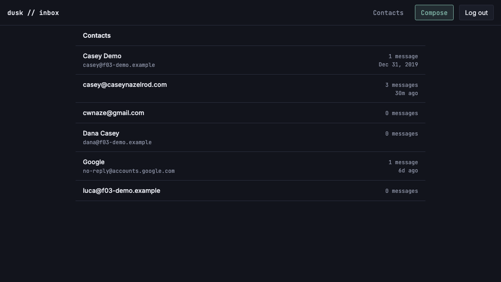

# US-I01: Contacts list view

*2026-08-01T02:05:08Z by Showboat 0.6.1*
<!-- showboat-id: 8635a1f2-3233-42d8-a258-88674803a2af -->

**Story:** `/contacts` lists every `contacts` row sorted alphabetically by display name (falling back to the email when there is no name), each row showing name, email, and correspondence stats derived from `emails` — a message count and a last-contacted timestamp.

**What was built**

- `listContacts` in `src/lib/server/db/contacts.ts` — one query: a LEFT JOIN from `contacts` onto `emails` grouped by contact, where the join condition is the correspondence rule (the contact sent it, or is in `to_emails`/`cc_emails`, and it isn't soft-deleted). LEFT, not INNER, so a contact with no surviving mail still renders at 0.
- `src/routes/(app)/contacts/` — a read-only `+page.server.ts` load plus `+page.svelte`/`ContactRow.svelte`, in the same flat divider-row style as the inbox list.
- A **Contacts** link in the `(app)` shell, beside Compose — both are whole-app destinations rather than one route's state.
- `src/lib/server/db/verify-contacts-list.mts` — a live-DB smoke test for the SQL, which is the part no type can check.

## The query

The whole story is one statement. Every branch of the correspondence rule is exercised by the smoke test below.

```bash
sed -n '/^const CORRESPONDS_WITH_CONTACT/,/^`;/p' src/lib/server/db/contacts.ts
```

```output
const CORRESPONDS_WITH_CONTACT = sql`
	${emails.isDeleted} = 0
	and (
		lower(${emails.fromEmail}) = lower(${contacts.email})
		or exists (
			select 1 from json_each(${emails.toEmails}) as recipient
			where lower(recipient.value) = lower(${contacts.email})
		)
		or exists (
			select 1 from json_each(coalesce(${emails.ccEmails}, '[]')) as recipient
			where lower(recipient.value) = lower(${contacts.email})
		)
	)
`;
```

## Live-DB smoke test

Seeds five contacts and a thread of five messages into the live Turso database, asserts the list, then deletes every seeded row (emails → threads → contacts, because the remote connection enforces the FKs). Notice the cases that matter: casing differences on both sides, a soft-deleted message excluded from the count, a Cc-only recipient counted, a Bcc-only recipient not counted, and two contacts with no mail at all.

```bash
node --env-file=.env node_modules/.bin/tsx src/lib/server/db/verify-contacts-list.mts
```

```output
listContacts — live DB
  ok   returns every contact, including ones with no mail
  ok   sorts by display name falling back to the address
  ok   counts inbound mail by sender, case-insensitively
  ok   takes the latest received_at as last-contacted
  ok   counts outbound mail by To recipient, case-insensitively
  ok   excludes a soft-deleted message from the count
  ok   counts outbound mail by Cc recipient
  ok   does not count a Bcc-only recipient
  ok   leaves last-contacted null with no mail
  ok   a contact with no mail at all counts 0
  ok   contacts with no mail still preserve auto_created
11/11 checks passed
```

## In the browser

Self-contained: seeds the shared demo fixture, starts a dev server, logs in through the real endpoint (the session cookie is httpOnly — `document.cookie` cannot fake it), reads the rendered rows, and tears all of it down again.

The demo fixture's `casey@f03-demo.example` is Cc'd on one seeded message and the other two demo contacts are on none, so this shows both sides of the LEFT JOIN in the actual page.

```bash
set -e
trap 'kill %1 2>/dev/null; rodney --local stop >/dev/null 2>&1; node --env-file=.env node_modules/.bin/tsx src/lib/server/db/seed-f03-demo.mts --cleanup >/dev/null 2>&1' EXIT

node --env-file=.env node_modules/.bin/tsx src/lib/server/db/seed-f03-demo.mts >/dev/null
npm run dev -- --port 5177 >/dev/null 2>&1 &
until curl -sf -o /dev/null http://localhost:5177/login; do sleep 1; done

rodney --local start >/dev/null
# The session cookie is httpOnly, so it has to be set by the real endpoint:
# seed the code, then log in with fetch *from the page*.
rodney --local open http://localhost:5177/login >/dev/null
rodney --local js "fetch('/api/auth/verify-code',{method:'POST',headers:{'content-type':'application/json'},body:JSON.stringify({code:'123456'})}).then(r=>r.status)" >/dev/null
rodney --local open http://localhost:5177/contacts >/dev/null
rodney --local waitstable >/dev/null

echo "header link -> $(rodney --local attr 'header a[href="/contacts"]' href)"
echo
# Only the seeded rows: the live database also holds this owner's real contacts.
rodney --local js "Array.from(document.querySelectorAll('main li')).map(li=>li.innerText.split('\n').map(s=>s.trim()).filter(Boolean).join(' | ')).filter(t=>t.includes('f03-demo.example')).join('\n')"
```

```output
header link -> /contacts

Casey Demo | casey@f03-demo.example | 1 message | Dec 31, 2019
Dana Casey | dana@f03-demo.example | 0 messages
luca@f03-demo.example | 0 messages
```

```bash {image}

```



## Quality gates

```bash
npm run check 2>&1 | grep -o 'COMPLETED.*'
```

```output
COMPLETED 1532 FILES 0 ERRORS 0 WARNINGS 0 FILES_WITH_PROBLEMS
```

```bash
npm run lint 2>&1 | tail -2
```

```output
Checking formatting...
All matched files use Prettier code style!
```
