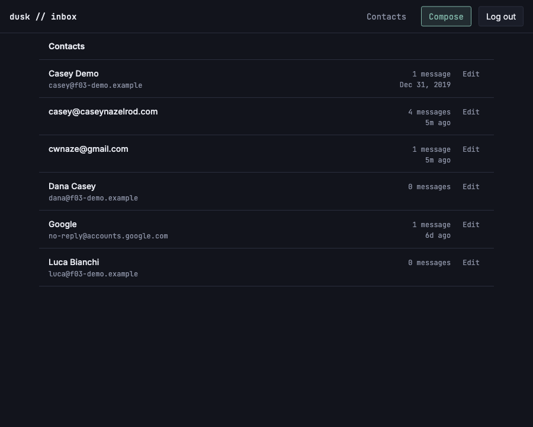
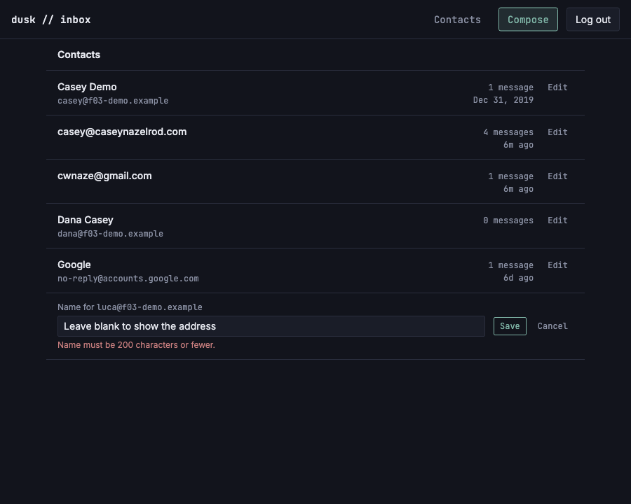

# Edit a contact

*2026-08-01T02:21:39Z by Showboat 0.6.1*
<!-- showboat-id: 4637cf2a-4e8e-4c7a-af6d-fa300c8c32b4 -->

**Story:** every contact row has an edit action opening a form with a `name` field; saving updates the `contacts` row **and** sets `auto_created = false`, so a future inbound email from that address can no longer overwrite the name.

**What was built**

- `updateContactName` in `src/lib/server/db/contacts.ts` — one statement setting `name` *and* clearing `auto_created`. Clearing the flag is not a side feature: it is the edit's durability. A blank name stores `null` (what the sort and `displayName` already read as "fall back to the address"), never `''`.
- A `rename` form action on `src/routes/(app)/contacts/+page.server.ts`, which **validates the session itself** — a SvelteKit action runs *before* the `(app)` layout's load, so without that check an anonymous POST would complete the rename and only then be redirected to `/login`.
- `ContactRow.svelte` renders either a read row with an Edit link or the rename form. Which row is open is **server state in the URL** (`?edit=<id>`), not component state, so the form works with JavaScript off, survives a refresh, and stays open across a validation failure.
- `verify-contacts-list.mts` extended with the round trip FR-2 actually cares about: rename → auto-upsert → the manual name survives.

## The write

Both columns in one statement, because setting the name without clearing the flag would look like it worked and silently revert on the next email from that address.

```bash
sed -n '/^export async function updateContactName/,/^}/p' src/lib/server/db/contacts.ts
```

```output
export async function updateContactName(
	db: Database,
	id: string,
	name: string | null,
	now: Date = new Date()
): Promise<Contact | undefined> {
	const [updated] = await db
		.update(contacts)
		.set({ name: name?.trim() || null, autoCreated: false, updatedAt: now })
		.where(eq(contacts.id, id))
		.returning();
	return updated;
}
```

## Live-DB smoke test

The last six checks are new. The one that matters is the pair: rename the contact, then run `upsertAutoContact` against the same address with a *different* display name — exactly what the next inbound delivery does — and confirm the owner's name is still there. That round trip is the only thing that actually demonstrates FR-2; asserting on the update alone would pass even if the flag were never cleared.

```bash
node --env-file=.env node_modules/.bin/tsx src/lib/server/db/verify-contacts-list.mts
```

```output
listContacts — live DB
  ok   returns every contact, including ones with no mail
  ok   sorts by display name falling back to the address
  ok   counts inbound mail by sender, case-insensitively
  ok   takes the latest received_at as last-contacted
  ok   counts outbound mail by To recipient, case-insensitively
  ok   excludes a soft-deleted message from the count
  ok   counts outbound mail by Cc recipient
  ok   does not count a Bcc-only recipient
  ok   leaves last-contacted null with no mail
  ok   a contact with no mail at all counts 0
  ok   contacts with no mail still preserve auto_created
updateContactName — live DB
  ok   trims the stored name
  ok   clears auto_created on a manual rename
  ok   a later auto-upsert does not overwrite a manual name
  ok   the manual name survives the auto-upsert
  ok   a blank name is stored as null
  ok   a cleared name sorts and renders by address again
  ok   returns undefined for an unknown contact id
18/18 checks passed
```

## In the browser

Self-contained, same shape as US-I01's: seed the shared demo fixture, start a dev server, log in through the real endpoint (the session cookie is httpOnly, so `document.cookie` cannot fake it), then drive the actual rename and tear it all down.

The subject is the fixture's `luca@f03-demo.example`, an auto-created contact with **no name** — it renders as its own address, which is the case where the edit form's seeding is easy to get wrong.

```bash
set -e
trap "kill %1 2>/dev/null; rodney --local stop >/dev/null 2>&1; node --env-file=.env node_modules/.bin/tsx src/lib/server/db/seed-f03-demo.mts --cleanup >/dev/null 2>&1" EXIT

node --env-file=.env node_modules/.bin/tsx src/lib/server/db/seed-f03-demo.mts >/dev/null
npm run dev -- --port 5178 >/dev/null 2>&1 &
until curl -sf -o /dev/null http://localhost:5178/login; do sleep 1; done

rodney --local start >/dev/null
rodney --local open http://localhost:5178/login >/dev/null
rodney --local js "fetch(\"/api/auth/verify-code\",{method:\"POST\",headers:{\"content-type\":\"application/json\"},body:JSON.stringify({code:\"123456\"})}).then(r=>r.status)" >/dev/null
rodney --local open http://localhost:5178/contacts >/dev/null
rodney --local waitstable >/dev/null

# The demo contact ids are fresh UUIDs per seed, so find the row by its address.
ROW="Array.from(document.querySelectorAll(\"main li\")).find(li=>li.innerText.includes(\"luca@f03-demo.example\"))"
echo "before      -> $(rodney --local js "$ROW.innerText.split(\"\\n\")[0].trim()")"
echo "edit link   -> $(rodney --local js "$ROW.querySelector(\"a\").getAttribute(\"href\").replace(/=.*/, \"=<uuid>\")")"

rodney --local js "(()=>{$ROW.querySelector(\"a\").click(); return 1})()" >/dev/null
rodney --local waitstable >/dev/null

echo "form label  -> $(rodney --local js "document.querySelector(\"main form label\").innerText.trim()")"
# Seeded from the *stored* name, not the rendered one: pre-filling this with the
# address fallback would name the contact after its own address on first save.
echo "field value -> $(rodney --local js "JSON.stringify(document.querySelector(\"main form input[name=name]\").value)")"
echo "posts to    -> $(rodney --local attr "main form" action | sed "s/=[0-9a-f-]\{36\}/=<uuid>/")"
```

```output
before      -> luca@f03-demo.example
edit link   -> /contacts?edit=<uuid>
form label  -> Name for luca@f03-demo.example
field value -> ""
posts to    -> ?/rename&edit=<uuid>
```

Saving it. The rename redirects (303) back to the bare `/contacts` — the form is deliberately not `use:enhance`d, so without the redirect the owner would be left sitting on the action's own POST URL with a refresh that re-submits. The list re-sorts around the new name for free, because the action re-runs the page's `load` rather than patching the row in place.

```bash
set -e
trap "kill %1 2>/dev/null; rodney --local stop >/dev/null 2>&1; rm -f flag-check.mts; node --env-file=.env node_modules/.bin/tsx src/lib/server/db/seed-f03-demo.mts --cleanup >/dev/null 2>&1" EXIT

cat > flag-check.mts <<"MTS"
import { createClient } from "@libsql/client";
const c = createClient({ url: process.env.TURSO_DATABASE_URL!, authToken: process.env.TURSO_AUTH_TOKEN! });
const r = await c.execute({ sql: "select name, auto_created from contacts where email = ?", args: ["luca@f03-demo.example"] });
console.log(JSON.stringify(r.rows[0]));
c.close();
MTS

node --env-file=.env node_modules/.bin/tsx src/lib/server/db/seed-f03-demo.mts >/dev/null
npm run dev -- --port 5179 >/dev/null 2>&1 &
until curl -sf -o /dev/null http://localhost:5179/login; do sleep 1; done

rodney --local start >/dev/null
rodney --local open http://localhost:5179/login >/dev/null
rodney --local js "fetch(\"/api/auth/verify-code\",{method:\"POST\",headers:{\"content-type\":\"application/json\"},body:JSON.stringify({code:\"123456\"})}).then(r=>r.status)" >/dev/null

ROW="Array.from(document.querySelectorAll(\"main li\")).find(li=>li.innerText.includes(\"f03-demo.example\")&&li.innerText.includes(\"luca\"))"
DEMO="Array.from(document.querySelectorAll(\"main li\")).filter(li=>li.innerText.includes(\"f03-demo.example\")).map(li=>li.innerText.split(\"\\n\")[0].trim()).join(\", \")"

rodney --local open http://localhost:5179/contacts >/dev/null && rodney --local waitstable >/dev/null
echo "demo rows before -> $(rodney --local js "$DEMO")"
echo "stored           -> $(node --env-file=.env node_modules/.bin/tsx flag-check.mts)"
echo

rodney --local js "(()=>{$ROW.querySelector(\"a\").click(); return 1})()" >/dev/null
rodney --local waitstable >/dev/null
rodney --local input "main form input[name=name]" "Luca Bianchi" >/dev/null
rodney --local click "main form button[type=submit]" >/dev/null
rodney --local waitstable >/dev/null

echo "url after save   -> $(rodney --local url | sed "s|http://localhost:5179||")"
echo "demo rows after  -> $(rodney --local js "$DEMO")"
echo "stored           -> $(node --env-file=.env node_modules/.bin/tsx flag-check.mts)"
rodney --local screenshot -w 900 /tmp/claude-501/contacts-renamed.png >/dev/null
```

```output
demo rows before -> Casey Demo, Dana Casey, luca@f03-demo.example
stored           -> {"name":null,"auto_created":1}

url after save   -> /contacts
demo rows after  -> Casey Demo, Dana Casey, Luca Bianchi
stored           -> {"name":"Luca Bianchi","auto_created":0}
```

```bash {image}

```



## The two things that have to fail

A validation failure has to leave the form **open**, and an unauthenticated POST has to change nothing.

The first is why the form posts to `?/rename&edit=<id>` rather than `?/rename`: a form action's query *replaces* the page's, so without carrying `edit` the `fail()` re-render would come back with the form closed — silently discarding the input the owner is being asked to correct. Below, the input's `maxlength` is stripped first, on purpose: it is a browser courtesy, and the check that counts is the server's.

The second is the `(app)` route group's standing trap: a SvelteKit action runs **before** the layout load that protects the group, so `rename` calls `validateSession` itself. Without that, the POST below would rename the contact and *then* redirect the anonymous caller to `/login`.

```bash
set -e
trap "kill %1 2>/dev/null; rodney --local stop >/dev/null 2>&1; rm -f flag-check.mts; node --env-file=.env node_modules/.bin/tsx src/lib/server/db/seed-f03-demo.mts --cleanup >/dev/null 2>&1" EXIT

cat > flag-check.mts <<"MTS"
import { createClient } from "@libsql/client";
const c = createClient({ url: process.env.TURSO_DATABASE_URL!, authToken: process.env.TURSO_AUTH_TOKEN! });
const r = await c.execute({ sql: "select name, auto_created from contacts where email = ?", args: ["luca@f03-demo.example"] });
console.log(JSON.stringify(r.rows[0]));
c.close();
MTS

node --env-file=.env node_modules/.bin/tsx src/lib/server/db/seed-f03-demo.mts >/dev/null
npm run dev -- --port 5180 >/dev/null 2>&1 &
until curl -sf -o /dev/null http://localhost:5180/login; do sleep 1; done

rodney --local start >/dev/null
rodney --local open http://localhost:5180/login >/dev/null
rodney --local js "fetch(\"/api/auth/verify-code\",{method:\"POST\",headers:{\"content-type\":\"application/json\"},body:JSON.stringify({code:\"123456\"})}).then(r=>r.status)" >/dev/null
rodney --local open http://localhost:5180/contacts >/dev/null && rodney --local waitstable >/dev/null

ROW="Array.from(document.querySelectorAll(\"main li\")).find(li=>li.innerText.includes(\"luca@f03-demo.example\"))"
rodney --local js "(()=>{$ROW.querySelector(\"a\").click(); return 1})()" >/dev/null
rodney --local waitstable >/dev/null

echo "== 201 characters, with the browser cap removed =="
rodney --local js "(()=>{const i=document.querySelector(\"main form input[name=name]\"); i.removeAttribute(\"maxlength\"); i.value=\"x\".repeat(201); document.querySelector(\"main form\").requestSubmit(); return 1})()" >/dev/null
rodney --local waitstable >/dev/null
echo "inline error     -> $(rodney --local js "document.querySelector(\"main [role=alert]\").innerText")"
echo "alerts on page   -> $(rodney --local js "document.querySelectorAll(\"main [role=alert]\").length") (the failure annotates only its own row)"
echo "form still open  -> $(rodney --local js "!!document.querySelector(\"main form input[name=name]\")")"
echo "stored           -> $(node --env-file=.env node_modules/.bin/tsx flag-check.mts)"
rodney --local screenshot -w 900 /tmp/claude-501/contacts-edit-error.png >/dev/null
echo
echo "== POST with no session cookie =="
ID=$(rodney --local js "document.querySelector(\"main form input[name=id]\").value")
echo "status           -> $(curl -s -o /dev/null -w "%{http_code}" -X POST "http://localhost:5180/contacts?/rename" -H "x-sveltekit-action: true" -F "id=$ID" -F "name=HACKED")"
echo "stored           -> $(node --env-file=.env node_modules/.bin/tsx flag-check.mts)"
```

```output
== 201 characters, with the browser cap removed ==
inline error     -> Name must be 200 characters or fewer.
alerts on page   -> 1 (the failure annotates only its own row)
form still open  -> true
stored           -> {"name":null,"auto_created":1}

== POST with no session cookie ==
status           -> 401
stored           -> {"name":null,"auto_created":1}
```

```bash {image}

```



## Quality gates

```bash
npm run check 2>&1 | grep -o 'COMPLETED.*'
```

```output
COMPLETED 1532 FILES 0 ERRORS 0 WARNINGS 0 FILES_WITH_PROBLEMS
```

```bash
npm run lint 2>&1 | tail -2
```

```output
Checking formatting...
All matched files use Prettier code style!
```
