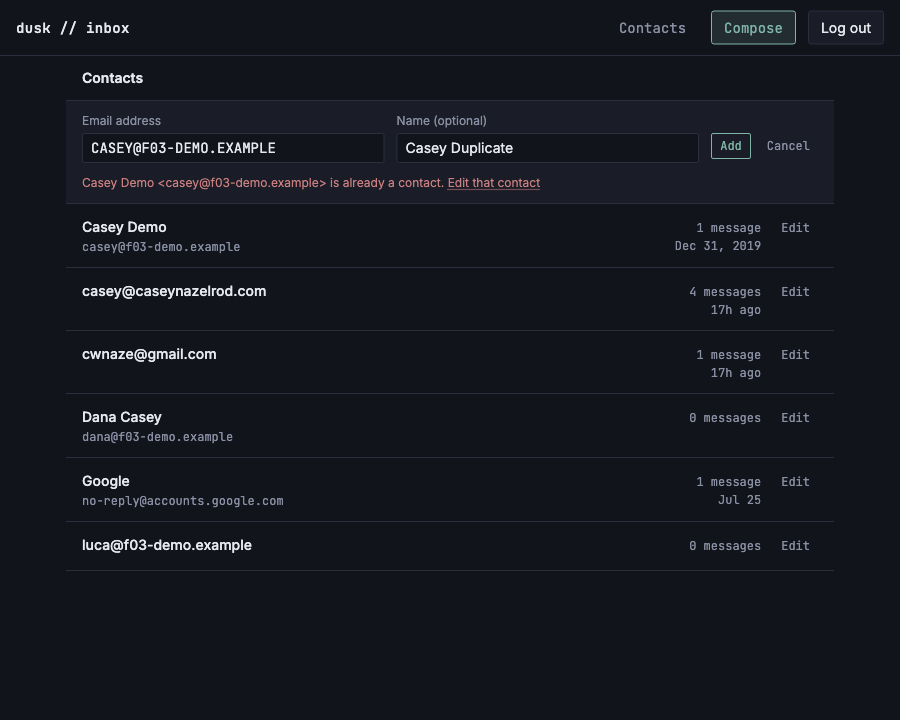

# US-I03: Manually add a contact

*2026-08-01T02:51:58Z by Showboat 0.6.1*
<!-- showboat-id: f2a67f19-4120-4f9a-a69f-dd27812a3fef -->

## What this story adds

`/contacts` could only ever show addresses the app had already *seen* — `upsertAutoContact` runs on inbound mail and on send, so a contact exists only after a message does. US-I03 adds the other direction: an **Add contact** form on the same page, so an address can be put in the list (and therefore in Compose's autocomplete) before it has ever emailed the owner.

Three pieces:

- **`createContact`** (`src/lib/server/db/contacts.ts`) — inserts with `auto_created = false` from birth, for the same reason `updateContactName` clears the flag: the owner typed this name, so the next delivery from that address must not overwrite it. Duplicates come back as a **return value**, not an exception: the insert is `onConflictDoNothing` + re-read, so the conflicting row is available to name in the error and a genuine race loses harmlessly instead of 500ing. A pre-read alone would still race — the unique index is the only real arbiter.
- **The `add` action** (`+page.server.ts`) — validates the session itself (an action runs *before* the group layout's load), then checks the address with `isValidAddress` from `$lib/compose/addresses`: the *same* rule the compose recipient field and the send action use, because a contact this page accepts but Send rejects would be a contact the owner can't actually use.
- **`AddContactForm.svelte`** — open/closed is `?add` in the URL, exactly like the edit form's `?edit=<id>`. Server-rendered, works with JavaScript off, survives a refresh, and stays open (and filled in) across a `fail()`.

## Quality checks

`svelte-check` prints a run timestamp on every line, so the capture below strips it — otherwise `showboat verify` fails on a re-run over a number that was never part of the result.

```bash
npm run check 2>&1 | grep -o "COMPLETED.*"
npm run lint 2>&1 | tail -2
```

```output
COMPLETED 1533 FILES 0 ERRORS 0 WARNINGS 0 FILES_WITH_PROBLEMS
Checking formatting...
All matched files use Prettier code style!
```

## The SQL, against the live database

`verify-contacts-list.mts` grew from 18 checks to 32. The new ones cover what no typecheck reaches: that the unique index is what actually rejects a duplicate, that `normalizeEmail` is what makes a *differently cased* address hit that index at all, that a hand-added contact still renders in `listContacts` at 0 messages (the LEFT JOIN's whole reason for existing), and the FR-3 round trip — a manual add survives the first real delivery from that address, the same way a manual rename does.

The script seeds into the live DB under a per-PID stamp and deletes everything it seeded in a `finally`, so the row count below is stable regardless of what real mail is in the database.

```bash
node --env-file=.env node_modules/.bin/tsx src/lib/server/db/verify-contacts-list.mts 2>&1 | sed -n "/createContact/,\$p"
```

```output
createContact — live DB
  ok   inserts a new address
  ok   normalizes the stored address
  ok   trims the stored name
  ok   a manual add is never auto_created
  ok   a duplicate address is rejected, not inserted
  ok   the rejection carries the existing contact
  ok   and does not overwrite its name
  ok   the duplicate check is case-insensitive
  ok   and finds the same row
  ok   a blank name is stored as null
  ok   a manually added contact lists at 0 messages
  ok   with no last-contacted stamp
  ok   a later auto-upsert does not overwrite a manual add
  ok   the hand-typed name survives
32/32 checks passed
```

## In the browser

Self-contained, same shape as US-I01/US-I02's: seed the shared demo fixture, start a dev server, log in through the real endpoint (the session cookie is `httpOnly`, so `document.cookie` cannot fake it), drive the real form, then tear it all down.

The rendered rows are filtered down to the fixture's stamp domain, because the live DB also holds real mail.

```bash
set -e
trap "kill %1 2>/dev/null; rodney --local stop >/dev/null 2>&1; node --env-file=.env node_modules/.bin/tsx src/lib/server/db/seed-f03-demo.mts --cleanup >/dev/null 2>&1" EXIT

node --env-file=.env node_modules/.bin/tsx src/lib/server/db/seed-f03-demo.mts >/dev/null
npm run dev -- --port 5181 >/dev/null 2>&1 &
until curl -sf -o /dev/null http://localhost:5181/login; do sleep 1; done

rodney --local start >/dev/null
rodney --local open http://localhost:5181/login >/dev/null
rodney --local js 'fetch("/api/auth/verify-code",{method:"POST",headers:{"content-type":"application/json"},body:JSON.stringify({code:"123456"})}).then(r=>r.status)' >/dev/null
rodney --local open http://localhost:5181/contacts >/dev/null && rodney --local waitstable >/dev/null

# The live DB holds real mail too, so every listing is filtered to the fixture.
DEMO='Array.from(document.querySelectorAll("main li")).map(li=>li.innerText.split("\n")[0].trim()).filter(t=>/f03-demo|Casey Demo|Dana Casey|Ivy/.test(t)).join(" | ")'
echo "demo rows before -> $(rodney --local js "$DEMO")"

# The affordance is a plain link, and it sits above the list rather than inside
# it: adding the first contact has to work when there is no list at all.
echo "add link         -> $(rodney --local attr 'main a[href*=add]' href)"
rodney --local click 'main a[href*=add]' >/dev/null && rodney --local waitstable >/dev/null
echo "posts to         -> $(rodney --local attr 'main form' action)"

rodney --local input 'main form input[name=email]' 'ivy.manual@f03-demo.example' >/dev/null
rodney --local input 'main form input[name=name]' 'Ivy Manual' >/dev/null
rodney --local click 'main form button[type=submit]' >/dev/null && rodney --local waitstable >/dev/null

echo "url after add    -> $(rodney --local url | sed 's|http://localhost:5181||')"
echo "demo rows after  -> $(rodney --local js "$DEMO")"
```

```output
demo rows before -> Casey Demo | Dana Casey | luca@f03-demo.example
add link         -> /contacts?add
posts to         -> ?/add&add=1
url after add    -> /contacts
demo rows after  -> Casey Demo | Dana Casey | Ivy Manual | luca@f03-demo.example
```

The list re-sorts around the new contact for free — the action re-runs the page's `load` rather than patching a row in, so there is no second ordering to disagree with `listContacts`. And it ends in a `redirect(303, …)` to the bare `/contacts`: this form is deliberately not `use:enhance`d, so without it the owner would be left on the action's own POST URL with a refresh that re-submits the add.

### Rejections

Everything below is one session against the real app: a duplicate in a different case than the row stores, an address the compose field would also reject, and an anonymous POST. The last one matters because `(app)/+layout.server.ts` does **not** cover it — a form action runs *before* the layout's load, so without this action's own `validateSession` an anonymous POST would insert the contact and only then be redirected to `/login`.

The final DB dump is the assertion that none of the three wrote anything: the fixture's three contacts, unchanged.

```bash
set -e
trap "kill %1 2>/dev/null; rodney --local stop >/dev/null 2>&1; rm -f dupe-check.mts; node --env-file=.env node_modules/.bin/tsx src/lib/server/db/seed-f03-demo.mts --cleanup >/dev/null 2>&1" EXIT

# A `.mts` probe has to live inside the repo root to resolve node_modules, and
# `tsx -e` cannot do top-level await (it emits CJS) — hence the temp file.
cat > dupe-check.mts <<'PROBE'
import { createClient } from '@libsql/client';
const c = createClient({ url: process.env.TURSO_DATABASE_URL!, authToken: process.env.TURSO_AUTH_TOKEN! });
const r = await c.execute("select email, name, auto_created from contacts where email like '%@f03-demo.example' order by email");
console.log(r.rows.map((x) => `${x.email} name=${JSON.stringify(x.name)} auto_created=${x.auto_created}`).join('\n'));
c.close();
PROBE

node --env-file=.env node_modules/.bin/tsx src/lib/server/db/seed-f03-demo.mts >/dev/null
npm run dev -- --port 5182 >/dev/null 2>&1 &
until curl -sf -o /dev/null http://localhost:5182/login; do sleep 1; done

rodney --local start >/dev/null
rodney --local open http://localhost:5182/login >/dev/null
rodney --local js 'fetch("/api/auth/verify-code",{method:"POST",headers:{"content-type":"application/json"},body:JSON.stringify({code:"123456"})}).then(r=>r.status)' >/dev/null

# --- a duplicate, in a different case than the stored row ------------------
rodney --local open 'http://localhost:5182/contacts?add' >/dev/null && rodney --local waitstable >/dev/null
rodney --local input 'main form input[name=email]' 'CASEY@F03-DEMO.EXAMPLE' >/dev/null
rodney --local input 'main form input[name=name]' 'Casey Duplicate' >/dev/null
rodney --local click 'main form button[type=submit]' >/dev/null && rodney --local waitstable >/dev/null

echo "inline error     -> $(rodney --local js 'document.querySelector("main [role=alert]").innerText.replace(/\s+/g," ").trim()')"
# The error points at the row that already owns the address, by opening its edit
# form — the useful next move when the contact turns out to already exist.
echo "points to        -> $(rodney --local attr 'main [role=alert] a' href | sed 's/=[0-9a-f-]\{36\}/=<uuid>/')"
echo "form still open  -> $(rodney --local js 'Boolean(document.querySelector("main form input[name=email]"))')"
echo "email kept       -> $(rodney --local js 'document.querySelector("main form input[name=email]").value')"
echo "name kept        -> $(rodney --local js 'document.querySelector("main form input[name=name]").value')"

# --- an address the compose field would also reject -----------------------
rodney --local input 'main form input[name=email]' 'not-an-address' >/dev/null
rodney --local js '(()=>{document.querySelector("main form input[name=email]").removeAttribute("type"); document.querySelector("main form").requestSubmit(); return 1})()' >/dev/null
rodney --local waitstable >/dev/null
echo "invalid address  -> $(rodney --local js 'document.querySelector("main [role=alert]").innerText.trim()')"

# --- an anonymous POST, which the layout load would NOT have stopped -------
echo "anon POST        -> $(curl -s -o /dev/null -w '%{http_code}' -X POST 'http://localhost:5182/contacts?/add' -F 'email=intruder@f03-demo.example' -F 'name=Intruder')"

echo "contacts in db   ->"
node --env-file=.env node_modules/.bin/tsx dupe-check.mts
```

```output
inline error     -> Casey Demo <casey@f03-demo.example> is already a contact. Edit that contact
points to        -> /contacts?edit=<uuid>
form still open  -> true
email kept       -> CASEY@F03-DEMO.EXAMPLE
name kept        -> Casey Duplicate
invalid address  -> Enter a valid email address.
anon POST        -> 401
contacts in db   ->
casey@f03-demo.example name="Casey Demo" auto_created=1
dana@f03-demo.example name="Dana Casey" auto_created=1
luca@f03-demo.example name=null auto_created=1
```

The rejected state as rendered — both fields kept, the error naming the contact that already owns the address, and `Edit that contact` opening that row's rename form.

```bash {image}

```


