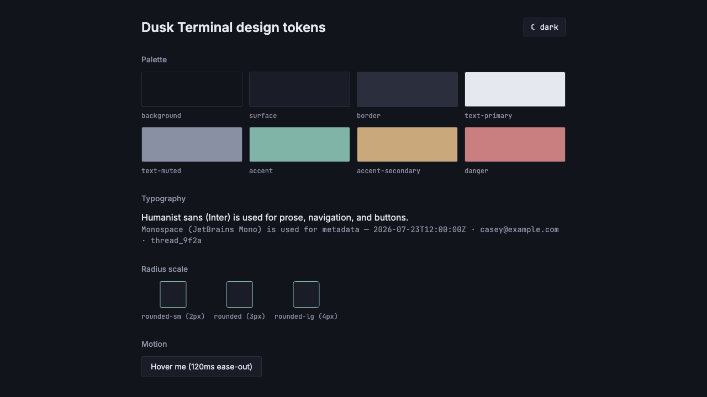
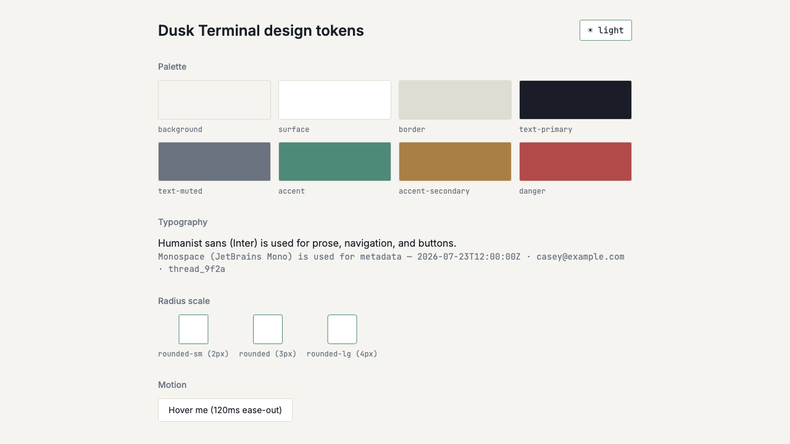

# Design tokens and Tailwind theme configuration

*2026-07-23T15:42:52Z by Showboat 0.6.1*
<!-- showboat-id: 7548178b-ffa7-4dd0-b666-ff8bf1649954 -->

US-J01 implements the Dusk Terminal design tokens as Tailwind v4 CSS-first theme config: palette (dark + light) as CSS custom properties toggled via a `data-theme` attribute (falling back to `prefers-color-scheme`), Inter/JetBrains Mono self-hosted via @fontsource, a 2-4px radius scale, and 120-160ms motion tokens. A theme toggle component and a /dev/tokens verification page exercise all of this.

```bash
npm run check 2>&1 | grep -E 'svelte-check|COMPLETED' | sed -E 's/^[0-9]+ //'
```

```output
> svelte-kit sync && svelte-check --tsconfig ./tsconfig.json
COMPLETED 1180 FILES 0 ERRORS 0 WARNINGS 0 FILES_WITH_PROBLEMS
```

```bash
npm run lint 2>&1 | tail -5
```

```output
> resend-email-inbox@0.0.1 lint
> prettier --check . && eslint .

Checking formatting...
All matched files use Prettier code style!
```

```bash
npm run build 2>&1 | tail -6 | sed -E 's/built in [0-9]+ms/built in <ms>/'
```

```output
✓ built in <ms>

Run npm run preview to preview your production build locally.

> Using @sveltejs/adapter-vercel
  ✔ done
```

Verified in browser via rodney at /dev/tokens: dark theme is the default on load (color-scheme: dark, body background rgb(18, 20, 28) = #12141C), fonts resolve to Inter (sans) and JetBrains Mono (mono), and the radius tokens compute to 2px/3px as expected.

```bash {image}
screenshot.png
```



Clicking the ThemeToggle switches data-theme to 'light', persists the choice to localStorage, and body background updates to rgb(245, 244, 240) = #F5F4F0 (the light palette from tasks/prd-ui-ux.md) — confirming the theme toggle switches all tokens correctly.

```bash {image}
screenshot-2.png
```


