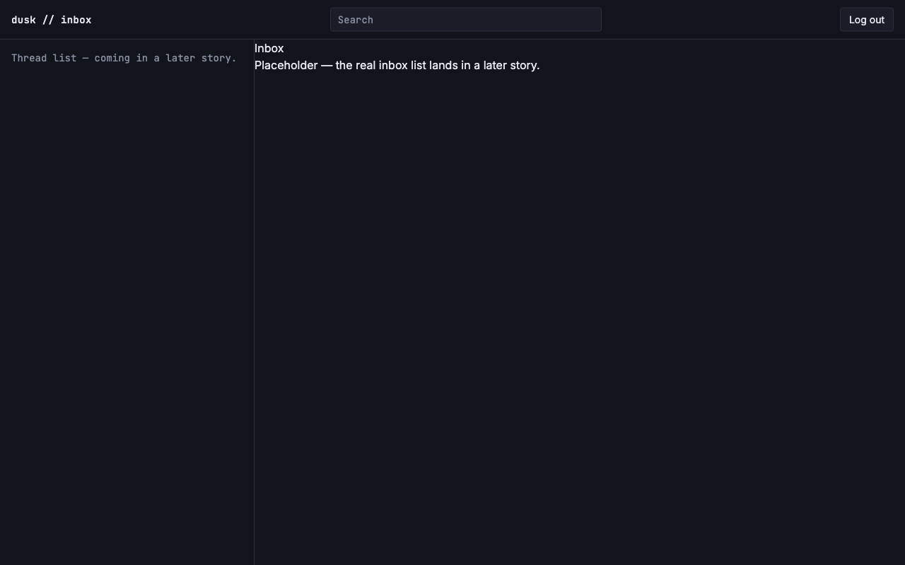
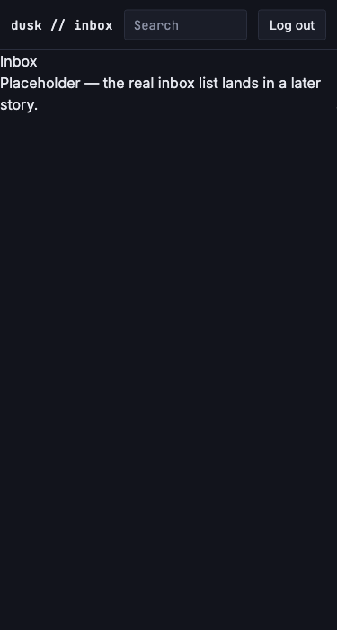

# App shell layout (desktop two-pane, responsive collapse)

*2026-07-23T16:32:49Z by Showboat 0.6.1*
<!-- showboat-id: c43c4631-3114-4597-96eb-8a818107c2ac -->

US-J02: adds the (app) route group's app shell — a top bar (app mark, search input, logout form) plus a two-pane desktop layout (fixed 360px left column, flexible right pane) that collapses to a single right-pane stack below the lg (1024px) breakpoint. Left pane is a structural placeholder for the real thread list, which lands in US-F01.

```bash
npm run check 2>&1 | sed -E 's/^[0-9]{10,} //'
```

```output

> resend-email-inbox@0.0.1 check
> svelte-kit sync && svelte-check --tsconfig ./tsconfig.json

START "/Users/bloodintern1/Desktop/Resend-Email-Inbox"
COMPLETED 1184 FILES 0 ERRORS 0 WARNINGS 0 FILES_WITH_PROBLEMS
```

```bash
npm run lint 2>&1
```

```output

> resend-email-inbox@0.0.1 lint
> prettier --check . && eslint .

Checking formatting...
All matched files use Prettier code style!
```

```bash
npm run build 2>&1 | grep -E 'vite v|modules transformed|built in|Using @sveltejs|done$|Run npm run preview' | sed -E 's/built in [0-9.]+(ms|s)/built in N/'
```

```output
vite v8.1.5 building ssr environment for production...

transforming...✓ 159 modules transformed.
vite v8.1.5 building client environment for production...

transforming...✓ 167 modules transformed.
✓ built in N
✓ built in N
Run npm run preview to preview your production build locally.
> Using @sveltejs/adapter-vercel
  ✔ done
```

Route protection still holds (unaffected by this story): unauthenticated /inbox redirects to /login, and a session cookie lets it through to render inside the new shell.

```bash
curl -s -i http://localhost:5173/inbox | tr -d '\r' | grep -E '^(HTTP|location)'
```

```output
HTTP/1.1 302 Found
location: /login
```

```bash
curl -s -i --cookie 'session=fake-token-value' http://localhost:5173/inbox | tr -d '\r' | grep -E '^HTTP'
```

```output
HTTP/1.1 200 OK
```

Verified live via rodney with a demo session cookie set through document.cookie (real login/session issuance lands in US-B02/B03). Desktop viewport (1280px, >=1024 lg breakpoint) shows the two-pane shell — fixed left column ('Thread list — coming in a later story.' placeholder) plus the right pane rendering the /inbox page content, with the top bar (app mark, search input, logout button) spanning both:

```bash {image}
docs/demos/us-j02-desktop.png
```



Mobile viewport (375px) collapses to a single-pane stack — the left column is hidden below the lg breakpoint, only the top bar and right-pane content render, with no horizontal overflow (screenshot below is exactly 375px wide with no cropped/cut-off content):

```bash {image}
docs/demos/us-j02-mobile.png
```



Clicking the 'Log out' button submits the POST /logout form, which clears the session cookie and redirects to /login (confirmed via 'rodney url' returning http://localhost:5173/login after the click).
