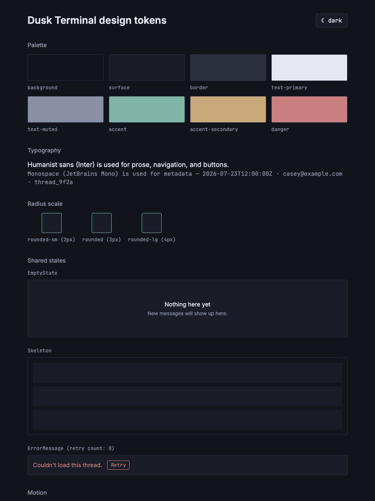
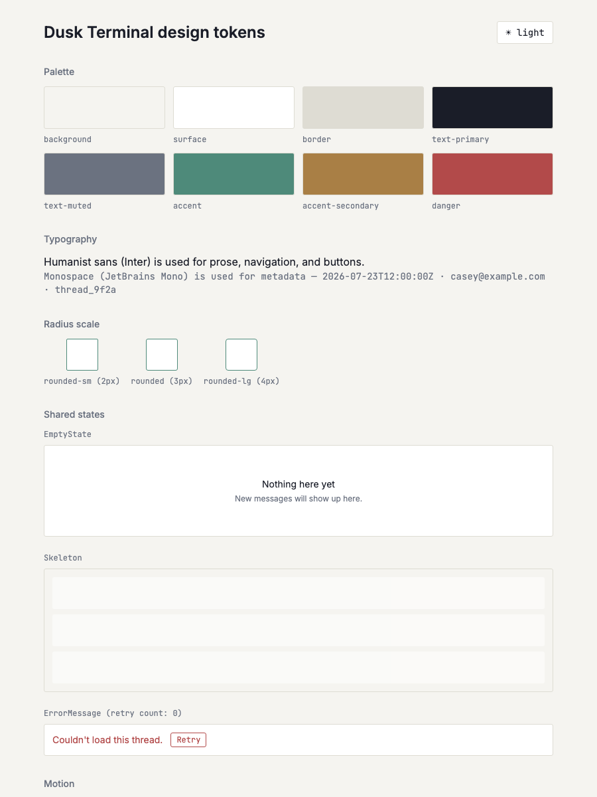

# Shared empty/loading/error state components

*2026-07-27T12:44:59Z by Showboat 0.6.1*
<!-- showboat-id: ed5f748b-20a8-45de-952a-b3d7d63f18a9 -->

Implemented three shared, dark/light-aware components using the Dusk Terminal design tokens from US-J01: EmptyState (message + optional sub-copy, centered/quiet, no illustration), Skeleton (N pulsing rows in surface tone), and ErrorMessage (danger-colored inline text with optional retry button). All three are wired into the /dev/tokens dev page (unauthenticated, non-app route, same pattern as US-J01) for visual QA under a 'Shared states' section.

```bash
npm run check 2>&1 | tail -3 | sed -E 's/^[0-9]{10,}/<ts>/'
```

```output

<ts> START "/Users/bloodintern1/Desktop/Resend-Email-Inbox"
<ts> COMPLETED 1187 FILES 0 ERRORS 0 WARNINGS 0 FILES_WITH_PROBLEMS
```

```bash
npm run lint 2>&1 | tail -10
```

```output

> resend-email-inbox@0.0.1 lint
> prettier --check . && eslint .

Checking formatting...
All matched files use Prettier code style!
```

```bash
npm run build 2>&1 | tail -8 | sed -E 's/built in [0-9]+ms/built in <duration>/'
```

```output
.svelte-kit/output/server/chunks/server.js                                                          127.06 kB │ gzip: 32.96 kB

✓ built in <duration>

Run npm run preview to preview your production build locally.

> Using @sveltejs/adapter-vercel
  ✔ done
```

```bash {image}

```



```bash {image}

```



Verified live via rodney against /dev/tokens (unauthenticated dev-only route): the EmptyState renders the centered message + sub-copy with no illustration; the Skeleton renders 3 pulsing rows (fixed a demo bug where the wrapping container also used bg-surface, making the surface-toned skeleton rows invisible against it — corrected the demo wrapper to bg-background so rows are visible; the component itself is unchanged and correctly uses bg-surface per the design spec); ErrorMessage renders in the danger color (rgb(201,127,127) = #c97f7f, matching the dark-theme --dt-danger token) with a Retry button whose onclick callback fires (retry count went 0 -> 1 after a rodney click). Re-confirmed both dark and light themes via the existing ThemeToggle — screenshots below.
